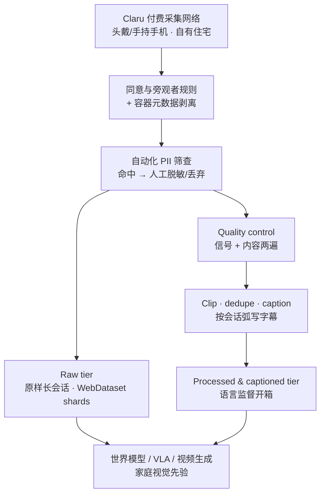

# RekaDaily-10k（家务第一人称视频数据集）

**RekaDaily-10k** 是 [Reka AI](https://reka.ai/) 经 [Claru](https://claru.ai) 付费采集网络发布的 **无剧本第一人称家务 / 日常视频** 语料：目标全量 **10,312** 小时，以 **Apache 2.0**、**ungated** 形式贡献给物理 AI / 世界模型与 VLA 社区。

## 一句话定义

**在真实住宅由付费采集者头戴/手持手机录制的大规模无剧本 egocentric 家务视频；分 raw（原样长会话）与 processed+captioned（短片段+机器字幕）两档，开箱提供家庭场景视觉与语言监督，但不是机器人关节轨迹。**

## 英文缩写速查

| 缩写 | 英文全称 | 简要说明 |
|------|----------|----------|
| Ego / POV | Egocentric / Point of View | 第一人称 / 头戴视角 |
| VLA | Vision-Language-Action | 视觉–语言–动作模型；本语料常作人侧预训练层 |
| QC | Quality Control | processed 档的信号/内容两遍质控 |
| PII | Personally Identifiable Information | 人脸、处方签、邮件等；发布前自动化筛查 |
| HF | Hugging Face | raw 档托管平台 |
| WDS | WebDataset | tar shard 打包格式，便于流式训练 |

## 为什么重要

- **家庭分布 × 无剧本：** 相对剪辑过的烹饪视频或实验室遥操作，本集强调 **真实住宅杂乱、打断、长间隔与双手琐碎家务**——正是部署环境里难「预约」的部分。
- **开放许可 + 可商用：** Apache 2.0、ungated，适合工业与学术共用；raw 档允许自建 clipping / 标注，不被发布方管线绑架。
- **语言监督路径清晰：** processed 档按 **会话弧** 写字幕（含离开–返回类长程活动），比单帧场景描述更接近指令条件模型所需监督。
- **与 Ego 生态互补：** 发布页将自身定位为 Ego4D / Egocentric-10K / EPIC-KITCHENS 的 **家用 + 高分辨率（约 1,670 h 原生 4K）** 补充。

## 核心信息

| 字段 | 内容 |
|------|------|
| 机构 | 瑞卡人工智能（Reka AI）；采集引擎 Claru |
| 模态 | 第一人称 RGB 视频（mp4/mov）；raw 无字幕；processed 每片段一文案 |
| 目标规模 | **10,312** 小时；约 **1,670** 小时原生 4K |
| Raw（入库日） | 约 **886** h / **39,643** 视频 / **1,877** shards（HF README；增量中） |
| 场景 | 采集者自有住宅为主（洗衣、厨清、收纳、扫地、卸货等日常家务） |
| 动作标签 | 项目级 taxonomy（`flow/activities` 或 `category/subcategory`）；**无** 机器人 DOF / 腕手 3D |
| HF 入口 | <https://huggingface.co/datasets/RekaAI/RekaDaily-10k-raw> |
| 许可 | Apache 2.0 |

### 数据集速查

| 维度 | 内容 |
|------|------|
| **规模** | 全量目标 10,312 h；raw 增量上线（入库日 README ≈ 886 h） |
| **模态** | Ego RGB 视频 + JSON/parquet 元数据；（processed）短片段字幕 |
| **许可证** | Apache 2.0（商用与再分发允许，需遵循署名条款） |
| **重定向就绪度** | **低**：人体视频先验层；**无** 原生手姿 / SMPL / 机器人关节字段，要进策略需自建重建或仅作视觉/语言预训练 |

## 流程总览

## 工程实践

| 项 | 要点 |
|----|------|
| **获取 raw** | HF `RekaAI/RekaDaily-10k-raw`；`browse` / `metadata` parquet 可先扫元数据再下 shard |
| **加载** | `webdataset.WebDataset(hf_resolve_url)`；项目目录见 source 归档 |
| **Processed 档** | 研究页宣称另档同前缀发布；入库日以 raw 为主入口，选型前再核 HF |
| **开源状态** | **数据已开源（增量）**；**无** 配套训练代码仓（语料发布） |
| **隐私** | 问题反馈 `contact@reka.ai`；筛查不完美，工程侧仍应做二次审查 |
| **下游读法** | 适合 **金字塔第 ③ 层**（人 Ego 视频）与世界模型视觉先验；**不要**当成 [HIW-500](./hiw-500-dataset.md) 一类真机遥操作替代品 |

## 与相邻语料对比

| 对照 | RekaDaily-10k 的定位 |
|------|---------------------|
| **Ego4D / EPIC-KITCHENS** | 更偏活动理解基准；本集强调 **付费家务规模 + 双档发布 + Apache 2.0** |
| **Egocentric-10K** | 工业生产环境第一人称；本集补 **家庭住宅** |
| **[EgoWorld-100W](./egoworld-100w.md)** | 百万级、**申请制**商业语料；本集规模叙事相近量级小时数但 **公开 ungated 下载** |
| **[RekaCS2-10k](./rekacs2-10k-dataset.md)** | 同机构、同量级小时数；CS2 **游戏控制稠密对齐**（CC BY-NC），本集为 **真实家务**（Apache 2.0） |
| **[EgoScale](../methods/egoscale.md)** | 方法侧强调腕手标签缩放；本集是 **无原生手姿** 的开放视频语料 |
| **[HIW-500](./hiw-500-dataset.md)** | **机器人** G1 家庭遥操作；本集是 **人类** ego 视频，任务重叠（家务）但监督形态不同 |

## 局限与风险

- **不是可执行动作数据：** 无关节、无末端、无接触标签；接 VLA/IL 需重建、伪动作或仅作视觉–语言层。
- **增量发布口径：** 研究页写全量「下周初」上线，工程以 HF README 当前小时数与 parquet 为准，避免按宣传数排算力。
- **QC 覆盖不全：** 官方写明 QC 中途引入，覆盖「大部分而非全部」现有发布；raw 档本身几乎不过滤。
- **隐私残余风险：** 家庭室内 + 自动化筛查上限 → 下游再训仍应保留人工抽检与下架响应流程。
- **地域/文化偏差：** 采集者网络多区域，但家务物体与布局分布仍由 Claru 供给决定，不宜当作全球家庭均匀样本。

## 关联页面

- [Ego 分类 01：数据采集](../overview/ego-category-01-data-collection.md) — 人类作分布式采集者
- [EgoScale](../methods/egoscale.md) — 人视频规模预训练方法
- [EgoWorld-100W](./egoworld-100w.md) — 申请制百万级 ego 操作语料对照
- [RekaCS2-10k](./rekacs2-10k-dataset.md) — 同机构 CS2 游戏 ego（稠密动作；许可不同）
- [HIW-500](./hiw-500-dataset.md) — 家庭真机遥操作对照（机器人侧）
- [具身数据金字塔](./paper-data-pyramid-embodied-manipulation.md) — 第 ③ 层 Ego/Exo
- [人形训练数据管线选型指南](../queries/humanoid-training-data-pipeline.md) — 人体视频层入口
- [Manipulation](../tasks/manipulation.md) — 操作任务总览

## 参考来源

- [RekaDaily-10k 研究发布页归档](../../sources/sites/rekadaily-10k.md)
- [RekaDaily-10k-raw HF 数据卡归档](../../sources/datasets/rekadaily-10k-raw.md)

## 推荐继续阅读

- 研究页：<https://reka.ai/labs/research/rekadaily-10k-egocentric-household-manipulation-data>
- Hugging Face raw：<https://huggingface.co/datasets/RekaAI/RekaDaily-10k-raw>
- World Model Data Pipeline：<https://reka.ai/news/world-model-data-pipeline>
- Claru 数据引擎：<https://claru.ai>
