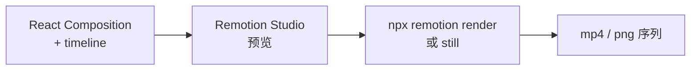

# Remotion

**Remotion**（[remotion-dev/remotion](https://github.com/remotion-dev/remotion)）是用 **React + TypeScript** 描述时间轴、动效与合成的 ** programmatic video** 框架：代码即成片规格，可在 **agent 生成、拖拽交互、数据驱动批量渲染** 之间切换而不丢源真值。

## 一句话定义

把 **UI 组件思维** 搬到视频：用 React props/组合表达镜头，用 `@remotion/renderer` 等管线导出 mp4/webm，并可选 Lambda/Vercel 做 **规模化渲染**。

## 英文缩写速查

| 缩写 | 英文全称 | 简要说明 |
|------|----------|----------|
| SSR | Server-Side Rendering | Remotion 服务端逐帧渲染视频 |
| GUI | Graphical User Interface | Remotion Studio 交互时间轴 |
| API | Application Programming Interface | Node/Lambda/Player 等编程接口 |
| CLI | Command-Line Interface | `npx remotion` 系列命令 |

## 为什么重要（对本知识库读者）

- **Agent 时代视频栈：** README 定位 *Video tools for the agent era*；官方提供 [Agent Skills 文档](https://www.remotion.dev/docs/ai/skills) 与 [Prompts](https://www.remotion.dev/prompts)，与 [video-shotcraft](video-shotcraft.md) 的 Remotion 样片库、[claude-api](../entities/anthropic-claude-api-skill.md) 类 API 技能形成 **「规约 + 参考实现 + 渲染 CLI」** 链。
- **本仓库路线成片：** `media/roadmap-motion-control-video/` 用 Remotion + 章节脚本生成 [motion-control 解说视频](../../roadmap/motion-control.md) 资产，证明 **知识库内容 → 可复现视频 pipeline** 可行。
- **与 Manim / GSAP 分工：** [Manim](manim.md) 偏数学动画；[GSAP Skills](gsap-skills.md) 偏 Web 动效技能；Remotion 偏 **产品/路线/marketing 级成片与 batch**。

## 核心结构

| 模式 | 说明 |
|------|------|
| Agentic | Coding agent 写/改 Composition 与 `src/` 场景 |
| Interactive | Remotion Studio 拖拽与时间轴 |
| Programmatic | 数据绑定、模板化批量出片 |
| 渲染 | Node SSR、Lambda、Vercel Sandbox、客户端导出 |
| 嵌入 | Player、Editor Starter、Mediabunny 等 |

### 流程总览（本地渲染）

## 工程实践

| 主题 | 结论 |
|------|------|
| 开源 | **GitHub monorepo 已开源**；**商业使用** 须读 [Remotion License](https://www.remotion.dev/license)（非单一 OSI  SPDX） |
| 入门 | `npx create-video@latest` |
| 验收 | [video-shotcraft](video-shotcraft.md) 推荐镜头级 `npx remotion still` + 审美规则 subagent |
| 与本站 CI | 视频为 **可选媒体产物**；不参与 `make ci-preflight` 默认门禁 |

## 源码运行时序图

**不适用（简版）** — 框架本体为大型 monorepo，典型用户路径是 **CLI `remotion render`** 或 **Lambda 部署**；深度运行时序因部署面（本地 vs Lambda）差异大，工程入口见官方 [SSR 文档](https://www.remotion.dev/docs/ssr)。

## 局限与风险

- **许可：** 个人/小团队与 **公司/大规模** 条款不同；ingest 时以官网为准，勿假设「全免费 MIT」。  
- **依赖 Node/React 栈：** 与 Python 仿真主栈正交，适合 **展示层** 而非控制环。  
- **渲染成本：** 长片高分辨率 batch 需预算 CPU/GPU 或 Lambda 费用。

## 与其他页面的关系

- [video-shotcraft](video-shotcraft.md) — Agent Skill 级 Remotion 镜头库  
- [motion-control 路线视频 README](../../media/roadmap-motion-control-video/README.md) — 本库 Remotion 实践  
- [Karpathy LLM Wiki](../references/llm-wiki-karpathy.md) — 知识编译与多媒体导出并列  

## 推荐继续阅读

- 文档首页：<https://www.remotion.dev/docs>  
- GitHub：<https://github.com/remotion-dev/remotion>  

## 参考来源

- [Remotion 仓库归档](../../sources/repos/remotion.md)
