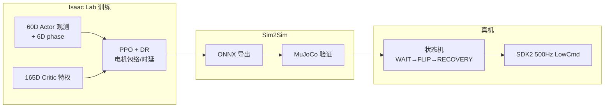
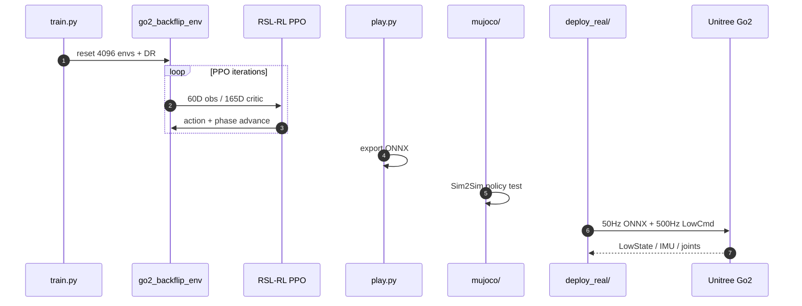

# GO2 Backflip（Robot-Nav / PPO-backflip）

**GO2 Backflip** 是 [Robot-Nav](https://github.com/Robot-Nav) 社区在 **Unitree Go2** 上开源的 **高动态后空翻** 全流程：Isaac Lab **相位条件 PPO** 训练 → ONNX 导出 → MuJoCo Sim2Sim → SDK2 真机状态机。策略 **不跟踪预录轨迹**，靠相位时钟 + 本体反馈闭环完成约 2 s 翻滚—落地—恢复。

## 一句话定义

**用 6 维谐波相位特征把后空翻拆成可学习的阶段时钟，在显式电机包络与时延随机化下，把 60 维可部署观测的 PPO 策略一路推到 Go2 真机。**

## 英文缩写速查

| 缩写 | 英文全称 | 简要说明 |
|------|----------|----------|
| PPO | Proximal Policy Optimization | on-policy 策略梯度，本项目训练算法 |
| DR | Domain Randomization | 仿真参数随机化以收窄 sim-to-real 差距 |
| ONNX | Open Neural Network Exchange | 跨框架导出格式，真机推理用 |
| Sim2Sim | Simulation to Simulation | 换物理引擎验证策略是否过拟合训练仿真器 |
| PD | Proportional–Derivative | 关节阻抗控制；训练侧力矩由 PD 产生 |
| SDK2 | Unitree SDK2 | Go2 官方底层通信与电机接口 |

## 为什么重要

- **完整开源链路：** 同仓库含环境定义、奖励、DR、ONNX、MuJoCo 与 `deploy_real/` 状态机，适合作为 **高动态四足 Sim2Real** 工程范本。
- **相位条件化实践：** 借鉴 [DeepMimic](../methods/deepmimic.md) 周期动作思想但 **不用模仿奖励**——与 [repo-go2-backflip](./repo-go2-backflip.md) 同属「时序敏感技能」路线。
- **真机细节可复现：** 50 Hz 策略 / 500 Hz LowCmd 分层、动作延迟与训练对齐、RL 阶段 **直接发 torque** 避免双 PD 环。

## 流程总览

## 核心机制

| 模块 | 要点 |
|------|------|
| **相位特征** | $\phi=2\pi t/T$ 的多频率 sin/cos（6D）；同一姿态在不同 phase 允许不同动作 |
| **Actor 观测** | 仅机体系角速度、重力投影、关节状态、动作历史、相位——**无可仿真特权** |
| **Critic 特权** | 含摩擦、质量、真实线速度等 165D，训练期估值用 |
| **奖励** | 起跳、空中负俯仰角速度、对齐、四足接触、落地冲击抑制、恢复站姿等分项 |
| **安全课程** | 逐步收紧关节/速度/接触约束 |
| **真机状态机** | 按 A 只重置 phase；不重置真实状态与动作历史 |

## 工程实践

| 项 | 内容 |
|----|------|
| **训练** | `python train.py`（`isaaclab_backflip/`）；4096 并行（文内） |
| **导出** | `play.py` → ONNX |
| **Sim2Sim** | `mujoco/` |
| **部署** | `deploy_real/`；预训练 `model_*.onnx` |
| **开源状态** | **已开源** — [GO2_backflip/PPO-backflip](https://github.com/Robot-Nav/GO2_backflip/tree/PPO-backflip) |

### 源码运行时序图

## 局限与风险

- **高动态真机风险：** 需完整 safety watchdog（NaN、超速、低电压、`SELECT` 急停等）；触发前检查直立与接触。
- **硬件绑定：** 针对 Go2 12 DoF 与 SDK2；迁移他机型需重调 PD、包络与观测。
- **非论文工作：** 无同行评审指标；以社区 demo 与代码可读性为主。

## 关联页面

- [legbot-MPC-WBC](./legbot-mpc-wbc.md)（同 Robot-Nav 维护）
- [DeepMimic](../methods/deepmimic.md)、[Sim2Real](../concepts/sim2real.md)
- [Locomotion](../tasks/locomotion.md)

## 推荐继续阅读

- [B 站演示 BV1HbtJ6AENK](https://www.bilibili.com/video/BV1HbtJ6AENK/)
- [GitHub: Robot-Nav/GO2_backflip](https://github.com/Robot-Nav/GO2_backflip/tree/PPO-backflip)

## 参考来源

- [sources/repos/go2-backflip.md](../../sources/repos/go2-backflip.md)
- [PinkRobot 原理到代码长文](../../sources/blogs/wechat_pinkrobot_go2_backflip_ppo_2026-09-15.md)
