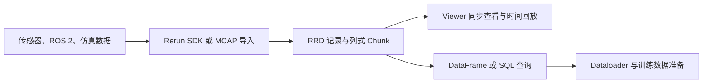

# Rerun

## 一句话定义

Rerun 是面向机器人与 Physical AI 的多模态数据工具链：用 SDK 或导入器接入多频率数据，在统一时间轴中可视化和查询，并将记录用于预处理与训练数据准备。

## 英文缩写速查

| 缩写 | 英文全称 | 简要说明 |
|------|----------|----------|
| SDK | Software Development Kit | 在机器人应用中记录和发送数据的开发库 |
| RRD | Rerun Data | Rerun 原生记录文件格式，扩展名为 .rrd |
| MCAP | MCAP log container format | 面向多通道、带时间戳消息的日志容器，可由 Viewer 导入 |
| URDF | Unified Robot Description Format | 描述机器人连杆、关节与几何模型的格式 |
| ROS 2 | Robot Operating System 2 | Rerun 可通过 MCAP 导入或实时节点桥接接入 ROS 2 数据 |
| ECS | Entity Component System | Rerun 用实体路径与组件组织日志数据的模型 |
| SQL | Structured Query Language | 可用于查询机器人记录的数据接口之一 |

## 为什么重要

机器人调试通常需要同时检查不同频率的相机、点云、TF、关节状态和控制量。只看单条日志或单个传感器难以还原故障发生的时刻。Rerun 将空间数据和时序信号放在同一条时间线上，支持回放，也能继续用记录做筛选、转换和训练数据准备。

它的价值因此不止于“把数据画出来”：同一份记录可用于在线调试、离线复盘、跨模态对齐和数据集整理，减少不同工具之间重复导出与转换。

## 核心原理

### 组件与数据模型

Rerun SDK 将记录组织为带时间信息的事件。实体路径标识数据对象，组件描述该对象的属性，例如位置、颜色、图像像素或变换。不同频率的数据可共享时间轴，也可使用各自的时间轴；Viewer 据此同步显示空间视图、图像、曲线和表格。

数据可实时发送到 Viewer，也可保存为 .rrd。官方架构说明将其描述为基于列式 chunk 的多模态存储；SDK、Viewer 与查询工具使用同一记录，便于把可视化数据接入后续处理。

### 从机器人记录到训练数据

### 数据入口与工作模式

| 入口 | Rerun 的处理方式 | 典型用途 |
|------|------------------|----------|
| Python、Rust、C++ SDK | 在应用中记录图像、点云、变换、关节状态、标量等 | 在线调试、保存自定义机器人日志 |
| MCAP 文件 | Viewer 可直接打开；CLI 可转换为 .rrd | 复盘 ROS 2 或 Foxglove 生态日志 |
| ROS 2 实时 topic | 官方示例用 ROS 2 节点订阅并转为 Rerun 记录 | 观察运行中的传感器与导航数据 |
| URDF | 导入模型网格、关节与 frame 信息 | 将机器人模型叠加到空间数据 |
| Catalog / Dataloader | 跨记录查询并生成训练批次 | 机器人数据集整理与训练 |

### MCAP、ROS 2 与 URDF 的边界

- **离线 MCAP**：官方导入器会把常见 ROS 2 / Foxglove 消息转成 Rerun 语义类型；其他受支持的 ROS 2 消息可通过反射解析为可查询组件。具体解码器随版本变化。
- **实时 ROS 2**：官方 ROS node 示例订阅指定 topic 并映射到 Rerun API。它是集成示例，不意味着 Rerun 取代 ROS 2 或提供完整 ROS 运行时。
- **URDF 关节运动**：导入器读取静态模型与 frame；要回放动态姿态，还需按对应父子 frame 记录变换或关节状态。
- **格式区别**：MCAP 是外部日志容器，.rrd 是 Rerun 原生记录格式；按需导入或转换，避免把两者当成同一格式。

## 工程实践

1. **先定数据入口**：已有 ROS 2 bag 优先评估 MCAP 直接打开；实时运行则用 SDK 或 ROS 2 示例节点转发所需 topic。
2. **统一时间语义**：记录时明确选择 sequence 或 timestamp 时间轴，并保留原始采样时间；跨传感器对齐前核查时钟偏差和时间戳来源。
3. **先选关键信号**：相机、TF、关节状态、命令与误差等按调试问题取舍，避免无差别记录造成 Viewer 负载过高。
4. **分清静态与动态模型数据**：URDF 提供模型结构，运行时变换提供姿态变化；缺少动态变换时，模型不会自动复原机器人的运动。
5. **调试与训练共用记录**：完成可视化复盘后，可用查询接口过滤片段、对齐采样率，再送入 Dataloader 或导出数据集。

| 检查项 | 建议 |
|--------|------|
| 数据完整性 | 检查各传感器时间戳、frame 名称、关节顺序及丢帧情况 |
| Viewer 性能 | 对高实体数、大点云或长记录先裁剪时间窗与数据通道 |
| 版本兼容 | SDK 与 Viewer 配套升级；API 仍在积极开发，按 Release 核对变更 |
| 部署角色 | 将 Rerun 作为记录、分析与可视化工具，不放入实时控制安全关键环路 |

## 局限与风险

- 官方仓库仍处于积极开发阶段，API 可能发生破坏性变化；项目文档提示实体过多或百万级点云等场景可能拖慢 Viewer。
- MCAP 解码能力取决于消息定义与对应解码器；自定义消息是否能语义化显示，应在目标版本与实际 bag 上验证。
- 实时 ROS 2 接入要由节点或桥接层完成，topic QoS、时间戳和消息转换仍需工程侧负责。
- Rerun Hub 是商业化服务；开源 SDK 与 Viewer 可单独使用，但团队级目录、存储和访问能力需区分产品边界。

## 关联页面

- [ROS 2 基础](../concepts/ros2-basics.md) — topic、时间戳与 bag 的中间件语义。
- [MCAP 日志格式](./mcap-log-format.md) — 离线多通道日志入口与格式边界。
- [PlotJuggler](./plotjuggler.md) — 以时序曲线分析为主的机器人日志工具，可与 Rerun 对照选型。
- [Foxglove](./foxglove-studio.md) — ROS / MCAP 多模态可视化工具。
- [RL 策略真机调试 Playbook](../queries/robot-policy-debug-playbook.md) — 将观测、动作和真机日志结合分析。

## 参考来源

- [Rerun 官方仓库归档](../../sources/repos/rerun-io.md)
- [Rerun 官方站点与文档归档](../../sources/sites/rerun-io.md)
- [Rerun 官方 GitHub 仓库](https://github.com/rerun-io/rerun)
- [Rerun 官方架构说明](https://github.com/rerun-io/rerun/blob/main/ARCHITECTURE.md)
- [Rerun 官方 MCAP 文档](https://rerun.io/docs/howto/logging-and-ingestion/mcap)
- [Rerun 官方 ROS 2 节点示例](https://rerun.io/examples/robotics/ros_node)
- [Rerun 官方机器人数据预处理示例](https://rerun.io/examples/robotics/robot_data_preprocessing)

## 推荐继续阅读

- [Rerun 时间轴操作](https://rerun.io/docs/reference/viewer/timeline)
- [Rerun 的工作方式](https://rerun.io/docs/concepts/how-does-rerun-work)
- [LeRobot 数据集导出示例](https://rerun.io/examples/robotics/rerun_export)
- [PlotJuggler](./plotjuggler.md) 与 [Foxglove](./foxglove-studio.md) — 比较时序分析和多模态调试工作流。
