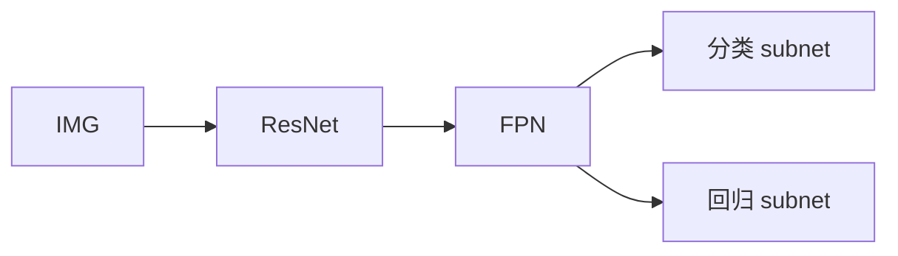

# RetinaNet

## 一句话定义

**RetinaNet** 是带 FPN 的单阶段密集检测器，核心用 **Focal Loss** 降低易分负样本权重，缓解 one-stage 精度长期落后两阶段的问题。

## 英文缩写速查

| 缩写 | 英文全称 | 简要说明 |
|------|----------|----------|
| FL | Focal Loss | 调制交叉熵，抑易分负例 |
| FPN | Feature Pyramid Network | 多尺度特征金字塔 |
| Anchor | Anchor Box | 预定义参考框 |
| AP | Average Precision | 检测精度 |
| One-stage | One-stage Detector | 无独立 RPN 的检测器 |

## 为什么重要

- 课程 3.2.2：与 YOLO 并列的单阶段代表，理论贡献（FL）影响后续大量密集预测任务。
- 中等算力边缘设备上仍是可解释的基线之一。

## 核心原理

骨干 + FPN 产出多尺度特征；每层密集锚框分类与回归。Focal Loss：$\mathrm{FL}(p_t)=-\alpha_t(1-p_t)^\gamma\log(p_t)$，使训练聚焦难例。

## 工程实践

| 项 | 建议 |
|----|------|
| γ / α | 论文常用 γ=2、α=0.25，按类别不平衡重调 |
| 实现 | MMDetection / Detectron2 RetinaNet |
| 对照 | 同骨干对比 Faster / YOLO 的 AP 与 FPS |

## 局限与风险

仍依赖锚框与 NMS；极端长尾需类别均衡策略。实时性通常不如高度优化的 YOLO 部署栈。

## 关联页面

- [R-CNN 族](../methods/rcnn-family.md)
- [YOLO](./paper-yolo-unified-realtime-detection.md)
- [检测指标](../concepts/object-detection-metrics.md)
- [Transformer CV 课程策展](../entities/transformer-cv-curriculum.md)

## 参考来源

- [Transformer 视觉应用课程大纲](../../sources/courses/transformer_cv_applications_syllabus.md)

## 推荐继续阅读

- [RetinaNet / Focal Loss (ICCV 2017) arXiv:1708.02002](https://arxiv.org/abs/1708.02002)
