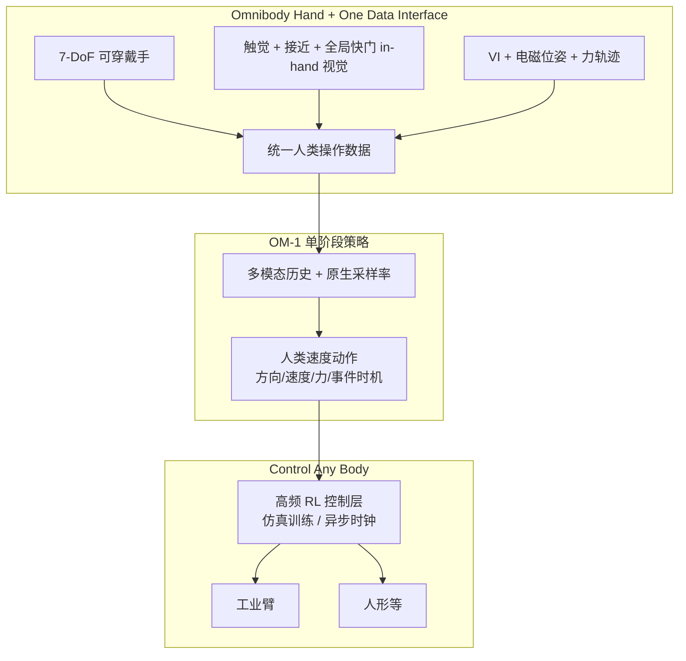

# OM-1：通才操作策略（Reward AI）

| 字段 | 内容 |
|------|------|
| **机构** | 励元智能（Reward AI） |
| **类型** | 产业官方博客（非 peer-reviewed 论文） |
| **模型 / 栈** | **Omnibody**：Hand + One Data Interface + **OM-1** + Control Any Body |
| **发布** | 2026-09 |
| **开源** | **确认未开源**（无公开代码 / 权重 / 数据集；2026-09-15 再核公司站仍无仓） |

## 一句话定义

**OM-1** 是 Reward AI 的 **Omnibody Model 1**：在 **仅人类穿戴示范**（无遥操作、无机上 rollout）的前提下，从统一多模态接口学习 **人类速度** 的接触丰富操作，并通过独立高频控制层 **同一策略** 部署到工业臂与人形等多样本体。

## 英文缩写速查

| 缩写 | 英文全称 | 简要说明 |
|------|----------|----------|
| OM-1 | Omnibody Model 1 | 本页通才操作策略核心 |
| VI | Visual-Inertial | 视觉-惯性手部位姿跟踪基线 |
| EM | Electromagnetic Sensing | 电磁辅助跟踪，补 VI 高速 overshoot |
| MCP | Metacarpophalangeal Joint | 掌指关节；Omnibody Hand 力量抓联动轴 |
| IL | Imitation Learning | 人类示范驱动学习范式 |
| RL | Reinforcement Learning | 控制层在仿真中的训练方式 |

## 为什么重要

- **人类数据直驱机器人动作：** 不经「人类→遥操作机器人→策略」中间环，把接触直觉直接蒸馏进策略（对照传统 IL / 遥操作数据飞轮）。
- **采集-学习-控制一体：** *One Model, One Data Interface, Any Body* 把传感原生率、单阶段训练与异步高频控制绑在同一产品叙事，区别于「先采数据再拼模块」。
- **跨本体轴：** 工业臂到人形共用策略接口，补 [跨具身迁移](../overview/hub-cross-embodiment.md) 产业闭源样本（与 [GEN-1.5](./generalist-gen15-one-shot.md) physical prompting、[S1](./skild-s1.md) 视频 ICL 机制不同）。
- **DexCap 后继：** 团队前序 [DexCap](./paper-notebook-dexcap-scalable-and-portable-mocap-data-collecti.md) 已验证可穿戴 mocap→灵巧 IL；OM-1 把栈推到 **人类同速 + 通才策略 + 机载控制**。

## 流程总览

## 核心原理

### 1. Omnibody Hand：功能导向的 7-DoF 可穿戴

- 保留 **选接触点、手内重定向、精密/力量抓切换**，而非人手关节逐点仿形。
- 人体工学：指长差由远端屈曲机构吸收，避免 compensated grasp 污染示范分布。
- 穿戴者按 **自然操作** 示范，不必迎合某台机器人运动学。

### 2. One Data Interface：人类节奏下的完整交互记录

- **被动日常采集**（工作/烹饪等）与 **传送带分拣级高速** 任务并存；缺失毫秒级接触瞬间会显著降数据 yield。
- 传感组合：高频触觉、接近觉、全局快门 in-hand 视觉；路径上叠加 **力**（拉门、搬箱）。
- 跟踪：VI 在快速反转时 overshoot；叠加 **电磁** 定位（博客自报最高速平均 overshoot **24.9→9.5 mm**，约 **60%** 降）。

### 3. OM-1：仅人类数据、单阶段、跨本体策略

- **训练边界：** 无遥操作、无机上经验；人类运动 **直接** 映射为机器人动作输出。
- **数据形态统一：** 首条与最新示范同接口 → **无** pre/post-training 分界，扩规模只需加人类数据。
- **模态处理：** 各传感器 **原生采样率** 入模 + 时间历史；动作为方向、速度、力与抓取/移动等 **事件时机**。
- **推理：** 面向低延迟的新架构，支撑与人类示范同速的闭环。

### 4. Control Any Body：与策略解耦的高频执行

- 仿真 RL 学速度/加速度相关动力学、外扰与延迟；接触丰富任务（冰箱门、变重箱子）靠 **力/阻抗级** 跟踪而非已知环境模型。
- **异步：** 控制层自有高频时钟，策略推理抖动不中断运动。
- **在线过渡优化：**  successive 预测间平滑，避免投掷/摆动等高动态下的轨迹断裂。

## 工程实践

| 项 | 实践要点 |
|----|----------|
| **数据协议** | 优先保留 **接触前接近 + 接触触觉 + in-hand 视觉** 共时序；高速任务忌事后平滑轨迹 |
| **跟踪栈** | VI 作基线、EM 补高速段；记录环境电磁校准流程 |
| **适应成本** | 博客称新任务 **<30 分钟** 人类数据；部署时区分 **策略学习** vs **控制层 sim RL** 成本 |
| **跨本体** | 验证工业臂与人形上 **同一动作接口** 的可执行性，而非仅换 kinematic retarget |
| **开源对照** | 可穿戴 mocap 学术线看 [DexCap](./paper-notebook-dexcap-scalable-and-portable-mocap-data-collecti.md)；通才闭源对照 [GEN-1.5](./generalist-gen15-one-shot.md)、[S1](./skild-s1.md) |
| **开源状态** | **不适用源码运行时序图** — 确认未开源 |

## 与其他工作对比

| 维度 | OM-1（本页） | DexCap（前序论文） | GEN-1.5 | S1（Skild） |
|------|-------------|-------------------|---------|-------------|
| 证据 | 公司博客 + 演示视频 | RSS 2024 论文 | 公司博客 | 公司博客 |
| 人类数据 | 可穿戴多模态，**无机上/无遥操作** | mocap + DexIL 到机器人手 | physical prompt 3–12 s | 任务视频 ICL |
| 跨本体 | 工业臂↔人形，统一策略接口 | 论文内特定灵巧手 | 多末端 / 真机 | 多场景视频 |
| 控制 | 独立高频 RL 层 + 异步 | 传统控制 + 可选 HITL | 100 Hz 端到端 | 未强调分层控制 |
| 开源 | **未开源** | 论文/项目页（非 OM-1 栈） | **未开源** | **未开源** |

## 局限与风险

- **闭源不可复现：** <30 分钟、overshoot 降幅等数字无法独立验证。
- **与 DexCap 勿混读：** OM-1 是商业全栈叙事；DexCap 开源边界与 OM-1 **不等价**。
- **同名混淆：** [OpenMind OM1](https://github.com/OpenMind/OM1) 为机器人 runtime，**非** 本页策略。
- **高速接触安全：** 人类同速策略 + 高频控制对真机 **力限/急停** 要求极高。
- **电磁跟踪：** 环境干扰与标定成本在产线落地时是隐藏税。

## 关联页面

- [Reward AI（公司入口）](./reward-ai-robotics.md)
- [DexCap（前序可穿戴 mocap）](./paper-notebook-dexcap-scalable-and-portable-mocap-data-collecti.md)
- [跨具身迁移（知识链）](../overview/hub-cross-embodiment.md)
- [Foundation Policy](../concepts/foundation-policy.md)
- [Imitation Learning](../methods/imitation-learning.md)
- [Manipulation](../tasks/manipulation.md)
- [GEN-1.5 一次示范学习](./generalist-gen15-one-shot.md)
- [S1（Skild）](./skild-s1.md)

## 参考来源

- [OM-1 博客来源归档](../../sources/blogs/rewardai_om1.md)
- [Reward AI 公司站归档](../../sources/sites/rewardai.md)
- 原文：<https://www.rewardai.com/blog/OM-1/>

## 推荐继续阅读

- [DexCap 项目页](https://dex-cap.github.io/) — 团队前序可穿戴灵巧 mocap 与 DexIL
- Anderson, P. W. (1972). *More Is Different* — 本篇引用的「量变引起质变」论据
- [GEN-1.5: Embodied Foundation Models are One-Shot Learners](https://generalistai.com/blog/gen-1.5) — 闭源通才策略适应成本对照
