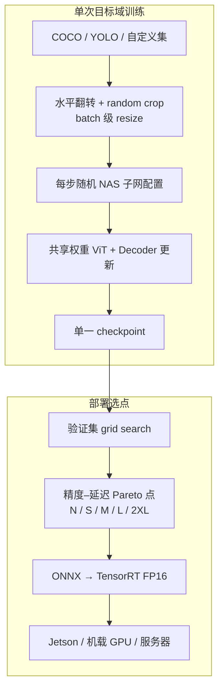

---

type: entity
tags:
  - repo
  - paper
  - computer-vision
  - object-detection
  - instance-segmentation
  - real-time
  - perception
  - robotics
status: complete
updated: 2026-06-22
arxiv: "2511.09554"
venue: "ICLR 2026"
code: https://github.com/roboflow/rf-detr
related:
  - ../methods/object-detection.md
  - ../concepts/vision-backbones.md
  - ../queries/object-detection-model-selection.md
  - ./paper-yolo-unified-realtime-detection.md
  - ../tasks/manipulation.md
  - ../tasks/humanoid-soccer.md
sources:
  - ../../sources/papers/rf_detr_arxiv_2511_09554.md
  - ../../sources/repos/rf_detr.md
  - ../../sources/sites/rfdetr-docs.md
summary: "RF-DETR 是 Roboflow 提出的实时 DETR 族：DINOv2 骨干 + 端到端 weight-sharing NAS，单次训练后在 Pareto 前沿选精度–延迟点；COCO 上 2XL 首破 60 AP，支持检测/分割/关键点微调与 ONNX–TensorRT 部署。"
tags: [repo, paper, computer-vision, object-detection, instance-segmentation, real-time, perception, robotics, nvidia, cmu]

---

# RF-DETR（Roboflow Detection Transformer）

**RF-DETR** 是 Roboflow 与 CMU 联合提出的 **实时 closed-vocabulary 检测 Transformer**（ICLR 2026，[arXiv:2511.09554](https://arxiv.org/abs/2511.09554)）。它以 **DINOv2 ViT 骨干** 继承互联网规模视觉先验，用 **OFA 式 weight-sharing NAS** 在单次目标域训练后 **无需重训** 即可在验证集上 grid search 不同 **分辨率 / patch / decoder 层数 / query 数** 的 Pareto 点；官方实现 [`roboflow/rf-detr`](https://github.com/roboflow/rf-detr) 提供 **`pip install rfdetr`** 统一 API，覆盖 **检测、实例分割、人体关键点（preview）** 与 **COCO/ YOLO 格式微调**。

## 一句话定义

**把 DETR 做成可针对任意数据集与硬件在精度–延迟 Pareto 曲线上「即选即用」的 specialist 检测器：DINOv2 预训练 + NAS 子网共享权重 + 无 NMS 端到端推理，兼顾 COCO 榜单与 RF100-VL 类真实域迁移。**

## 英文缩写速查

| 缩写 | 英文全称 | 简要说明 |
|------|----------|----------|
| RF-DETR | Roboflow Detection Transformer | 本文方法及开源模型族 |
| DETR | DEtection TRansformer | 无 anchor/NMS 的集合预测检测框架 |
| NAS | Neural Architecture Search | 神经架构搜索；本文用 weight-sharing 端到端 NAS |
| ViT | Vision Transformer | 视觉 Transformer 骨干 |
| AP | Average Precision | COCO 检测/分割标准精度指标 |
| NMS | Non-Maximum Suppression | 传统检测器去重后处理；DETR 系通常不需要 |
| ONNX | Open Neural Network Exchange | 跨框架模型交换格式，便于 TensorRT 部署 |
| RF100-VL | Roboflow 100 Vision-Language benchmark | 100 个 diverse 数据集的域迁移评测集 |

## 为什么重要

- **实时 DETR 新标杆：** **RF-DETR-2XL** 在 COCO 上 **60.1 AP50:95 @ 17.2 ms**（T4, TensorRT FP16），据论文为首个 **实时 >60 AP** 的检测器；**Large** 在 **6.8 ms** 下达 **56.5 AP**，优于同级 YOLO11x 且延迟更低。
- **机器人选型新选项：** 相对 YOLO，**无 NMS**、**DINOv2 域迁移更强**（RF100-VL 上 YOLOv8/v11 明显落后）；相对 GroundingDINO，**无文本塔、快 ~20×**，适合 **固定类别机载闭环**（球/人/障碍/工装）。
- **一次训练、多部署点：** NAS 子网共享权重 → 同一 checkpoint 可换 **Nano→Large** 分辨率与 decoder 深度，便于 **仿真训练 → Jetson/服务器分级部署** 而不重复训多套模型。
- **任务统一：** 检测与 **RF-DETR-Seg** 共享 backbone 与训练 API；关键点 preview 可做人形 **2D 姿态锚点**（再级联 3D/控制）。

## 核心结构

| 模块 | 作用 |
|------|------|
| **DINOv2 ViT 骨干** | 12 层 ViT；窗口/全局 attention 交错；FlexiViT 式 **可变 patch size** |
| **多尺度 projector** | LayerNorm（非 BN）→ 支持梯度累积与小 batch 微调 |
| **Deformable decoder** | 多层 decoder；训练时 **全层监督**，推理可 **drop 任意层** |
| **Query tokens** | 空间先验；推理时可减 query 数降延迟 |
| **Seg 头（可选）** | Encoder 特征双线性上采样 + pixel embedding；与 query 点积得 mask |
| **Weight-sharing NAS** | 每步随机采样：分辨率、patch、decoder 层、query 数、窗口块数 |

### 训练与推理流水线

## 模型族与工程入口

| 规模 | 典型用途 | COCO AP50:95 | T4 延迟 | 许可 |
|------|----------|--------------|---------|------|
| **Nano** | 边缘极致实时 | 48.4 | 2.3 ms | Apache 2.0 |
| **Small / Medium** | 机载默认 | 53.0 / 54.7 | 3.5 / 4.4 ms | Apache 2.0 |
| **Large** | 精度–延迟甜点 | 56.5 | 6.8 ms | Apache 2.0 |
| **2XL** | 服务器高精度 | **60.1** | 17.2 ms | PML 1.0（`rfdetr[plus]`） |

安装：`pip install rfdetr`（Python ≥3.10）。微调：`RFDETRLarge().train(dataset_dir='./dataset', epochs=50, batch_size=4)`。导出：`model.export(format="onnx")`。

## 与其他检测路线对比

| 路线 | 代表 | 相对 RF-DETR |
|------|------|--------------|
| YOLO 单阶段 | YOLOv8/v11 | RF-DETR **COCO/RF100-VL 精度更高**；**无 NMS**；DINOv2 **域迁移更好** |
| 实时 DETR | RT-DETR、LW-DETR、D-FINE | RF-DETR-N **+5 AP** 于 D-FINE-N；**NAS 一次训练多尺度** |
| 开放词汇 VLM | GroundingDINO、YOLO-World | VLM **开放类/语言** 强；RF-DETR **closed-vocab 微调快 20×+** |
| 两阶段 R-CNN | Faster R-CNN | R-CNN **小目标定位** 仍稳；RF-DETR **端到端实时** 更适合闭环 |

## 常见误区或局限

- **误区：「DETR 一定比 YOLO 慢。」** RT-DETR / RF-DETR 已证明 **TensorRT 下 2–7 ms** 可行；选型应看 **同一 artifact 上的延迟+AP**，并注意论文强调的 **200 ms buffer 延迟协议**。
- **误区：「换最大模型就解决域 gap。」** RF100-VL 表明 **数据分布与 augmentation 假设** 比 COCO 榜单排名更关键；RF-DETR 的 **scheduler-free** 设计正是为了减少 COCO 过拟合。
- **局限：** **Closed-vocabulary**——新类需重新标注微调，不能像 GroundingDINO 那样语言 prompt；**XL/2XL 非 Apache**；关键点仍为 **preview**。
- **工程注意：** FP16 量化须用官方 export；**输入分辨率与 query 数** 是延迟主旋钮，与换 YOLO 版本同等重要。

## 关联页面

- [目标检测（方法）](../methods/object-detection.md)
- [视觉骨干（概念）](../concepts/vision-backbones.md)
- [Query：目标检测模型选型](../queries/object-detection-model-selection.md)
- [YOLO v1（论文实体）](./paper-yolo-unified-realtime-detection.md)
- [Manipulation（任务）](../tasks/manipulation.md)
- [Humanoid Soccer（任务）](../tasks/humanoid-soccer.md)

## 参考来源

- [RF-DETR 论文摘录（arXiv:2511.09554）](../../sources/papers/rf_detr_arxiv_2511_09554.md)
- [rf-detr 仓库归档](../../sources/repos/rf_detr.md)
- [RF-DETR 官方文档站](../../sources/sites/rfdetr-docs.md)

## 推荐继续阅读

- 论文 PDF：<https://arxiv.org/pdf/2511.09554.pdf>
- GitHub：<https://github.com/roboflow/rf-detr>
- 文档：<https://rfdetr.roboflow.com/latest/>
- [LW-DETR](https://arxiv.org/abs/2406.08460)（直接架构前身）
- [DINOv2](https://arxiv.org/abs/2304.07193)（骨干预训练）
- [Ultralytics YOLO 文档](https://docs.ultralytics.com/)（YOLO 系工程对照）
