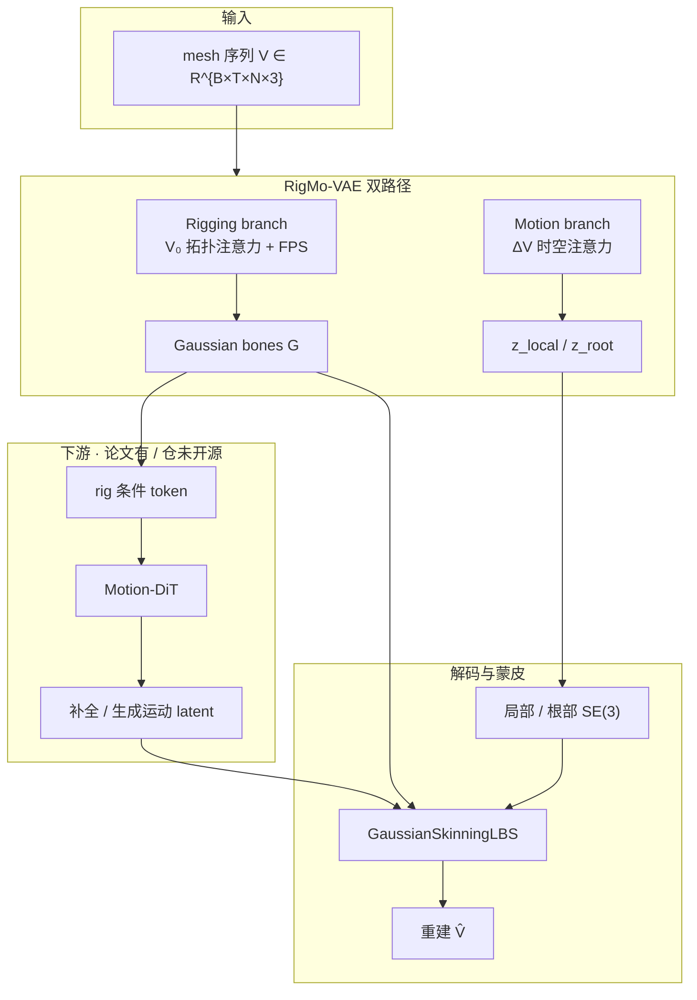
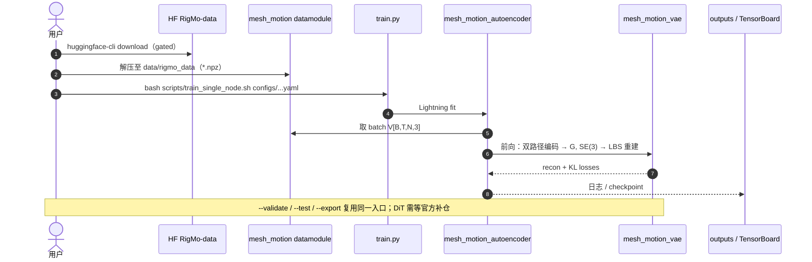

# RigMo：统一 Rig 与 Motion 的生成式动画

**RigMo**（*Unifying Rig and Motion Learning for Generative Animation*，arXiv:2601.06378；GitHub 标注 CVPR 2026）是 Snap / UIUC 等提出的 **无人工骨架标注** 框架：从原始变形 mesh 序列 **feed-forward** 发现可解释的 **Gaussian bones + skinning**，并分解出局部/根部 **SE(3)** 运动；可选的 **Motion-DiT** 在该结构感知潜空间上做可控运动补全与生成。

## 英文缩写速查

| 缩写 | 英文全称 | 简要说明 |
|------|----------|----------|
| RigMo | Rig + Motion（本文方法名） | 联合学习绑骨结构与运动动力学的统一框架 |
| VAE | Variational Autoencoder | RigMo-VAE：双路径编码 + 高斯 LBS 重建 |
| DiT | Diffusion Transformer | Motion-DiT：在 motion latent 上扩散生成/补全 |
| LBS | Linear Blend Skinning | 线性混合蒙皮；本文用可微 Gaussian LBS |
| SE(3) | Special Euclidean Group in 3D | 刚体位姿（旋转+平移）；局部骨与根变换 |
| FPS | Farthest Point Sampling | 在顶点上采样 \(K\) 个 bone token |
| DT4D | DeformingThings4D | 有机非刚体变形序列数据集之一 |

## 为什么重要

- **填「有 rig 无发现 / 有变形无结构」鸿沟**：auto-rigging 吃标注、运动生成吃预定义树、顶点 4D 生成又难出可复用资产；RigMo 把 **结构发现** 与 **动力学** 放进同一 VAE。
- **跨类可动画资产**：人、动物与多样非人形拓扑上报告可迁移的 soft bones，适合作为图形学 4D 资产管线的上游，而非假定 SMPL/SMPL-X。
- **对机器人栈的间接价值**：输出的显式 bone/skinning 与运动参数，可作为 **重定向上游资产** 或仿真角色驱动的参考；与真机控制仍隔着 [Motion Retargeting](../concepts/motion-retargeting.md) / 物理跟踪一层。勿与 Disney **Generative Motion Rig**（Blender 插件工作流）或仓库内 **GMR = General Motion Retargeting** 混淆——对照见 [Generative Motion Rig](./generative-motion-rig.md)。

## 流程总览

## 核心结构 / 机制

### 1）Rigging branch（静态结构）

- 以 **首帧** 为规范几何，拓扑感知自注意力聚合邻域；FPS 选 \(K\) bone token。
- 解码每骨 **Gaussian 描述子** \(G_k=[\Delta c_k, s_k, q_k]\)，诱导 soft skinning（实践中常稀疏到 top-\(K_s\)）。
- 目标：结构应反映 **稳定几何** 而非某一段运动实例，以便跨姿态迁移。

### 2）Motion branch（动力学）

- 输入帧间位移 \(V_\Delta\)；与 bone token 做 cross-attention。
- **Local / Root VAE** 分别采样 \(z_{\mathrm{local}}, z_{\mathrm{root}}\)，解码为 per-bone 与全局 **SE(3)**。
- 可选 **temporal attention**（仓库默认 temporal 配置）提升时序连贯。

### 3）Motion-DiT（下游生成）

- 以静态 rig 特征为条件，在 **motion latent** 上扩散；支持稀疏帧 mask 补全。
- 论文强调主贡献在 VAE 分解；DiT 用于证明潜空间可用于可控生成。

### 4）数据与评测（归纳）

| 项 | 要点 |
|----|------|
| 语料 | ~20k 序列：DT4D、TrueBones、Objaverse-XL（过滤） |
| 表示 | 顶点规范到 ~5K + 邻接；\(T{=}20\) |
| 主表 | DT4D 上重建 + **跨运动迁移** CD 优于 per-case opt / UniRig+opt / MagicArticulate+opt |
| 延迟 | ~40 ms/帧（A100，20 帧 5K 顶点，feed-forward） |

## 源码运行时序图

官方仓发布 **RigMo-VAE** 训练入口；**Motion-DiT 不适用本图**（未开源）。

复现路径：申请 HF 数据 → 按 README 解压 → `configs/rigmo_vae_temporal_single_node.yaml` 单卡冒烟，或 SLURM 对齐论文 8×8 GPU。

## 工程实践（速览）

| 项 | 说明 |
|----|------|
| 环境 | Python 3.10、PyTorch 2.5、CUDA 匹配的 wheel |
| 配置 | `num_tokens`（\(K\)）、`use_temporal_attn`、`num_frames` 须与 data 一致 |
| 许可 | **CC BY-NC 4.0** — 商业使用需联系作者；数据集另受上游许可约束 |
| 开源边界 | VAE **已开源**；Motion-DiT **未发布**；权重以仓库/项目页后续更新为准 |
| 镜像页 | `rigmo-page.github.io` 文案可能滞后；以 [haoz19 项目页](https://haoz19.github.io/RigMo-page/) 与 GitHub README 为准 |

## 局限与风险

- **部分开源**：不能把「有 GitHub」理解成完整论文管线可复现。
- **非机器人控制器**：输出是动画资产/运动学变形，不是力矩或 WBC；真机需重定向 + 跟踪。
- **分布与拓扑**：训练依赖所选 mesh 语料；极端拓扑或 OOD 风格运动仍可能失败。
- **名称易混**：≠ Disney [Generative Motion Rig](./generative-motion-rig.md)；≠ [General Motion Retargeting](../methods/motion-retargeting-gmr.md)。

## 关联页面

- [Generative Motion Rig（Disney SIGGRAPH Talks）](./generative-motion-rig.md) — DCC 侧 generative keyframing 对照
- [Diffusion-based Motion Generation](../methods/diffusion-motion-generation.md) — DiT / 扩散运动生成总览
- [ARDY](./ardy.md) — 人体骨架上的交互式生成式运动（有预定义结构）
- [Kimodo](./kimodo.md) — 大规模动捕上的可控运动扩散
- [Blender](./blender.md) — DCC 资产层；RigMo 输出可进入 DCC/仿真资产链
- [Character Animation vs Robotics](../concepts/character-animation-vs-robotics.md) — 角色资产 vs 物理可控边界

## 参考来源

- [sources/papers/rigmo_arxiv_2601_06378.md](../../sources/papers/rigmo_arxiv_2601_06378.md)
- [sources/sites/rigmo-page.md](../../sources/sites/rigmo-page.md)
- [sources/repos/rigmo.md](../../sources/repos/rigmo.md)

## 推荐继续阅读

- [RigMo 项目页](https://haoz19.github.io/RigMo-page/) — 方法图、结果与 Code/Data
- [GitHub haoz19/RigMo](https://github.com/haoz19/RigMo) — VAE 训练 README
- [arXiv:2601.06378](https://arxiv.org/abs/2601.06378) — 论文全文
- [HF RigMo-data](https://huggingface.co/datasets/haoz19/RigMo-data) — 预处理训练数据（gated）
