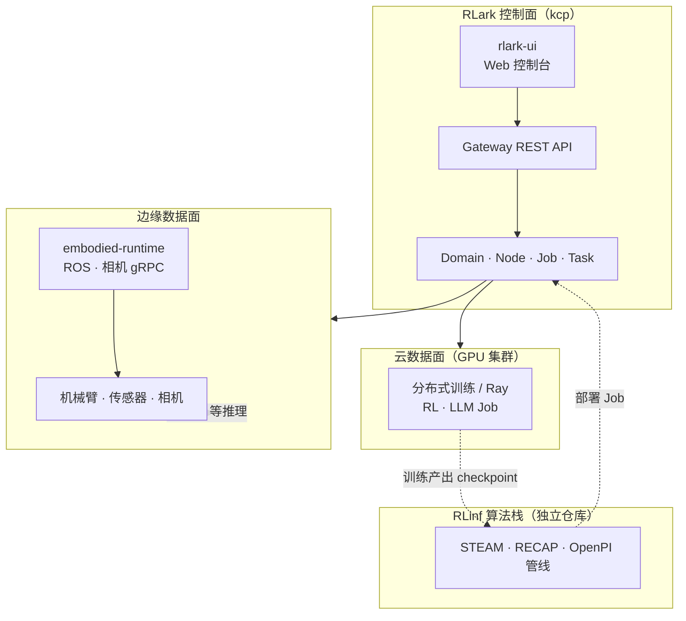
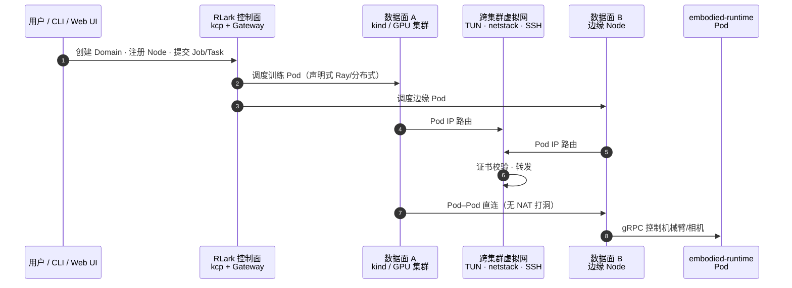

# RLark（跨集群具身智能云原生平台）

**RLark**（[`RLinf/RLark`](https://github.com/RLinf/RLark)，[文档](https://rlark.readthedocs.io/en/latest/)）是 **RLinf 生态** 内的 **跨集群云原生管理平台**：用 **Kubernetes 原生 CRD** 与 **kcp 控制面**，把 **多站点 GPU 集群** 与 **边缘机器人节点**（机械臂、相机、传感器）纳入同一套 **Job/Task** 声明式编排，覆盖 **云侧 RL/LLM 训练** 到 **边缘部署** 的全链路，而不是替代 [RLinf](../../sources/repos/rlinf.md) 内的 STEAM/RECAP 等 **算法与训练脚本**。

## 一句话定义

**用 Domain/Node/Job 抽象与跨集群虚拟网络，让「云端训练 Pod」和「边缘 embodied-runtime Pod」像同一逻辑集群一样调度与互通——具身工作负载的 control plane，不是 VLA checkpoint 仓库。**

## 英文缩写速查

| 缩写 | 英文全称 | 简要说明 |
|------|----------|----------|
| CRD | Custom Resource Definition | Kubernetes 扩展资源（Domain、Job、Task 等） |
| kcp | Kubernetes Control Plane | 多租户、可扩展的 K8s 风格 API 控制面（RLark 控制面运行其上） |
| RL | Reinforcement Learning | 云侧 GPU 训练负载类型之一 |
| LLM | Large Language Model | 与 RL 并列的云侧训练负载 |
| mTLS | mutual TLS | Agent 与跨集群转发使用的 X.509 双向认证 |
| ROS | Robot Operating System | `embodied-runtime` 在边缘管理机械臂/相机等硬件 |

## 为什么重要

- **与 RLinf 分工清晰：** [RLinf](https://github.com/RLinf/RLinf) 解决 **具身 RL 训练系统**（流水线、STEAM/RECAP、OpenPI 对接）；RLark 解决 **资源在哪跑、如何跨站点组网、如何声明分布式 Job**——选型时勿把二者混为「一个 pip install」。真机 **在线 runtime** 另见 [RLinf-USER](./paper-rlinf-user.md)（Ray + EasyTier；与 RLark 的 kcp/CRD 路径不同）。
- **云–边一体抽象：** 同一平台描述 **GPU 集群训练** 与 **边缘 embodied-runtime**（ROS、相机 gRPC），契合「仿真/训练在云上、闭环在边上」的常见落地形态。
- **跨集群 Pod 直连：** 基于 **TUN + gVisor netstack + SSH 隧道** 的虚拟网络，文档强调 **无需 NAT 打洞** 的 Pod–Pod 通信——云 GPU 与边缘设备可直接对话，降低多数据中心 + 真机混合拓扑的集成成本。
- **可验证 Quick Start：** [Read the Docs Quick Start](https://rlark.readthedocs.io/en/latest/quickstart/) 提供 **一键 CLI**（控制面 + 双 kind 数据面 + 连通性验证）与 **Web UI** 建集群/Domain/Job 流程，适合 POC 前阅读 [管理员指南](https://rlark.readthedocs.io/en/latest/admin-guide/) 中的网络与安全章节。

## 核心原理

### 平台分层（与 RLinf 生态）

### 跨集群 Job 调度（概念流）

## 工程实践

| 项 | 说明 |
|----|------|
| **开源状态** | **已开源** Apache-2.0（2026/09 公告）；见 [仓库归档](../../sources/repos/rlark.md) |
| **本地 POC** | 优先 [Quick Start](https://rlark.readthedocs.io/en/latest/quickstart/)：一键 CLI 或 UI + 双 kind 数据面 |
| **边缘硬件** | `apps/embodied-runtime` + [Python SDK](https://github.com/RLinf/RLark/tree/main/sdks/embodied-runtime-python) |
| **监控** | Prometheus 指标、Pod 日志流 |
| **路线图** | 仓内 [ROADMAP.md](https://github.com/RLinf/RLark/blob/main/ROADMAP.md)（运行时、账号、自定义 workload 等） |

## 局限与风险

- **运维复杂度：** kcp + 多数据面 + 证书体系适合 **平台团队**；小团队单机 RL 仍可直接用 [RLinf](https://github.com/RLinf/RLinf) Docker/脚本，不必强行上 RLark。
- **运行时覆盖演进中：** README 写明 **Docker / Raw** 边缘运行时仍在 roadmap，当前主线以 **Kubernetes 数据面** 为主。
- **不自带策略权重：** 与 [VLA 开源复现景观](../overview/vla-open-source-repro-landscape-2025.md) 中「RLinf ≠ checkpoint 仓」同理，RLark **不发布** π₀.₅ 等权重。

## 关联页面

- [RLinf 训练系统归档](../../sources/repos/rlinf.md) — 算法与 STEAM/RECAP 管线
- [APXInf](./apxinf.md) — 同生态端侧 VLA 推理
- [Harness VLA / RPent](./paper-harness-vla.md) — agentic 运行时
- [Genie Sim 3.0](./genie-sim-3.md) — 仿真训练接口可接 RLinf；RLark 可管跨集群训练部署
- [强化学习](../methods/reinforcement-learning.md) — 云侧 RL Job 背景
- [训练栈分层地图](../overview/robot-training-stack-layers-technology-map.md) — ④ 运行时/异构调度层对照

## 参考来源

- [RLark 仓库归档](../../sources/repos/rlark.md)
- [RLark Read the Docs 归档](../../sources/sites/rlark-readthedocs.md)
- [RLinf 仓库归档](../../sources/repos/rlinf.md)

## 推荐继续阅读

- [RLark Quick Start（Read the Docs）](https://rlark.readthedocs.io/en/latest/quickstart/)
- [RLark Architecture](https://rlark.readthedocs.io/en/latest/architecture/)
- [RLinf GitHub](https://github.com/RLinf/RLinf)
- [RLark 中文文档](https://rlark.readthedocs.io/zh-cn/latest/)
