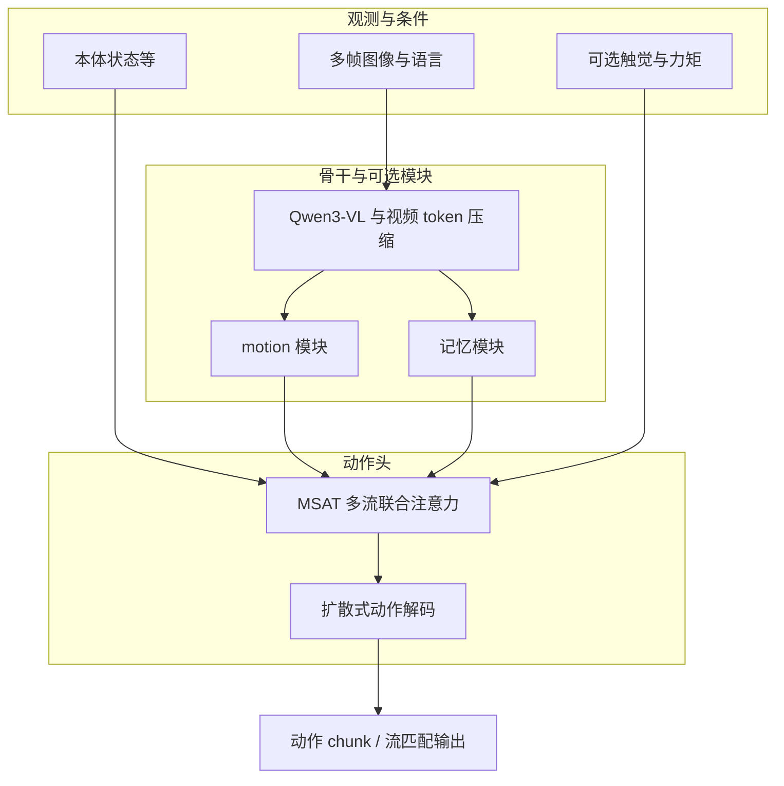
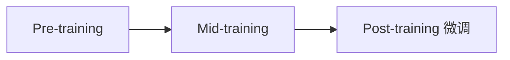

# RLDX-1

**RLDX-1** 是面向类人**灵巧操作**的 **Vision-Language-Action（VLA）** 开源模型与代码库（技术报告见 arXiv:2605.03269）。在继承大规模 VLM 语义能力的同时，通过 **Multi-Stream Action Transformer（MSAT）**、分阶段训练与可选的触觉 / 力矩条件，把「时序动力学、长程上下文、接触物理」显式接进策略；推理侧强调 **CUDA 图捕获、算子融合与 Real-Time Chunking（RTC）** 以降低端到端延迟。

## 一句话定义

用 **多流联合注意力的扩散式动作头（MSAT）** 把认知、物理传感与动作生成绑在同一套 VLA 里，并在 **预训练 → 中训 → 任务微调** 管线上用合成数据补稀有操作，再用编译与 RTC 把全模态模型推到数十毫秒量级的控制步长。

## 为什么重要

- **能力拆分清晰**：运动感知、记忆、物理传感是三条可独立开关的「功能增量」，便于对照实验与部署裁剪。
- **数据与社区栈对齐**：训练入口围绕 **LeRobot v2.1** 与 **EmbodimentTag** 约定，和 [LeRobot](./lerobot.md)、GR00T 系代码生态兼容，降低从数据到 fine-tune 的摩擦。
- **把「能跑多快」写进发布叙事**：公开 **图捕获 / fullgraph** 与 **RTC** 组合及延迟量级，对真机 **action chunk** 链路（参见 [Action Chunking](../methods/action-chunking.md)）有直接工程参考价值。

## 架构与数据流（主干）

**MSAT** 为认知、物理与动作各设一流，经 **联合 self-attention** 耦合；README 中将其表述为在 **MM-DiT** 思路之上向动作建模的扩展。视觉侧使用 **Qwen3-VL**；中间层对视频 token **压缩**以控制算量。可选模块包括：**多帧 + motion 模块**（运动感知）、**记忆 Transformer**（跨窗口历史）、**触觉 / 力矩等 physics stream** 及对未来物理信号的联合预测头。

### 流程总览

## 训练管线

公开叙事为 **三阶段**：**Pre-training**（视频等上的泛化）→ **Mid-training**（在如 DROID、ALLEX 等数据上注入操作与多模态能力）→ **Post-training / Fine-tune**（仿真或任务集适配）。**合成数据**用于放大稀有操作与组合场景。训练 CLI 为 `rldx/experiment/launch_train.py`，通过 `--video-length`、`--use-memory`、`--use-motion`、`--use-physics` 等组合能力；可与 **LoRA**、**训练时 RTC**（与 Black et al. 训练时 action conditioning 工作同源）联用。

## 推理与部署

两条路径：**进程内** `RLDXPolicy.get_action`，以及 **ZeroMQ** `run_rldx_server.py` 服务真机或仿真。优化维度包括：`--compile {submodule,fullgraph}` 的 **静态图与融合核**，以及 `--rtc-inference-mode {guided,trained}` 的 **chunk 边界拼接**（与 Black et al. RTC 论文一致）；`trained` RTC 需训练阶段打开对应选项并与 fullgraph 等配置匹配。

README 在 RTX 5090 上报告约 **43.7 ms/step**、**>22 Hz**（随 GPU 架构与 compile 档位变化；非 Blackwell 设备上官方建议倾向 `submodule`）。

## 基准与检查点

仿真侧在 **LIBERO / SIMPLER / RoboCasa / GR-1 Tabletop / RoboCasa365** 等上报告成功率；各基准对应独立 **Hugging Face fine-tune 权重** 与 `run_scripts/eval/` 下的复现说明。预训练与中训检查点如 `RLDX-1-PT`、`RLDX-1-MT-DROID`、`RLDX-1-MT-ALLEX` 等在集合页列出。

## 常见误区与许可

- **误区：开箱即商用。** 权重采用 **RLWRLD 非商用** 许可条款，与代码 **Apache 2.0** 分离；产品化前需单独审阅 HF 上各模型的 `LICENSE.md`。
- **误区：延迟数字可跨硬件直接复现。** 公开数字针对特定 GPU 与 `compile`/RTC 组合；其他架构应优先按文档做 `submodule` 与 RTC 兼容性矩阵排查。

## 参考来源

- [RLDX-1 仓库归档](../../sources/repos/rldx-1.md)
- Kim et al., *RLDX-1 Technical Report*, arXiv:2605.03269 — 技术报告与系统描述
- [RLDX-1 GitHub 仓库](https://github.com/RLWRLD/RLDX-1) — README、`docs/architecture.md` / `training.md` / `inference_server.md`

## 关联页面

- [VLA（Vision-Language-Action）](../methods/vla.md) — VLA 总览与典型路线
- [Manipulation（操作任务）](../tasks/manipulation.md) — 灵巧操作任务层定位
- [LeRobot](../entities/lerobot.md) — 数据格式与具身工具链
- [StarVLA](../methods/star-vla.md) — 同 Qwen3-VL 生态下的另一 VLA 极简路线对照
- [Action Chunking](../methods/action-chunking.md) — 与 RTC / 分块推理相关的控制接口
- [Diffusion Policy](../methods/diffusion-policy.md) — 扩散式动作建模背景

## 推荐继续阅读

- [RLDX-1 Technical Report（arXiv）](https://arxiv.org/abs/2605.03269)
- [项目主页](https://rlwrld.ai/rldx-1)
