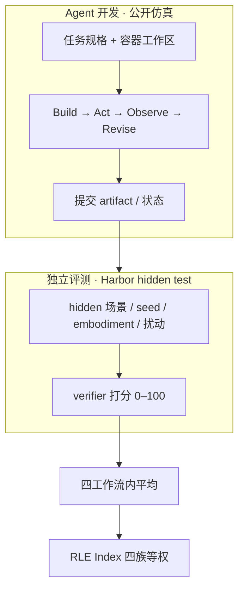
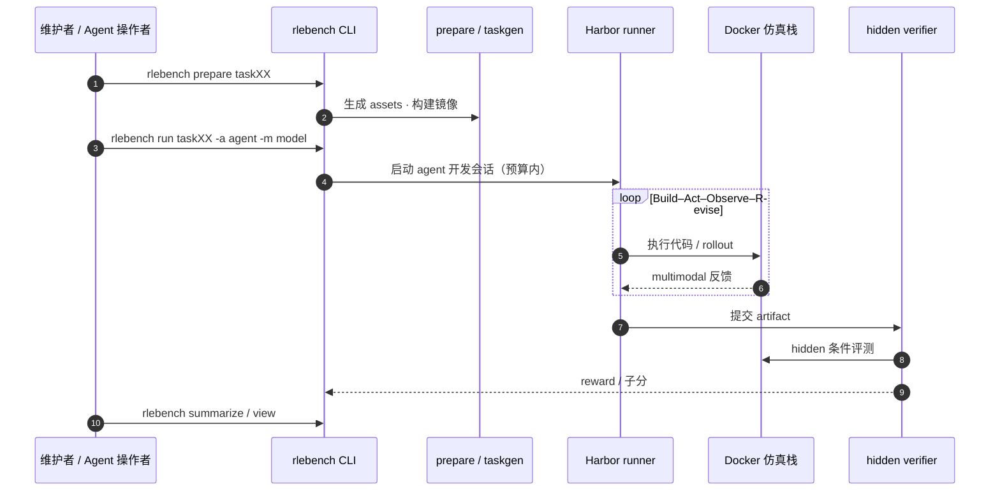

# RLE-Bench（Coding Agent 机器人学习工程资格考）

**RLE-Bench**（*A Qualifying Exam for Coding Agents as Robot Learning Engineers*，[项目页](https://rle-bench.github.io/)，[博客](https://rle-bench.github.io/blog/)，[GitHub](https://github.com/RLE-Bench/RLE-Bench)，**MIT**）由 **哈佛大学** 与 **佐治亚理工学院** 联合发布：在 **物理接地仿真** 中评测 **通用 coding agent** 能否承担 **机器人学习工程师（RLE）** 的全栈工作——不只写代码，还要 **运行、观察 multimodal 反馈、迭代实验**，并在预算内交付 **可独立验证的 artifact**（harness、ONNX policy、VLA recipe、估计器、MJCF 设计等）。

## 一句话定义

**RLE-Bench 把「coding agent 会不会写机器人代码」推进到「agent 能否在有限时间/交互/算力下，完成控机、训策略、建感知、改硬件四类工程闭环，并在 hidden 物理条件下仍站得住」。**

## 英文缩写速查

| 缩写 | 英文全称 | 简要说明 |
|------|----------|----------|
| RLE-Bench | Robot Learning Engineer Benchmark | 本文基准；九任务族 + RLE Index |
| RLE | Robot Learning Engineer | 被模拟的岗位能力：控机 / 训 policy / 感知 / 机械设计 |
| RLE Index | RLE-Bench aggregate score | 四工作流等权平均，0–100 |
| VLA | Vision-Language-Action | T05 交付训练 recipe 后评测的对象 |
| MJCF | MuJoCo XML Format | T08 移动底座等机械设计提交格式 |
| ONNX | Open Neural Network Exchange | T04 导出的 tracking policy 格式 |
| Harbor | Harbor evaluation framework | Laude Institute 沙箱评测运行时（断网 + verifier） |

## 为什么重要

- **补「终端/代码库榜」盲区：** SWE-bench 等测 digital agent；RLE-Bench 强制 **三维仿真 + 不可撤销动作 + 动力学后果**，更接近真实 RLE 日常。
- **评过程而不只评最终 policy：** T02 评 **给别的 agent 用的 harness**；T05 评 **recipe** 而非 agent 权重——与 [RoboBench](./robo-bench.md)（MLLM 被动 QA）和 [RoboCasa](./robocasa.md)（固定 pipeline 成功率）形成 **agentic 工程** 第三轴。
- **四能力分解避免单分误导：** 视觉 grounding、策略 hill-climbing、物理设计 **可分化**；初榜显示 **感知工作流差距最大、策略学习较接近、机械设计 universally hard**。
- **与 coding agent 方法线直接对话：** [ASPIRE](../methods/aspire.md) / [ENPIRE](../methods/enpire.md) 研究 **闭环 trace 与自改进**；RLE-Bench 提供 **跨任务、可比的 qualification 榜**。
- **工程可复现：** MIT 仓 + Harbor CLI + Docker 仿真栈；Leaderboard 与博客案例（GPT-6 Astra 等）可对照 [`sources/repos/rle-bench.md`](../../sources/repos/rle-bench.md) 本地重跑。

## 核心信息

| 项 | 内容 |
|----|------|
| 机构 | 哈佛大学（Harvard）、佐治亚理工学院（Georgia Tech） |
| 规模 | **9** 任务族 · **4** 工作流 · 各 task 含多 subtask/变体（博客称 48 子任务量级） |
| 代码 | [RLE-Bench/RLE-Bench](https://github.com/RLE-Bench/RLE-Bench)（MIT） |
| 评测运行时 | [Harbor](https://github.com/laude-institute/harbor) |
| 论文 | **截至 2026-09-16 无 arXiv**；README 提供 `@misc{rlebench2026}` |
| 开源核查 | **已开源**（评测 CLI + 任务规范 + Docker）；HF `RLE-Bench/task05` 等 **部分数据** |

## 四工作流 × 九任务

| 工作流 | Task | 交付物 | 开发预算（博客） | Hidden 评测要点 |
|--------|------|--------|------------------|-----------------|
| **Interactive Control** | T01 Agentic Control | agent 上下文 + 控制经验 | 8 h · 50k steps · 8 CPU · 1 GPU | RoboCasa 五厨房任务 ×5 trial SR |
| | T02 Harness Engineering | 感知工具 + 控制器 + manual | 8 h · 75k steps · 8 CPU · 1 GPU | **新 agent** 零样本 held-out 任务 SR |
| | T03 Embodied Reasoning | 决策/答案 | ≤9 h · 50k steps · 8 CPU · 1 GPU | 五 subtask 平均 SR |
| **Policy Development** | T04 Whole-Body Tracking | ONNX tracking policy | 4 h · 8 CPU · 1×5090 | MuJoCo-Warp → MuJoCo-C hidden 扰动 |
| | T05 NanoVLA Recipe | 每 subtask 一 recipe | 4 h · 1×H100 | 按 recipe 训 VLA 后评 SR |
| **Perception & Estimation** | T06 Pose Estimation | 估计器 / TorchScript | 2 h · 变体 | 100 静态帧 + 10 push episodes；形错 zero group |
| | T07 Bin Clearing | 闭环 policy 包 | 4 h · 4 CPU | 八 hidden clutter piles |
| **Mechanical Design** | T08 Mobile Base | MJCF + 控制器 | 2 h · 4 CPU | 三臂 worst-case + 静/动态稳定性 |
| | T09 GELLO Gravity Comp. | 机构 + 标定程序 | 3 h · 4 CPU | unseen 实例/姿态/载荷 |

T01 另设 **L1/L2/L3** 三档接口：裸 action API → +SAM3/Contact-GraspNet 等 → +privileged 物体位姿，用于 ablation **robotics scaffolding** 对 agent 的收益。

## 流程总览

## 源码运行时序图

节点对齐 [`sources/repos/rle-bench.md`](../../sources/repos/rle-bench.md) 与官方 README。

关键复现路径：`make install` → `rlebench doctor` → `prepare` → `run` → `summarize jobs`；GPU 任务加 `--device cuda:0`。

## 初榜读法（2026-09-14 Leaderboard 叙事）

| 分化 | 要点 | 工程含义 |
|------|------|----------|
| **视觉 grounding** | GPT-6 Astra vs Claude Opus 5 在感知/交互工作流差距最大 | bin clearing、位姿等 **读场景** 仍是分水岭 |
| **策略学习** | Astra / Opus / GPT-5.6 Sol 更接近 | motion tracking + VLA recipe **hill-climbing** 头部差距收窄 |
| **物理设计** | 普遍低分；T08 可达 shelf/payload 满分仍 **稳定性归零** | **可见目标 ≠ 物理可行**；MJCF 连通性/静稳态需单独查 |
| **T01 harness** | 多数模型 L2/L3 更省更准；Astra **L1 最强但加 harness 反 hurt** | 强 agent 可能 **over-scaffold**；读分必须带 interface level |

外部解读：[Walter Zhu：Astra and Beyond](./walterzhu-astra-and-beyond.md) 从 **tool orchestration / 逆物理 / agentic scaling** 解释 Astra 路线，与 T01–T05 演示互参（**非 RLE-Bench 官方文档**）。

## 工程实践

| 步骤 | 动作 |
|------|------|
| 1 | Linux + Docker + `uv`；GPU 任务准备 NVIDIA 驱动 |
| 2 | `git clone` → `make install` → `rlebench list` / `doctor` |
| 3 | `rlebench prepare <task>`  staging assets |
| 4 | 配置 agent API（如 `ANTHROPIC_API_KEY`）→ `rlebench run ...` |
| 5 | `summarize jobs` 得 `summary.json`；`view jobs` 查轨迹与媒体 |
| 6 | 读分对照 [Leaderboard](https://rle-bench.github.io/) 四族 profile，**勿只盯 RLE Index 单数** |

## 局限与风险

- **仿真判据：** hidden test 仍在 sim；T04 sim-to-sim 不等于真机 WBC。
- **成本口径：** 榜上 API cost **不含** 仿真/GPU 基础设施（博客明确）。
- **模型名时效：** 博客引用 GPT-6 Astra、Opus 5 等 **frontier 代号**，复现时对齐当时 API 快照。
- **论文未发：** 任务细节以 GitHub `tasks/` README 为准，Leaderboard 叙事可能领先预印本。
- **与 RLBench 易混名：** [RLBench](./rlbench.md) 是 Imperial **100 任务 IL/RL 环境**；RLE-Bench 评 **coding agent 工程闭环**，对象完全不同。

## 与其他基准的定位

| 基准 | 评谁 | 交互 | 与 RLE-Bench |
|------|------|------|--------------|
| **RLE-Bench** | **Coding agent** 全栈 RLE | 长时程代码+仿真闭环 | 本页 |
| [RoboBench](./robo-bench.md) | MLLM **embodied brain** | 被动 QA + 规划模拟 | 评 cognition，不评 agent 写训练脚本 |
| [RoboCasa](./robocasa.md) | 固定 **policy / VLA** | 环境 SR | T01/T02 仿真后端，非 agent 榜 |
| [DexBench](./dexbench.md) | 工业灵巧 **任务规范** | 真机规格 | 真机 OSC/Regime，非 agent qualification |
| EmboCoach / RoboCoach 线 | LLM agent 写 **RL/IL policy** | 32 sim 任务闭环 | 同「agent 写 policy」但 **不覆盖机械设计/ harness 移交** |

## 关联页面

- [ASPIRE](../methods/aspire.md) — code-as-policy 持续学习与技能库
- [ENPIRE](../methods/enpire.md) — 真机策略自改进 harness
- [RoboCasa](./robocasa.md) — T01/T02 厨房仿真后端
- [LIBERO benchmark](./libero-benchmark.md) — T05 VLA 轨之一
- [具身评测基准选型闭环](../overview/hub-embodied-eval-benchmark.md) — 本榜位于 **③ 策略层 adjacent：agentic 工程 qualification**
- [机器人视觉感知栈选型闭环](../queries/robot-perception-stack-selection-loop.md) — T06 位姿估计 / T07 bin clearing 与 T01 的 L2 档（SAM3 / Contact-GraspNet scaffolding）对应该闭环的感知选型口径

## 参考来源

- [RLE-Bench 项目页](../../sources/sites/rle-bench-github-io.md)
- [Introducing RLE-Bench 官方博客](../../sources/blogs/rle_bench_introducing_blog_2026-09-14.md)
- [RLE-Bench GitHub 仓](../../sources/repos/rle-bench.md)
- [Walter Zhu：Astra and Beyond](./walterzhu-astra-and-beyond.md) — GPT-6 Astra 概念解读（X 长文独立节点）

## 推荐继续阅读

- RLE-Bench Leaderboard：<https://rle-bench.github.io/>
- Harbor 评测框架：<https://github.com/laude-institute/harbor>
- 官方任务 README（仓内 `tasks/task01/README.md` 等）
