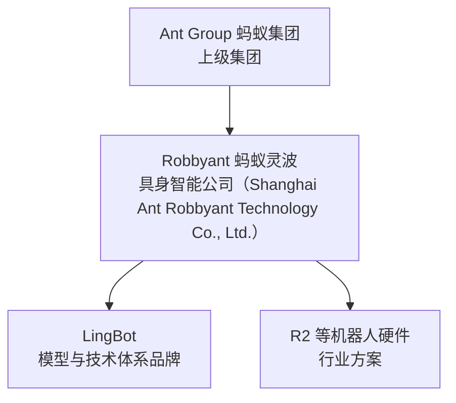
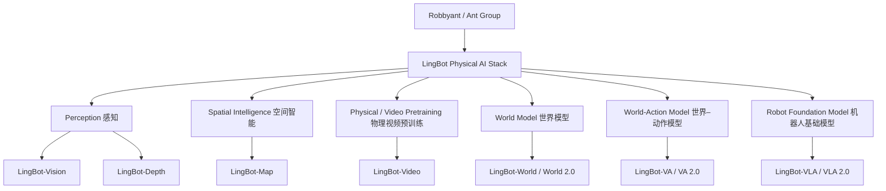
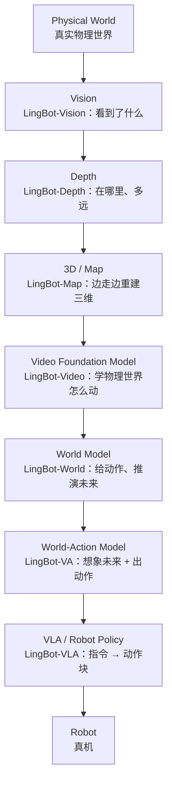
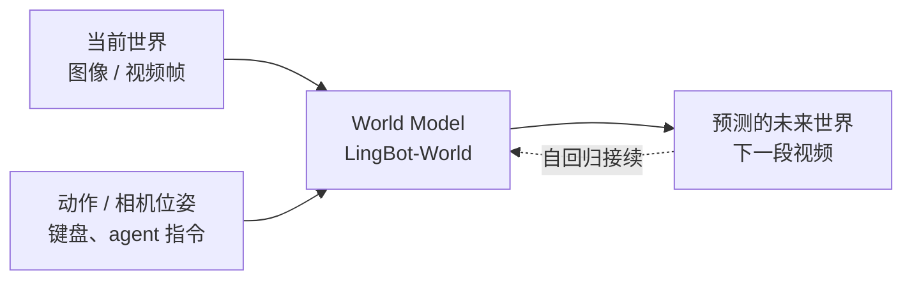
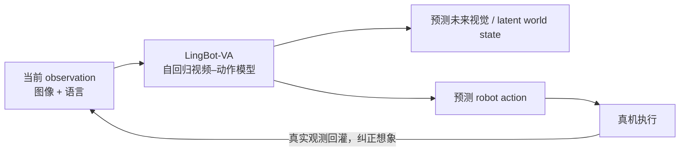
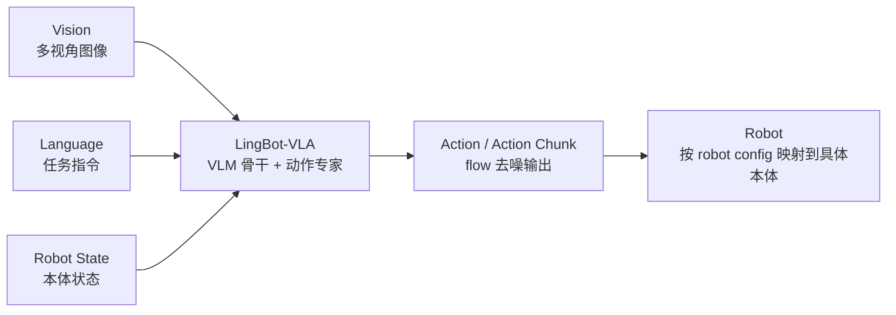

# Robbyant（蚂蚁灵波）

**Robbyant（蚂蚁灵波）** 是 **蚂蚁集团（Ant Group）** 旗下的具身智能公司，重点研发面向物理世界的感知、空间理解、世界模型、VLA、World-Action Model 和跨本体机器人控制技术。**LingBot** 是它的具身智能模型与技术体系品牌——LingBot 不是公司名。

## 一句话定义

**蚂蚁集团旗下的具身智能公司：用一套 LingBot 模型家族，把「看清物理世界 → 理解三维空间 → 预测世界怎么变 → 输出机器人动作」拆成七个可单独下载的模型，目标是官网所说的 "one brain for all robots"。**

## 英文缩写速查

| 缩写 | 英文全称 | 简要说明 |
|------|----------|----------|
| Physical AI | Physical Artificial Intelligence | 能感知并作用于真实物理世界的 AI（机器人、自动驾驶等） |
| VLA | Vision-Language-Action | 视觉 + 语言 → 机器人动作的基础策略模型 |
| WAM | World-Action Model | 同时建模「世界会怎么变」和「该怎么动」的模型族 |
| VA | Video-Action | LingBot-VA 的命名：视频预测与动作生成放在同一序列里 |
| WM | World Model | 给定当前状态和动作，预测未来世界状态的模型 |
| DiT | Diffusion Transformer | 用 Transformer 做去噪骨干的扩散模型 |
| MoE | Mixture of Experts | 混合专家；每个 token 只激活少数专家，扩容量不等比增算力 |
| MoT | Mixture of Transformers | 多条 Transformer 流共享注意力、各自保留参数 |
| IDM / FDM | Inverse / Forward Dynamics Model | 逆动力学（前后帧 → 动作）/ 前向动力学（当前帧 + 动作 → 下一帧） |
| RGB-D | RGB + Depth | 彩色图像加深度图的传感器输入 |

## 公司关系

| 层级 | 名称 | 说明（依据：[关于页归档](../../sources/sites/antgroup_robbyant.md)） |
|------|------|------|
| 上级集团 | Ant Group / 蚂蚁集团 | 关于页原文 "An embodied AI company under Ant Group" |
| 公司 / 团队 | Robbyant / 蚂蚁灵波科技 | CEO Xing Zhu，首席科学家 Yujun Shen（沈宇军） |
| 模型品牌 | LingBot | Vision / Depth / Map / Video / World / VA / VLA 七条模型线 |
| 代码与权重 | [github.com/robbyant](https://github.com/robbyant) · [huggingface.co/robbyant](https://huggingface.co/robbyant) | 见 [组织归档](../../sources/sites/robbyant_github.md) |

## 为什么重要

- **少见的「全栈都开源」样本：** 感知、3D、视频、世界模型、VLA 各层都有公开仓库和 Hugging Face 权重（VA 2.0 权重除外，见下文开源状态），适合在同一团队的接口约定下，拆开研究每一层对真机的贡献。
- **层与层之间有真实的依赖关系，不是只摆在一起：** LingBot-Depth 被 LingBot-VLA 1.0 的 depth 变体蒸馏、又是 VLA 2.0 Dual-Query 的教师；LingBot-Vision 论文称它推动 Depth 从 1.0 升到 2.0（来源见各小节）。
- **同时押注 VLA 和 WAM 两条路线：** LingBot-VLA 走「看到 → 直接出动作」，LingBot-VA 走「边想象未来边出动作」，便于在同一数据体系下对照这两条路线。
- **引用纪律：** 下文的数据小时数、成功率、帧率均为 **官方披露 / 官方自报**，除 README 公开的基准外未见第三方独立复现。

## Physical AI 技术栈全景

### LingBot 按层组织

### 从物理世界到机器人：一层一层往上搭

这张图是**阅读顺序**，不是推理时的数据流：七个模型各自独立发布、独立推理。它们在训练期的实际连接（依据论文 / README）主要有三处：

| 连接 | 方式 | 来源 |
|------|------|------|
| Vision → Depth | Vision 预训练骨干推动 Depth 1.0 → 2.0 深度补全 | [arXiv:2607.05247 摘要](../../sources/sites/technology-robbyant-com.md) |
| Depth → VLA 1.0 | `lingbot-vla-4b-depth` 从 LingBot-Depth 蒸馏几何线索 | [LingBot-VLA](./lingbot-vla.md) |
| Depth → VLA 2.0 | Dual-Query 以 LingBot-Depth（几何）+ DINO-Video（时序语义）为教师 | [LingBot-VLA 2.0](./lingbot-vla-v2.md) |

读者可以这样回答「Robbyant 怎么从感知走到真机控制」：底下三层（Vision / Depth / Map）负责把像素变成**可度量的几何状态**；中间两层（Video / World）负责学**物理世界的动态**；上面两层（VA / VLA）负责把前面的能力落到**机器人动作**。

## LingBot-Vision

**定位：** 面向 Physical AI 的自监督视觉骨干，解决机器人 **「看到了什么」**——而且不只要语义，还要边界和几何。

| 字段 | 内容 |
|------|------|
| 输入 → 输出 | 单张图像 → 稠密 patch 特征（可接深度估计、语义分割、视频目标分割、深度补全等下游头） |
| 核心方法 | **masked boundary modeling**：先学亚像素边界表示，再把含边界的 token 作为掩码目标去学稠密特征 |
| 规模 | ViT-S/16 到 1.1B 参数 ViT-g/16（HF：`lingbot-vision-vit-{small,base,large,giant}`） |
| 对照基线 | 论文以 DINOv3 为强基线 |
| 为什么对机器人重要 | 通用视觉基础模型偏重语义不变性，容易丢掉细粒度空间结构；边界和形状不连续处恰好是抓取、深度估计最需要的线索 |
| 入口 | [GitHub](https://github.com/robbyant/lingbot-vision) · [arXiv:2607.05247](https://arxiv.org/abs/2607.05247) · [项目页](https://technology.robbyant.com/lingbot-vision) · [HF](https://huggingface.co/collections/robbyant/lingbot-vision) · 站内 [LingBot-Vision](./cn-os-lingbot-vision.md) |

## LingBot-Depth

**定位：** 深度补全 / 空间感知。不只是知道「这是桌子」，还要知道 **桌子在哪里、离机器人多远**。

| 字段 | 内容 |
|------|------|
| 输入 → 输出 | RGB + 原始（有缺失、有噪声的）深度 + 相机内参 → 精修后的度量深度 + 相机系点云 |
| 核心方法 | **masked depth modeling**：把传感器在反光、无纹理表面上的深度缺失看成天然「掩码」，用视觉上下文补回来；RGB 与深度在共享潜空间里对齐 |
| 数据（官方披露） | 约 300 万 RGB-深度样本：RobbyReal 1.4M 真实室内 + RobbyVla 581K 机器人操作 + RobbySim 1M 仿真；已随代码公开 |
| 官方自报 | 深度精度与像素覆盖率超过顶级 RGB-D 相机；官网一句话强调帮助机器人看清**透明和反光物体** |
| 与 VLA / Spatial AI 的关系 | VLA 1.0 depth 变体、VLA 2.0 Dual-Query 都以它为几何教师——深度质量直接决定 VLA 得到的空间先验 |
| 入口 | [GitHub](https://github.com/robbyant/lingbot-depth) · [arXiv:2601.17895](https://arxiv.org/abs/2601.17895) · [项目页](https://technology.robbyant.com/lingbot-depth) · [HF](https://huggingface.co/robbyant/lingbot-depth-pretrain-vitl-14-v0.5) · 站内 [LingBot-Depth](./cn-os-lingbot-depth.md) |

## LingBot-Map

**定位：** 流式 3D 重建 / 空间智能，让机器人 **边走边理解周围的三维世界**。官方术语：**Geometric Context Transformer for Streaming 3D Reconstruction**。

| 字段 | 内容 |
|------|------|
| 输入 → 输出 | 连续单目视频流 → 每帧相机位姿、深度、点云 |
| 核心方法 | 前馈（feed-forward）3D 基础模型；在一个流式框架里统一坐标接地、稠密几何线索与长程漂移校正 |
| 官方自报 | 518×378 分辨率约 20 FPS，超过 10,000 帧仍稳定；仓库标注 ECCV 2026 oral & best paper candidate |
| 对机器人的意义 | 为导航、避障、移动操作提供不依赖离线 SLAM 后端的实时几何状态 |
| 入口 | [GitHub](https://github.com/robbyant/lingbot-map) · [arXiv:2604.14141](https://arxiv.org/abs/2604.14141) · [项目页](https://technology.robbyant.com/lingbot-map) · [HF](https://huggingface.co/robbyant/lingbot-map) · 站内 [方法页](../methods/lingbot-map.md) / [论文页](./paper-lingbot-map.md) |

## LingBot-Video

**定位：** 面向具身智能 / Physical AI 的**视频基础模型**，用机器人 manipulation、navigation、egocentric 视频等物理世界数据做预训练。可以把它看成 Physical AI 的 **physical-world pretraining layer**：先让模型见过足够多「物体被推、被抓、被搬走」的真实视频，再往上做世界模型和策略。

**和普通视频生成模型的差别（依据 [arXiv:2607.07675](https://arxiv.org/abs/2607.07675) 摘要）：**

| 维度 | 普通视频生成模型更关注 | LingBot-Video 更关注 |
|------|------------------------|----------------------|
| 训练目标 | visual quality、aesthetics、prompt following、motion consistency | 在此之外加 **physical rationality**（物理合理）与 **task completion**（任务是否完成）两类 reward |
| 数据 | 互联网内容视频 | 互联网视频 + 机器人 **manipulation / navigation / egocentric** 视频（项目页自报 70,000+ 小时具身向数据） |
| 关心的内容 | 画面好不好看 | 交互、状态转移、世界动态是否对得上 |
| 架构取舍 | 常见 dense 大模型 | **DiT** 骨干 + **MoE**，在容量和推理效率间取折中 |

| 字段 | 内容 |
|------|------|
| 模型 | Dense 1.3B（T2I / T2V / TI2V）；MoE 30B-A3B（总 30B、激活 3B）+ refiner |
| 官方自报 | MoE 30B-A3B 在 1M tokens 下相对 dense 基线约 3.18× 加速 |
| 用途（项目页） | 数据合成、策略评测、动作规划的 "physical-world simulator" |
| 入口 | [GitHub](https://github.com/robbyant/lingbot-video) · [arXiv:2607.07675](https://arxiv.org/abs/2607.07675) · [项目页](https://technology.robbyant.com/lingbot-video) · [HF](https://huggingface.co/collections/robbyant/lingbot-video) · 站内 [LingBot-Video](./cn-os-lingbot-video.md) |

## LingBot-World

**定位：** 交互式世界模型 / world simulator——根据动作或相机控制预测未来世界状态。

| 版本 | 要点（官方 README / 项目页） | 入口 |
|------|------------------------------|------|
| **World 1.0** | 源自视频生成的开源世界模拟器；分钟级视界保持上下文一致；16 fps 生成时延迟低于 1 秒；Base (Cam) 相机控制、Base (Act) 动作控制、Fast（KV cache）三种变体；Apache-2.0 | [GitHub](https://github.com/robbyant/lingbot-world) · [arXiv:2601.20540](https://arxiv.org/abs/2601.20540) · 站内 [LingBot-World](./lingbot-world.md) |
| **World 2.0（Infinity）** | 无界交互视界；720p 60 fps；更多交互动作；**pilot agent** 规划并执行角色行为，**director agent** 合成新的环境要素；14B / 1.3B；CC BY-NC-SA 4.0（非商用） | [GitHub](https://github.com/robbyant/lingbot-world-v2) · [arXiv:2607.07534](https://arxiv.org/abs/2607.07534) · 站内 [World 2.0](./paper-sa-2607-07534-infinite-worlds-with-versatile-interactions-ling.md) |

**边界：** LingBot-World 属于 world simulator / world foundation model，输出的是**视频**，不是关节指令，不应直接等同于 robot policy。它对机器人的价值在仿真、评测与数据生成；要变成动作，还需要 VA 或 VLA 这一层。

## LingBot-VA

**定位：** **Video-Action / World-Action Model**，不只是 VLA。

一句话：**普通 VLA 是「看到东西后直接决定怎么动」；LingBot-VA 试图同时学习「如果这样动，未来世界会变成什么」。**

也就是 **World Model + Action Policy** 放在同一条交错序列里建模。

### VA 1.0（[arXiv:2601.21998](https://arxiv.org/abs/2601.21998)，RSS 2026）

论文摘要给出的三个设计：

| 设计 | 含义 |
|------|------|
| **共享潜空间 + MoT** | 视觉 token 与动作 token 在同一潜空间，由 Mixture-of-Transformers 驱动；README 称 dual-stream MoT |
| **闭环 rollout** | 执行过程中持续用真实观测（ground-truth observations）替换想象，获得环境反馈 |
| **异步推理管线** | 动作预测与电机执行并行，配合 KV cache 提升控制效率 |

- 框架：autoregressive diffusion，同时学习帧预测与策略执行。
- 官方自报：RoboTwin 2.0 Easy / Hard 92.9% / 91.6%，LIBERO 平均 98.5%；真机六项操作任务以 π₀.₅ 为对照基线。
- 开源：`lingbot-va-base` 及 RoboTwin / LIBERO-Long 后训练权重，Apache-2.0。站内索引：[LingBot-VA](./paper-sa-2601-21998-lingbot-va-causal-video-action-world-model-for-g.md)。

### VA 2.0（项目页 + 仓内技术报告，2026-07 发布）

| 技术点 | 官方表述（[项目页归档](../../sources/sites/technology-robbyant-com.md)） |
|--------|------|
| **Semantic visual-action tokenizer** | 视觉 tokenizer 与冻结的感知编码器做语义对齐；latent action 由相邻视觉 latent 经 IDM / FDM 自监督得到 |
| **Causal pretraining** | 因果 DiT 在语言与 planner 上下文下联合预测未来视觉 latent 和 latent action |
| **MoE** | 视频流用稀疏 MoE（128 专家取 top-8），动作流保持 dense |
| **Multi-chunk prediction** | 同时预测后续 1 / 2 / 3 个 chunk，减少短视 rollout 与误差累积 |
| **Asynchronous inference** | 异步预测与执行 + re-grounding（用新观测重新对齐） |
| **加速** | FP8 TensorRT 等优化后端到端 "over 4x" 加速；通稿自报单 GPU 约 150 Hz |
| **In-context** | 项目页称可从示范视频做 in-context 适配；通稿称约 20 条示范、不更新参数即可泛化到新任务（两处口径不同，以技术报告为准） |

## LingBot-VLA

**定位：** 最直接的 **Robot Foundation Model**。

| 版本 | 要点（官方披露 / 官方自报） | 入口 |
|------|------------------------------|------|
| **VLA 1.0（4B）** | Qwen2.5-VL-3B + flow 动作头；约 20,000 小时、9 类双臂真机数据预训练；含 depth 变体 | [GitHub](https://github.com/robbyant/lingbot-vla) · [arXiv:2601.18692](https://arxiv.org/abs/2601.18692) · 站内 [LingBot-VLA](./lingbot-vla.md) |
| **VLA 2.0（6B）** | Qwen3-VL-4B + 稀疏 **MoE action expert**；约 **60,000 小时**预训练池：约 **50,000 h** 机器人数据、**20** 种本体 + 约 **10,000 h** egocentric 人类视频；**55 维**统一动作空间覆盖 arm / EEF / gripper / dexterous hand / waist / head / mobile base；Dual-Query 蒸馏 | [GitHub](https://github.com/robbyant/lingbot-vla-v2) · [arXiv:2607.06403](https://arxiv.org/abs/2607.06403) · 站内 [LingBot-VLA 2.0](./lingbot-vla-v2.md) |

- **跨本体 cross-embodiment：** 靠统一动作槽位 + 每台机器人一份 robot config YAML 映射，异构数据才能共训。
- **pretrained → post-training：** 预训练给跨本体先验；上新机器人仍需 LeRobot 格式数据、robot config 与 norm statistics 后训练，不是零样本即插即用。
- 以上小时数与本体数是 **官方自报**，本库未独立验证。

## 从世界模型到机器人动作

三条模型线输出的东西不同，这决定了它们在真机上的位置：

| 模型 | 输入 | 输出 | 能直接驱动机器人吗 | 在真机闭环中的角色 |
|------|------|------|:------------------:|--------------------|
| LingBot-World | 当前画面 + 动作 / 相机控制 | 未来视频 | 否 | 仿真器、评测环境、数据生成 |
| LingBot-VA | 观测 + 指令 | 未来视觉 latent **+** 动作 | 是 | 边想象边执行，真实观测回灌纠偏 |
| LingBot-VLA | 图像 + 指令 + 本体状态 | 动作块 | 是 | 前馈策略；Dual-Query 只在训练期借用「未来感知」表征 |

一个实用的读法：**World 是「脑内沙盘」，VA 是「带沙盘的策略」，VLA 是「反射很快的策略」**（这是本库的类比，不是官方说法）。

## 与 NVIDIA Physical AI Stack 对照

下表是帮助理解的**概念映射**，不是一一对应的产品关系，更不代表功能等价。

| Robbyant / LingBot | NVIDIA Physical AI 中大致对应的角色 | 差异提醒 |
|--------------------|------------------------------------|----------|
| LingBot-Video | [Cosmos](./nvidia-cosmos.md) 的物理世界视频预训练 | Cosmos 是含数据管线、tokenizer、多模型的平台；LingBot-Video 是单一视频基础模型 |
| LingBot-World | Cosmos world foundation model / 世界仿真 | World 2.0 强调实时可交互（游戏式 + 具身），许可证非商用 |
| LingBot-Vision / Depth | 感知模块 | NVIDIA 侧对应能力分散在多个感知模型与 Isaac 工具中 |
| LingBot-Map | 空间智能 / 建图 | — |
| LingBot-VLA | [GR00T](./isaac-gr00t.md) 类机器人基础模型 | GR00T N 系列面向人形；VLA 2.0 论文把 GR00T N1.7 列为对照基线 |
| LingBot-VA | 世界模型 + 机器人策略合一 | NVIDIA 侧未见同名单一产品；本库推测可对照 [Cosmos Policy](./paper-shenlan-wm-11-cosmos-policy.md) 这类「微调视频基础模型出动作」的工作 |
| 真机运行 | [Jetson](./nvidia-jetson.md) / 机器人运行时 / ROS 集成等部署层 | LingBot 公开仓提供策略服务脚本（如 VLA 2.0 真机 policy server），不含专用硬件平台 |

## 与 π0 / GR00T / Skild Brain 的关系

**VLA 这条线：** LingBot-VLA ↔ [π₀](./paper-pi0.md) / [π₀.₅](./paper-pi05-open-world-vla.md) ↔ [GR00T](./isaac-gr00t.md) ↔ [Skild Brain](./skild-ai.md)

| 对照对象 | 共同点 | 公开材料里的差异 |
|----------|--------|------------------|
| π₀ / π₀.₅（Physical Intelligence） | VLM 骨干 + flow 动作专家的同族工程范式 | LingBot-VLA 1.0 / 2.0 与 VA 的论文都把 π₀.₅ 作为对照基线 |
| GR00T（NVIDIA） | 跨本体机器人基础模型 | VLA 2.0 generalist 表格含 GR00T N1.7 对照行 |
| Skild Brain（Skild AI） | 都讲「一个大脑控制多种机器人」（Robbyant："one brain for all robots"；Skild："omni-bodied"） | Skild 截至本库记录**确认未开源**；LingBot-VLA 公开权重 |

**世界模型这条线：** LingBot-World ↔ [NVIDIA Cosmos](./nvidia-cosmos.md) ↔ [1X World Model](./paper-1xwm-redwood-world-model.md)——1X World Model 做全身人形动作条件视频预测、用作策略评测引擎，与 LingBot-World 同属「动作条件视频世界模型」，但机器人本体更具体。

**世界–动作这条线：** LingBot-VA ↔ [World-Action Model](../concepts/world-action-models.md) ↔ Video-Action Model（如 [DiT4DiT](./paper-dit4dit-video-action-model.md)、[mimic-video](./paper-sa-2512-15692-mimic-video-video-action-models-for-generalizabl.md)）。

以上链接用于导航与对照；各家任务、本体与评测口径不同，本页不做高下判断。

## 开源状态

截至 2026-09-29，按 [GitHub / HF 组织核查](../../sources/sites/robbyant_github.md)：

| 模型 | 代码 | 权重 | 许可证 |
|------|:----:|:----:|--------|
| LingBot-Vision 1.0 | ✅ | ✅ | Apache-2.0 |
| LingBot-Depth 1.0 | ✅ | ✅（另开放约 300 万 RGB-D 样本） | Apache-2.0 |
| LingBot-Map 1.0 | ✅ | ✅ | Apache-2.0 |
| LingBot-Video 1.0 | ✅ | ✅ | Apache-2.0 |
| LingBot-World 1.0 | ✅ | ✅ | Apache-2.0 |
| LingBot-World 2.0 | ✅ | ✅ | CC BY-NC-SA 4.0（非商用） |
| LingBot-VA 1.0 | ✅ | ✅ | Apache-2.0 |
| LingBot-VA 2.0 | 🟡 仅技术报告 PDF | ❓ 未确认开源 | — |
| LingBot-VLA 1.0 / 2.0 | ✅ | ✅ | 以 README 为准 |

- 老链接 `antgroup/lingbot` 已失效，一律以 `github.com/robbyant` 为准（见 [LingBot-World](./lingbot-world.md) 校正记录）。
- 「有权重」不等于「完整训练配方可复现」：预训练数据（如 VLA 2.0 的 6 万小时池）没有整体公开。

## 项目 / Paper / GitHub / Hugging Face

| 项目 | Paper | GitHub | Hugging Face | 项目页 |
|------|-------|--------|--------------|--------|
| LingBot-Vision | [2607.05247](https://arxiv.org/abs/2607.05247) | [lingbot-vision](https://github.com/robbyant/lingbot-vision) | [collection](https://huggingface.co/collections/robbyant/lingbot-vision) | [link](https://technology.robbyant.com/lingbot-vision) |
| LingBot-Depth | [2601.17895](https://arxiv.org/abs/2601.17895) | [lingbot-depth](https://github.com/robbyant/lingbot-depth) | [pretrain-vitl-14-v0.5](https://huggingface.co/robbyant/lingbot-depth-pretrain-vitl-14-v0.5) | [link](https://technology.robbyant.com/lingbot-depth) |
| LingBot-Map | [2604.14141](https://arxiv.org/abs/2604.14141) | [lingbot-map](https://github.com/robbyant/lingbot-map) | [lingbot-map](https://huggingface.co/robbyant/lingbot-map) | [link](https://technology.robbyant.com/lingbot-map) |
| LingBot-Video | [2607.07675](https://arxiv.org/abs/2607.07675) | [lingbot-video](https://github.com/robbyant/lingbot-video) | [collection](https://huggingface.co/collections/robbyant/lingbot-video) | [link](https://technology.robbyant.com/lingbot-video) |
| LingBot-World 1.0 | [2601.20540](https://arxiv.org/abs/2601.20540) | [lingbot-world](https://github.com/robbyant/lingbot-world) | [base-cam](https://huggingface.co/robbyant/lingbot-world-base-cam) | [link](https://technology.robbyant.com/lingbot-world) |
| LingBot-World 2.0 | [2607.07534](https://arxiv.org/abs/2607.07534) | [lingbot-world-v2](https://github.com/robbyant/lingbot-world-v2) | [collection](https://huggingface.co/collections/robbyant/lingbot-world-v2) | [link](https://technology.robbyant.com/lingbot-world-v2) |
| LingBot-VA 1.0 | [2601.21998](https://arxiv.org/abs/2601.21998) | [lingbot-va](https://github.com/robbyant/lingbot-va) | [va-base](https://huggingface.co/robbyant/lingbot-va-base) | [link](https://technology.robbyant.com/lingbot-va) |
| LingBot-VA 2.0 | [仓内 PDF](https://github.com/Robbyant/lingbot-va/blob/main/LingBot_VA2_paper.pdf) | 同 lingbot-va 仓 | 未确认 | [link](https://technology.robbyant.com/lingbot-va-v2) |
| LingBot-VLA 1.0 | [2601.18692](https://arxiv.org/abs/2601.18692) | [lingbot-vla](https://github.com/robbyant/lingbot-vla) | [vla-4b](https://huggingface.co/robbyant/lingbot-vla-4b) | [link](https://technology.robbyant.com/lingbot-vla) |
| LingBot-VLA 2.0 | [2607.06403](https://arxiv.org/abs/2607.06403) | [lingbot-vla-v2](https://github.com/robbyant/lingbot-vla-v2) | [vla-v2-6b](https://huggingface.co/robbyant/lingbot-vla-v2-6b) | [link](https://technology.robbyant.com/lingbot-vla-v2) |

## 局限与风险

- **公司信息有限：** 关于页未写成立时间与融资，本页不引用二手媒体数字。
- **官方 claim 未经独立验证：** 数据小时数、帧率、成功率均为官方自报；VA 2.0 的 150 Hz、4× 加速、示范条数尚无公开权重可复核。
- **版本号以官网为准：** 官网把 Vision / Depth / Map / Video 标为 1.0，VLA / VA / World 标为 2.0；Vision 论文提到的 Depth 2.0 在入库日官网仍标 1.0。

## 关联页面

- [LingBot-VLA](./lingbot-vla.md) · [LingBot-VLA 2.0](./lingbot-vla-v2.md) — 机器人基础模型
- [LingBot-VA](./paper-sa-2601-21998-lingbot-va-causal-video-action-world-model-for-g.md) — 世界–动作模型
- [LingBot-World](./lingbot-world.md) · [LingBot-World 2.0](./paper-sa-2607-07534-infinite-worlds-with-versatile-interactions-ling.md) · [LingBot-World 1.0 论文索引](./paper-sa-2601-20540-advancing-open-source-world-models-lingbot-world.md)
- [LingBot-Map（方法页）](../methods/lingbot-map.md) · [LingBot-Map（论文页）](./paper-lingbot-map.md)
- [LingBot-Vision](./cn-os-lingbot-vision.md) · [LingBot-Depth](./cn-os-lingbot-depth.md) · [LingBot-Video](./cn-os-lingbot-video.md)
- [HumanNet](./humannet.md) — 以 LingBot-VLA 架构做人视频 vs 真机数据对照
- [World-Action Models](../concepts/world-action-models.md) · [VLA](../methods/vla.md) · [Generative World Models](../methods/generative-world-models.md)
- [NVIDIA Cosmos](./nvidia-cosmos.md) · [Isaac GR00T](./isaac-gr00t.md) · [π₀](./paper-pi0.md) · [π₀.₅](./paper-pi05-open-world-vla.md)
- [Skild AI](./skild-ai.md) · [1X Technologies](./1x-technologies.md) · [1X World Model](./paper-1xwm-redwood-world-model.md)
- [RoboParty](./roboparty.md) · [Light Origins](./light-origins.md) — 国内另两类具身公司路线（开源人形整机 / 人类动作预训练 + 全身控制）
- [机器人基础模型公司路线对照（2026）](../comparisons/robot-foundation-model-company-paths-2026.md)
- [国内具身开源 424 项覆盖索引](../queries/china-domestic-opensource-424-coverage.md)

## 参考来源

- [Robbyant 公司页与 Ant Group 关系归档](../../sources/sites/antgroup_robbyant.md)
- [technology.robbyant.com 官网与项目页归档](../../sources/sites/technology-robbyant-com.md)
- [Robbyant GitHub / HF 组织归档](../../sources/sites/robbyant_github.md)
- [LingBot-VLA 2.0 项目页归档](../../sources/sites/lingbot-vla-v2-technology-robbant.md)
- [LingBot-World 2.0 项目页归档](../../sources/sites/lingbot-world-v2-technology-robbant.md)
- [LingBot-Map 项目页归档](../../sources/sites/lingbot-map-technology-robbant.md)

## 推荐继续阅读

- 官网：<https://technology.robbyant.com/>
- 关于页：<https://www.robbyant.com/about-robby>
- GitHub：<https://github.com/robbyant>
- Hugging Face：<https://huggingface.co/robbyant>
