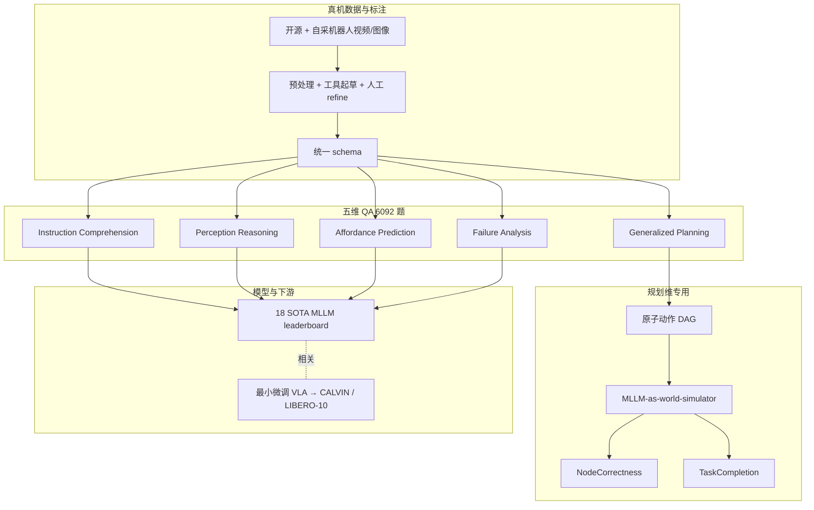

# RoboBench（MLLM 具身大脑综合评测）

**RoboBench**（*A Comprehensive Evaluation Benchmark for Multimodal Large Language Models as Embodied Brain*，arXiv:[2510.17801](https://arxiv.org/abs/2510.17801)，[项目页](https://robo-bench.github.io)，[代码](https://github.com/yulin-luo/RoboBench)，[数据](https://huggingface.co/datasets/LeoFan01/RoboBench)，[结果](https://huggingface.co/datasets/lyl010221-pku/RoboBench-Results)，**ECCV 2026**）把评测焦点从「机器人最终能不能做成」推进到 **System 2 是否具备操纵所需的完整高层认知**：在双系统范式下，将 **多模态大语言模型（MLLM）** 当作 **embodied brain**，沿 **理解意图 → 感知场景 → 规划与泛化 → affordance 细化 → 失败诊断** 全流水线出题，并用 **MLLM-as-world-simulator** 检验规划是否能在物理与视觉约束下达成关键物体状态变化。

## 一句话定义

用 **五维 QA + 真机 grounding 数据 + DAG 规划世界模拟器** 量化「MLLM 作为 embodied brain 在操纵任务里究竟会推理到哪一步」，并把分数与 **下游 VLA 控制** 的可迁移性对齐。

## 英文缩写速查

| 缩写 | 英文全称 | 简要说明 |
|------|----------|----------|
| MLLM | Multimodal Large Language Model | 多模态大语言模型，本基准主要评测对象 |
| VLA | Vision-Language-Action | 视觉-语言-动作策略；RoboBench 分与下游 VLA 显著相关 |
| VLM | Vision-Language Model | 视觉-语言模型，常作为 VLA 的 System 2 骨干 |
| DAG | Directed Acyclic Graph | 规划评测中原子动作因果依赖图 |
| QA | Question Answering | 本基准以选择题 / 多步问答形式组织 6092 题 |
| ECCV | European Conference on Computer Vision | 论文接收会议（2026） |

## 为什么重要

- **补齐「只评执行成功率」的盲区**：许多机器人基准报告 task success，却难以分离 **高层推理失败** 与 **低层控制失败**；RoboBench 明确评 **System 2**，与 [GR00T N1](./paper-hrl-stack-34-gr00t_n1.md)、[Vesta](./paper-vesta-generalist-embodied-reasoning.md) 等 **VLM + action head** 双系统路线直接对话。
- **覆盖完整操纵认知链**：不像单一 VQA 或规划题集，五维 taxonomy 把 **隐式指令、跨本体/物体/视角泛化、affordance、执行 vs 规划失败诊断** 放在同一坐标系，便于定位模型短板。
- **规划评测超越文本匹配**：**MLLM-as-world-simulator** 在 DAG 上 rollout 原子动作，检查 **NodeCorrectness** 与 **TaskCompletion**，减少「听起来合理但不可执行」的假阳性计划。
- **与下游 VLA 有统计信号**：将开源 VLM backbone 最小微调为 VLA 后，RoboBench **object-centric 感知** 与 **CALVIN** 长程表现 **r=0.884**；**LIBERO-10** 更依赖 **静态+dynamic affordance**（r=0.677）——说明不同控制基准依赖不同认知技能，RoboBench 可作 **VLM 选型诊断**。
- **工程可复现**：代码、HF 数据集与 leaderboard 结果均已发布；ECCV 2026 版覆盖 **18** 个闭源/开源/具身 MLLM（含 GPT-5.4、Claude-Opus-4.7、Gemini-3.1-Pro、Qwen3-VL、RoboBrain-2.5、MiMo-Embodied 等）。

## 核心结构

### 五维 taxonomy（14 能力 · 25 任务 · 6092 QA）

| 维度 | 测什么 | 代表子能力 / 任务 |
|------|--------|-------------------|
| **Instruction Comprehension** | 显式 vs **隐式** 意图 | Explicit / Implicit goal |
| **Perception Reasoning** | 四视图感知与时空推理 | Robot-type & robot-view；static/functional attribute；spatial relation；temporal grounding；causality；referential comprehension |
| **Generalized Planning** | 跨场景泛化与长程结构 | Cross-embodiment / object / view / task planning；Q1 长程、Q2 下一步、Q3 子任务状态 |
| **Affordance Prediction** | 可执行接触与运动 | Static contact；dynamic trajectory；navigation base position |
| **Failure Analysis** | 失败归因 | Execution-level vs planning-level error diagnosis |

数据来自 **开源真机操纵数据 + 自采**，强调 **多样本体、属性丰富物体、多视角、记忆驱动导航**；经 **工具辅助 + 人机协同** 标注后统一 schema 自动生成 QA。

### 规划评测：MLLM-as-world-simulator

- 每个任务分解为 **参数化原子动作序列**，构成 **DAG**（因果与时序依赖）。
- **Q1 长程规划**：MLLM 模拟器 rollout 动作，评 **动作对齐** 与 **关键物体状态是否达成**（视觉 + 物理约束）。
- **Q2 下一步规划**：比较预测 skill / object / parameter 与参考。
- **Q3 任务状态估计**：二分类判断子任务是否已完成。

### 与相关基准的定位

| 基准 | 主要对象 | 交互形态 | 与 RoboBench 关系 |
|------|----------|----------|-------------------|
| **RoboBench** | MLLM 作为 **embodied brain** | 被动 QA（多图 + 语言） | 操纵流水线 **五维认知** + 规划世界模拟 |
| [ESI-Bench](./esi-bench.md) | MLLM **空间智能** | **主动探索** 闭环（OmniGibson） | 强调遮挡/容纳等 **隐藏空间结构**；少覆盖操纵 affordance 与失败诊断 |
| [EWMBench](./ewmbench.md) | **具身世界模型** 视频生成 | 开环视频 rollout | 评场景/运动/语义一致性，非 MLLM 高层推理题集 |
| EmbodiedBench / EmbodiedEval | 导航+操作+QA 综合 | 具身环境交互 | 更偏 **端到端 agent**；RoboBench 更细粒度拆 **System 2 认知轴** |

## 流程总览（数据 → QA → 五维评测）

## 主要发现（ECCV 2026 leaderboard 摘要）

- **能力鸿沟大但前沿在进步**：Gemini-3.1-Pro 在感知（67.32）、affordance（85.70）、失败分析（52.95）最均衡；多数 MLLM 各维极不均衡。
- **闭源领先开源约 20 分**；同族内随规模/代际稳定提升。
- **隐式指令是共性难点**：最强显式目标模型在隐式指令上平均掉 **~18 分**；CoT 改写 ablation 表明非单纯 prompt 问题。
- **感知瓶颈在 embodiment 与时序**：functional attribute 可达 82+，但 **robot-view**（53.62）与 **temporal grounding**（50.38）最弱。
- **规划「听起来对、执行不了」**：规划失败 45% 为 **执行错误**（动作序列问题），24% 识别错误，25% 常识/物理约束错误。
- **视觉不可或缺**：GPT-5.4 text-only 在感知（27.12）与 affordance（25.61）接近随机，远低于最佳视觉 MLLM。
- **执行失败诊断极难**：最佳约 **43.71**，远低于规划失败诊断（最高 **80.74**）——需要细粒度空间与物理理解。

## 常见误区或局限

- **不是低层控制或 VLA 端到端基准**：RoboBench 评 **高层 MLLM 认知**；真机成功率仍需 CALVIN、LIBERO、SimplerEnv 等对照。
- **QA 形式 ≠ 在线闭环**：题目以选择题 / 多步问答为主，与 [ESI-Bench](./esi-bench.md) 的逐步探索 API 互补而非替代。
- **规划模拟器依赖 MLLM 能力**：世界模拟器本身有误差上界；DAG 粒度与物理约束抽象需随版本迭代校准。
- **数据与许可证**：HF 数据集与结果卡需单独核对使用条款；复现前以 GitHub README 环境为准。

## 关联页面

- [VLA（Vision-Language-Action）](../methods/vla.md) — 双系统架构与 RoboBench 所评 System 2 骨干
- [Manipulation（操作任务）](../tasks/manipulation.md) — 任务域与 CALVIN / LIBERO 等下游评测背景
- [ESI-Bench（具身空间智能基准）](./esi-bench.md) — 主动空间探索 vs 操纵流水线认知的互补基准
- [EWMBench（具身世界模型生成评测）](./ewmbench.md) — 像素域世界模型质量评测对照
- [Vesta（通用具身推理）](./paper-vesta-generalist-embodied-reasoning.md) — 同类「高层 cognition + 低层 actor」分层路线
- [Manipulation VLA 架构选型](../queries/manipulation-vla-architecture-selection.md) — VLM 骨干选型时可参考 RoboBench 维度分数
- [具身大模型评测基准选型闭环](../queries/embodied-eval-benchmark-selection-loop.md) — 本页是其「① 具身大脑/MLLM 认知评测层」的代表基准，双向回链

## 参考来源

- [RoboBench 论文摘录](../../sources/papers/robo_bench_arxiv_2510_17801.md)
- [RoboBench 仓库与数据归档](../../sources/repos/robo-bench.md)
- Luo et al., *RoboBench: A Comprehensive Evaluation Benchmark for Multimodal Large Language Models as Embodied Brain*, [arXiv:2510.17801](https://arxiv.org/abs/2510.17801)

## 推荐继续阅读

- [RoboBench 项目页](https://robo-bench.github.io) — 交互 leaderboard、demo case、数据与规划管线图
- [yulin-luo/RoboBench（GitHub）](https://github.com/yulin-luo/RoboBench) — 评测脚本与复现说明
- Mees et al., *CALVIN: A Benchmark for Language-Conditioned Policy Learning for Long-Horizon Robot Manipulation Tasks*, [arXiv:2112.03227](https://arxiv.org/abs/2112.03227) — RoboBench 报告 VLM–VLA 相关性的下游长程操纵基准
