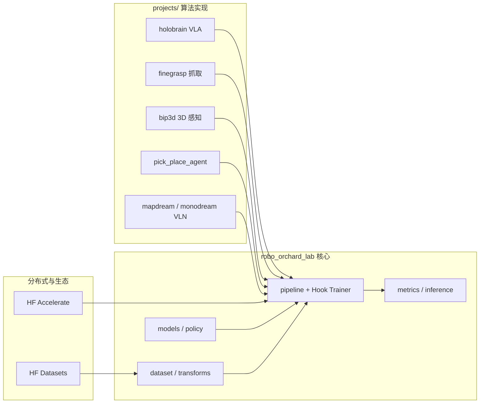
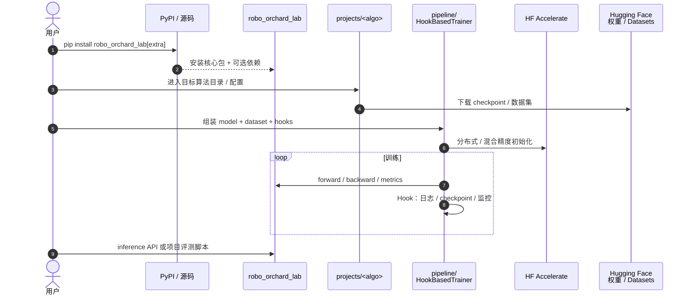

# RoboOrchardLab

**RoboOrchardLab** 是 **Horizon Robotics（地平线）** 在 **RoboOrchard** 大项目下发布的 **Python 具身 AI 训练与评测框架**：核心包 `robo_orchard_lab` 提供 **模块化训练管线**（数据、模型、Hook、Trainer、指标），与 **Hugging Face Accelerate / Datasets** 对齐以支持多 GPU / 多节点扩展；`projects/` 目录收纳 **感知、抓取、VLA、导航** 等 SOTA 算法实现与评测脚本。官方文档见 [horizonrobotics.github.io/robot_lab/robo_orchard/lab](https://horizonrobotics.github.io/robot_lab/robo_orchard/lab/index.html)，PyPI 包名 **`robo_orchard_lab`**（当前版本线 **0.5.x**）。

## 英文缩写速查

| 缩写 | 英文全称 | 简要说明 |
|------|----------|----------|
| VLA | Vision-Language-Action | 视觉–语言–动作端到端策略 |
| HF | Hugging Face | Accelerate、Datasets 等生态组件 |
| BEV | Bird's-Eye View | 鸟瞰图表示，MapDream 等导航方法常用 |
| VLN | Vision-Language Navigation | 视觉–语言导航任务 |
| 3D Det | 3D Object Detection | BIP3D 等 2D–3D 桥接感知任务 |
| MCAP | MCAP | 机器人数据记录容器格式，可选数据集 extra 支持 |

## 为什么重要

- **地平线具身 AI 的「训练基建层」**：与侧重 **人形运动跟踪** 的 [HoloMotion](./holomotion.md)、侧重 **Agent / 导航** 的 [HoloAgent](./holoagent.md) 并列，RoboOrchardLab 覆盖 **操作、感知、VLA、导航** 等算法的 **统一训练与 Model Zoo** 入口。
- **模块化管线而非单脚本堆叠**：`pipeline/trainer.py` + **Hook** 机制允许在不改主干训练循环的前提下替换 **优化器步、监控、回调**，适合研究侧快速试验。
- **算法与框架同仓交付**：`projects/holobrain`（HoloBrain-0 VLA）、`finegrasp_graspnet1b`、`bip3d_grounding`、`pick_place_agent`（RoboTwin 2.0 评测）等 **可直接 `pip install ".[extra]"` 拉取依赖**，降低从论文到可运行代码的路径长度。
- **命名易混淆需主动区分**：文档路径含 `robot_lab/`，与社区 IsaacLab 扩展 **[robot_lab](./robot-lab.md)**（`fan-ziqi`）**不是同一项目**——前者是 Horizon 文档树，后者是 Isaac Lab RL 环境扩展库。

## 核心机制（提炼）

1. **包分层：** `robo_orchard_lab/` 提供 **dataset / models / policy / metrics / distributed / inference** 等子模块；构建时依赖 **`robo_orchard_core`**（`orchard_config.toml`）。
2. **训练抽象：** `HookBasedTrainer` 将 **数据迭代、前向、反向、日志、 checkpoint** 拆为可组合 Hook；与 **Accelerate** 集成做分布式。
3. **算法项目：** `projects/*` 各自维护 **配置、权重下载、评测脚本**；README 链到独立项目页 / arXiv / Hugging Face 集合。
4. **发布形态：** **PyPI 基础包 + optional extras**（如 `[holobrain_0]`、`[finegrasp]`、`[bip3d]`）；部分三方依赖（如 **pytorch3d**）需按官方文档 **手动对齐 torch 版本** 安装。

## 流程总览

## 工程入口（一手链接）

| 类型 | URL |
|------|-----|
| 代码 | [HorizonRobotics/RoboOrchardLab](https://github.com/HorizonRobotics/RoboOrchardLab) |
| 文档 | [horizonrobotics.github.io/robot_lab/robo_orchard/lab](https://horizonrobotics.github.io/robot_lab/robo_orchard/lab/index.html) |
| PyPI | [pypi.org/project/robo_orchard_lab](https://pypi.org/project/robo_orchard_lab/) |
| HoloBrain 项目页 | [horizonrobotics.github.io/robot_lab/holobrain](https://horizonrobotics.github.io/robot_lab/holobrain/) |
| HoloBrain 论文 | [arXiv:2602.12062](https://arxiv.org/abs/2602.12062) |

## 源码运行时序图

节点对齐 [`sources/repos/horizon_robotics_robo_orchard_lab.md`](../../sources/repos/horizon_robotics_robo_orchard_lab.md) 与官方安装 / Trainer 教程。

## 工程实践

| 检查项 | 建议 |
|--------|------|
| 前置 | 先装匹配 CUDA 的 **torch ≥ 2.4**，再装 `robo_orchard_lab` |
| 选型 | 操作/VLA → `[holobrain_0]`；抓取 → `[finegrasp]`；3D 感知 → `[bip3d]` |
| 开发 | `make version && make install-editable`；`make dev-env` 启用 pre-commit |
| 教程 | 文档 **Trainer / Dataset / Model Zoo** 三节对应 `docs/tutorials/*` |
| 评测 | `pick_place_agent` 提供 RoboTwin 2.0 `place_empty_cup` 等任务示例 |

1. **区分训练栈**：本框架服务 **深度学习算法训练与 Model Zoo**；仿真 RL 环境扩展仍看 [robot_lab](./robot-lab.md)（Isaac Lab）或 [HoloMotion](./holomotion.md)（人形跟踪）。
2. **按 extra 装依赖**：避免一次性装全 extras；按目标 `projects/*` 选择，减少 pytorch3d 等版本冲突。
3. **权重与数据**：各项目 README 列出 Hugging Face / 第三方 checkpoint 路径；评测服务器路径与本地需对照 `deploy_policy.py` 中的 `ckpt_root`。

## 局限与风险

- **部分依赖非 PyPI 一键可用**：如 **pytorch3d** 需手动编译或选对 wheel，与 torch/CUDA 强绑定。
- **算法成熟度不均**：README 写明长期目标包含更广 **操作与全身控制**；当前首发侧重 **高级感知、抓取与 VLA**，运控侧仍以 HoloMotion 等独立仓为主。
- **文档站与仓库名大小写**：GitHub 仓为 `RoboOrchardLab`，部分元数据仍引用 `robo_orchard_lab` 小写路径，引用时以 **组织页实际 URL** 为准。
- **与 fan-ziqi/robot_lab 易混**：引用链接务必带 **HorizonRobotics** 组织前缀，避免误链到 Isaac Lab 社区扩展。

## 关联页面

- [VLA（Vision-Language-Action）](../methods/vla.md)
- [robot_lab（IsaacLab 扩展框架）](./robot-lab.md) — 命名对照，不同维护方与目标
- [HoloMotion](./holomotion.md) — 同组织人形运动跟踪栈
- [HoloAgent](./holoagent.md) — 同组织 Agent / 导航能力
- [HMI 开源项目主表导读](../queries/hmi-opensource-projects-coverage.md)
- [机器人视觉感知栈选型闭环](../queries/robot-perception-stack-selection-loop.md) — 本页 `projects/bip3d_grounding` 落在其 ③ 2D→3D 提升层（2D 检测/grounding 桥接 3D 检测），`finegrasp` 则是 ④ 下游策略消费层；本页提供的是训练框架入口，选哪个感知模型仍看该闭环

## 参考来源

- [RoboOrchardLab 仓库归档](../../sources/repos/horizon_robotics_robo_orchard_lab.md)
- [RoboOrchardLab 文档站归档](../../sources/sites/robo-orchard-lab-docs.md)
- [HorizonRobotics/RoboOrchardLab（GitHub）](https://github.com/HorizonRobotics/RoboOrchardLab)

## 推荐继续阅读

- [官方安装指南](https://horizonrobotics.github.io/robot_lab/robo_orchard/lab/getting_started/install.html) — PyTorch 与 optional extras
- [HoloBrain 项目页](https://horizonrobotics.github.io/robot_lab/holobrain/) — RoboOrchard 栈内的通用操作 VLA
- [FineGrasp 项目页](https://horizonrobotics.github.io/robot_lab/finegrasp/index.html) — 精细抓取与 `projects/finegrasp_graspnet1b`
