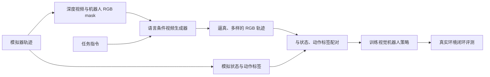

# RoboRender: Robot-Oriented Video Generation for Visual Sim-to-Real Transfer

## 一句话定义

**RoboRender** 用受几何和机器人掩码约束的视频生成模型改变模拟轨迹的视觉外观，同时保留训练策略所需的模拟器状态与动作标签。

## 英文缩写速查

| 缩写 | 英文全称 | 简要说明 |
|---|---|---|
| Sim2Real | Simulation-to-Real | 将仿真中学习的策略迁移至真实机器人 |
| RGB | Red-Green-Blue | 彩色图像通道 |
| RGB-D | Red-Green-Blue plus Depth | 彩色图像与深度图 |
| VLM | Vision-Language Model | 视觉与语言联合建模 |
| OOD | Out-of-Distribution | 与训练数据分布不同的输入或场景 |

## 要解决的问题

模拟器可以低成本生成大量轨迹，但合成图像和真实摄像头画面之间存在外观差异。直接在模拟图像上训练的视觉策略可能把仿真纹理、光照或背景当成线索；常规视觉域随机化能增加外观变化，却未必生成与真实场景一致的图像。

RoboRender 把“动作由模拟器定义”和“视觉由生成模型丰富”分开：模拟器保持状态、几何、运动及动作标签，生成器负责合成更真实的场景外观和干扰物。

## 方法流程

1. **从模拟器取条件：** 为轨迹生成深度视频和机器人 RGB mask 视频，同时保留指令、状态与动作。
2. **按指令生成 RGB 视频：** 视频模型以深度、语言和机器人 mask 为条件，合成材质、背景、光照和视觉干扰。
3. **构成训练样本：** 把生成的 RGB 帧与模拟器的状态和动作配对。
4. **训练并转移策略：** 先用生成数据训练视觉策略，再在真实机器人上做目标任务评测。

生成器不负责决定正确动作；监督动作来自模拟器轨迹。因此，生成视频若改变了物体关系或动作语义，训练标签就可能与像素不一致。该方法需要检验生成质量、跨帧几何一致性和动作标签有效性。

## 论文报告结果

论文在 pick-and-place、关节物体操作和移动操作任务上评估。作者报告基于 RoboRender 生成视频训练的策略平均真机成功率为 71%，并报告相对原始模拟渲染和常规视觉域随机化的提升。论文还展示了对同一模拟轨迹增加生成视频的多样性后，开门任务成功率改善。

这些数值属于论文给定的机器人、任务和评测协议；它们不等同于跨任务、跨硬件保证。应把“生成质量指标”和“真实机器人任务成功率”分别记录。

## 开放状态

本次收录的一手资料包括 arXiv 预印本和论文列出的项目主页。没有从论文或可访问官方来源确认其代码、权重或数据已公开，故当前按论文项目记录，不标记为开源实现。

## 关联页面

- [仿真到真机迁移](../concepts/sim2real.md)
- [域随机化](../concepts/domain-randomization.md)
- [世界-动作模型](../concepts/world-action-models.md)
- [Video Prediction Policy 2（VPP2）](./video-prediction-policy-2.md)

## 参考来源

- [RoboRender 论文归档](../../sources/papers/roborender_arxiv_2610_09254.md)
- [RoboRender 项目页归档](../../sources/sites/robo-render.md)
- [arXiv:2610.09254](https://arxiv.org/abs/2610.09254)
- [项目主页](https://robo-render.github.io/)
