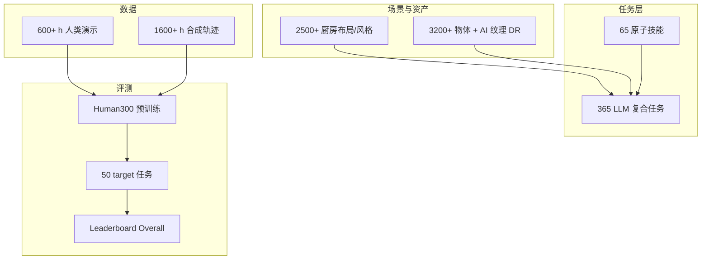
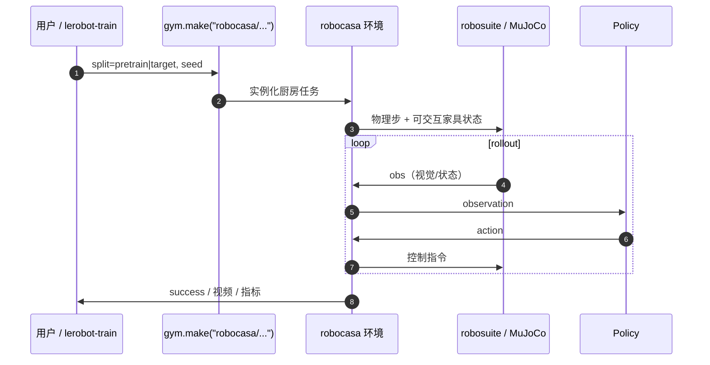

# RoboCasa / RoboCasa365

**RoboCasa** 是德州大学奥斯汀分校（UT Austin）团队发布的大规模 **厨房日常任务仿真框架**（MuJoCo + [robosuite](https://github.com/ARISE-Initiative/robosuite) 后端）。**RoboCasa365**（ICLR 2026）在 RSS 2024 原版上扩至 **365 任务、2500+ 厨房场景、3200+ 物体、2200+ 小时演示**，并提供 [公开 leaderboard](https://robocasa.ai/leaderboard.html) 评测通才策略。

## 一句话定义

用 LLM 策展的厨房复合任务 + 生成式场景/物体资产 + 人类与合成演示数据，在 **robosuite** 上构建可复现的 **仿真成功率榜**——测的是通才策略在居家操作上的多任务与零样本复合泛化，不是工业真机 OSC 规格。

## 英文缩写速查

| 缩写 | 英文全称 | 简要说明 |
|------|----------|----------|
| SR | Success Rate | 任务成功率；Leaderboard Overall 为三拆分均值 |
| VLA | Vision-Language-Action | π₀、GR00T、SmolVLA 等榜上单模型族 |
| LLM | Large Language Model | GPT-4 辅助定义复合任务与场景语义 |
| GPU | Graphics Processing Unit | Isaac Lab-Arena 并行评测对照对象（非本栈默认后端） |
| IL | Imitation Learning | 600+ h 人类演示 + 1600+ h 合成轨迹的主训练范式 |
| MTL | Multi-Task Learning | 50 任务榜的核心设定：Human300 预训练 → target 评测 |

## 先说结论

- **选型：** 若你要在 **厨房/居家操作** 上对标通才模型（π₀、GR00T、Diffusion Policy、RLDX-1 等），RoboCasa365 是当前 **有公开榜、有开源仿真栈** 的主线之一。
- **与 DexBench 分工：** [DexBench](./dexbench.md) 是 RLWRLD × NVIDIA 的 **工业真机灵巧规格**（OSC + Regime，无官方仿真 SR 榜）；RoboCasa 是 **MuJoCo 厨房仿真 SR 榜**。同一词「插入」两边公差与成功谓词不同，**勿混比数字**。
- **版本钉扎：** 评测须对齐 **v1.0.1**（horizon **1.5×**）；GR00T N1.5 等榜上数字已按此重评。
- **开源：** GitHub **已开源**（代码 MIT；资产 CC BY 4.0）；需下载 **~10GB** 厨房资产。

## 为什么重要

- **规模：** 365 任务 × 2500 场景 × 2200+ h 数据，支撑基础模型与终身学习设定。
- **公开榜：** 截至 2026-09-01，**13** 个模型已评测；榜首 **Xiaomi-Robotics-1 Overall 57.4%**，Composite-Unseen 仍仅 **32.1%**——复合零样本仍是瓶颈。
- **跨具身：** 单臂移动平台、人形、带臂四足共用厨房任务语法。
- **生态枢纽：** [Isaac Lab-Arena](./isaac-lab-arena.md) 博客以 RoboCasa 类任务展示 GPU 并行加速；[Lightwheel LW-BenchHub](./lw-benchhub-tour.md) 将 RoboCasa/LIBERO 厨房迁到 Arena EnvHub。

## 核心架构

### RoboCasa365 四支柱

| 支柱 | 规模 | 机制 |
|------|------|------|
| 任务 | 365 日常 + 65 原子 | GPT-4 组合 10 项基础技能（PnP、开门、旋钮、导航等） |
| 资产 | 2500+ 厨房、3200+ 物体 | 建筑杂志布局 + Objaverse / Lightwheel / Luma AI |
| 演示 | 600+ h 人 + 1600+ h 合成 | 遥操作 + 自动轨迹生成；2026-07 复合任务加 subtask 逐帧标注 |
| 评测 | 50 任务公开榜 | Human300 预训练 → Atomic / Composite Seen & Unseen |

### 流程总览

### 源码运行时序图

> 冒烟：`python -m robocasa.demos.demo_tasks`；Gym：`gym.make("robocasa/PickPlaceCounterToCabinet", split="pretrain")`。安装见 [`sources/repos/robocasa.md`](../../sources/repos/robocasa.md)。

## Leaderboard 读法（2026-09-01 快照）

| 指标 | 含义 |
|------|------|
| **Overall** | 50 任务平均成功率 |
| **Atomic-Seen（18）** | 原子任务；预训练见过 |
| **Composite-Seen（16）** | 复合任务；预训练见过 |
| **Composite-Unseen（16）** | 复合任务；预训练**未见过** → 零样本泛化 |

| Rank | Policy | Overall | Composite-Unseen |
|------|--------|---------|------------------|
| 1 | Xiaomi-Robotics-1 | 57.4 | 32.1% |
| 2 | ABot-M0.6 | 46.6 | 7.9% |
| 5 | RLDX-1 | 36.0 | 8.5% |
| 7 | GR00T N1.5 | 23.9 | 2.7% |
| 10 | π0.5 | 16.9 | 1.2% |
| 13 | Diffusion Policy | 6.1 | 1.3% |

完整表见 [Leaderboard 归档](../../sources/sites/robocasa-leaderboard.md)。训练配置展示仅供透明，**不可跨架构直接比**。

## 工程实践

| 步骤 | 做法 |
|------|------|
| 安装 | conda python 3.11 → robosuite **master** → `pip install -e robocasa` → `download_kitchen_assets`（~10GB） |
| 版本 | 评测对齐 **v1.0.1** horizon；复合数据可用 subtask 标注做分层策略 |
| Gym | `split="pretrain"` vs `"target"` 区分厨房/物体池 |
| 遥操作 | `demo_teleop`（键盘 / SpaceMouse） |
| 对标论文 | 报榜数字时写明 RoboCasa 版本与 50 任务协议 |
| 迁移到 Isaac | 走 Lightwheel [LW-BenchHub](./lw-benchhub-tour.md) / Arena EnvHub，**不是**直接 `import robocasa` 进 Isaac Lab |

## 与 DexBench 的对照（勿混名）

| | **RoboCasa365** | **[DexBench](./dexbench.md)** |
|--|-----------------|-------------------------------|
| 场景 | 厨房居家仿真 | 工业桌面真机规格 |
| 后端 | MuJoCo / robosuite | 无官方仿真仓（Arena coming soon） |
| 难度语言 | 任务成功率 + Seen/Unseen | OSC 六轴 + Regime |
| 开源 | **已开源** 仿真 + 榜 | 规范已公开；评测仓待发布 |
| 榜 | robocasa.ai/leaderboard | 无官方 SR 榜 |

## 局限与风险

- **厨房偏置：** 任务生态统计偏向西式厨房，不等价于工厂或物流线。
- **Composite-Unseen 仍低：** 榜首 Overall 57.4% 但 Unseen 复合仅 32.1%，勿夸大「通才已解决长视界」。
- **资产体积：** ~10GB 下载与 MuJoCo 渲染成本；大规模并行不如 Isaac GPU 栈。
- **榜协议演进：** 新提交审核制；历史论文须核对是否 v1.0.1 horizon。
- **与 Isaac 栈非同一环境：** Arena 上 RoboCasa **风格**任务由 Lightwheel 重建，数值不能与原 MuJoCo 榜直接划等号。

## 关联页面

- [DexBench](./dexbench.md) — 工业灵巧规格；仿真侧仍 coming soon
- [Isaac Lab-Arena](./isaac-lab-arena.md) — GPU 并行评测；RoboCasa 类任务迁移对照
- [LW BENCHHUB TOUR](./lw-benchhub-tour.md) — RoboCasa/LIBERO 厨房 + EnvHub
- [LIBERO](./libero-benchmark.md) — 终身学习机械臂套件；常与 RoboCasa 并列引用于 VLA 论文
- [LeRobot](./lerobot.md) — 部分榜模型与数据走 LeRobot 格式
- [RoboCasa365 论文实体](./paper-notebook-robocasa365-a-large-scale-simulation-framework-f.md)
- [Manipulation](../tasks/manipulation.md)
- [具身评测基准选型闭环](../queries/embodied-eval-benchmark-selection-loop.md)

## 参考来源

- [RoboCasa 仓库归档](../../sources/repos/robocasa.md)
- [RoboCasa 项目站归档](../../sources/sites/robocasa-ai.md)
- [RoboCasa365 Leaderboard 快照](../../sources/sites/robocasa-leaderboard.md)

## 推荐继续阅读

- 项目主页：<https://robocasa.ai/>
- 文档：<https://robocasa.ai/docs/introduction/overview.html>
- GitHub：<https://github.com/robocasa/robocasa>
- Leaderboard：<https://robocasa.ai/leaderboard.html>

## 一句话记忆

> RoboCasa365 = 厨房仿真的「通才策略高考」：开源 MuJoCo 栈 + 50 任务公开榜；工业灵巧看 DexBench，GPU 大规模厨房看 Arena × Lightwheel。
