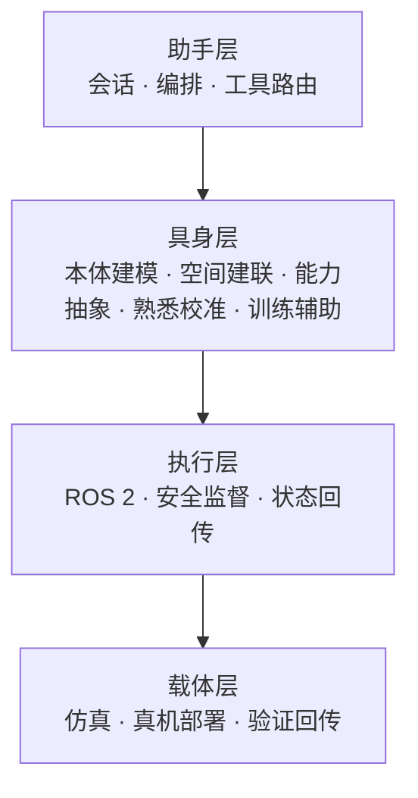

# RoboClaw

**RoboClaw**（[GitHub: MINT-SJTU/RoboClaw](https://github.com/MINT-SJTU/RoboClaw)）是上海交通大学 **MINT 实验室** 推出的开源 **具身智能助手**：目标不是给单台机器人套一层聊天壳，而是让助手在 **本体、传感器、环境与任务变化** 时仍能快速建立认知并迁移技能。

## 一句话定义

**通过「熟悉—校准—能力抽象」把任意机器人变成可被助手理解与调度的具身载体，而不是为每个 URDF 重写一套控制脚本。**

## 英文缩写速查

| 缩写 | 英文全称 | 简要说明 |
|------|----------|----------|
| SJTU | Shanghai Jiao Tong University | 上海交通大学；MINT 实验室隶属 |
| ROS 2 | Robot Operating System 2 | 执行层中间件与真机 IO |
| Embodied AI | Embodied Artificial Intelligence | 具身智能；感知–行动闭环 |
| IK | Inverse Kinematics | 运动学逆解；熟悉与标定环节常用 |
| Sim2Real | Simulation to Real | 仿真验证后上真机 |

## 核心信息

| 字段 | 内容 |
|------|------|
| 机构 | 上海交通大学（SJTU）· MINT 实验室 |
| 状态 | early stage（README 自标） |
| 上游参考 | [nanobot](https://github.com/HKUDS/nanobot)、[OpenClaw](./openclaw.md) 助手线 |

## 为什么重要

- **问题层级高于「自然语言发 cmd_vel」：** [RosClaw](./rosclaw.md) 解决 IM→ROS2 工具调用；RoboClaw 追问 **换本体后技能是否仍可用**。
- **熟悉流程产品化：** 新机器人接入时枚举关节/传感器、试探动作、校验位形与边界，再生成 **能力图谱**——比硬编码 URDF 适配更可维护。
- **能力抽象：** 高层语义动作（如「抓取」）映射到不同本体的子动作序列，支撑跨机械臂/双臂形态迁移。
- **训练辅助：** 在线示教、急停判断、环境恢复与继续训练——贴近真机 RL / 模仿学习闭环。

## 核心结构/机制

### 四层架构（文内归纳 + README 方向）

| 层 | 职责 |
|----|------|
| **助手** | 用户交互、多智能体编排；与 OpenClaw 设计理念相近 |
| **具身** | 关节/传感器枚举、坐标系与工作空间、语义技能接口、熟悉校准 |
| **执行** | ROS2 连接控制器、服务/动作、异常与安全监督 |
| **载体** | 仿真与真机切换、部署与数据回传 |

### 与 RosClaw 的分工

| 维度 | RosClaw | RoboClaw |
|------|---------|----------|
| 核心问题 | 如何用 IM 自然语言调用 ROS2 | 如何让助手理解并迁移到新本体 |
| 典型用户 | 运维/演示/远程操控 | 研发、跨平台部署、技能迁移 |
| 集成关系 | 可作 **交互前端** | 可作 **具身能力后端**（方向性，非已发布一体产品） |

## 工程实践

| 场景 | 做法 |
|------|------|
| 安装 | README：`AI-assisted setup` 或 `docs/INSTALLATION.md` / `DOCKERINSTALLATION.md` |
| 贡献方向 | 具身架构、能力抽象、ROS2 集成、仿真适配、评测与 DX |
| 社区 | Discord；GitHub Issues |

## 局限与风险

- **早期阶段：** API 与架构仍快速迭代；生产部署需跟踪 Release 与 breaking changes。
- **与 RosClaw 未捆绑：** 古月居文中的「组合使用」为架构互补叙述，非默认安装路径。
- **跨本体泛化边界：** 能力迁移仍依赖熟悉数据与仿真/真机验证；不能替代安全认证与现场急停。
- **文档与代码同步：** News 条目密集（2026-03～04）；选型以仓库 `docs/` 与 issue 为准。

## 关联页面

- [RosClaw](./rosclaw.md) — IM→ROS2 自然语言控制（交互层）
- [OpenClaw](./openclaw.md) — 助手运行时参考线
- [ros2_control](./ros2-control.md) — ROS2 控制器生态
- [跨本体迁移策略](../queries/cross-embodiment-transfer-strategy.md)
- [运动重定向](../concepts/motion-retargeting.md)

## 参考来源

- [RoboClaw 代码仓](../../sources/repos/roboclaw.md)
- [古月居：用自然语言控制 ROS2 机器人的完整技术方案](../../sources/blogs/wechat_guyue_rosclaw_ros2_natural_language.md)

## 推荐继续阅读

- 仓库：<https://github.com/MINT-SJTU/RoboClaw>
- Discord：<https://discord.gg/HNcDbDYR>
