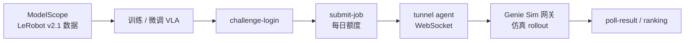

# RoboColiseum（Genie Sim 仿真挑战赛）

**RoboColiseum**（[官网](https://robocoliseum.ai/)，[榜单](https://robocoliseum.ai/leaderboard)）是智元在 **[Genie Sim 3.0](./genie-sim-3.md)** 上运营的 **在线仿真挑战赛与排行榜**：参赛者下载 **LeRobot v2.1** 训练数据、在自有 GPU 上部署 VLA/操纵策略，经 **WebSocket 反向隧道** 接入托管网关，在 **G2_omnipicker** 等仿真任务上评测并上榜。Challenge 文档、数据下载脚本与推理协议集成于 [AgibotTech/genie_sim](https://github.com/AgibotTech/genie_sim/tree/main/source/geniesim_benchmark/skills/robocoliseum)。

## 一句话定义

**四块独立能力榜 + 隧道式远程推理评测 + ModelScope 开放训练数据**，把 Genie Sim 仿真任务变成可对比、可复现的 **VLA 操纵策略公开竞技场**。

## 英文缩写速查

| 缩写 | 英文全称 | 简要说明 |
|------|----------|----------|
| VLA | Vision-Language-Action | 视觉–语言–动作策略；本榜主要评测对象 |
| API | Application Programming Interface | Challenge 平台 REST + WebSocket 隧道接口 |
| WS | WebSocket | 参赛者 inference agent 与网关的长连接传输 |
| SR | Success Rate | 任务成功率；榜单以平台聚合 **score** 排序（具体协议以官方为准） |
| SFT | Supervised Fine-Tuning | 参赛者常用 LeRobot 数据对基座模型微调后提交 |

## 为什么重要

- **与 Genie Sim 训练栈闭环：** 同生态下的 **场景仿真 + Benchmark + 公开榜**，降低「只在自家 sim 里好看」的信息不对称。
- **远程推理、本地权重：** 平台不托管 checkpoint；选手自管 GPU 与模型，更贴近真实部署约束，也避免权重上传门槛。
- **四榜分拆能力维：** `instruction` / `spatial` / `manip` / `robust` **独立计分**，比单一总分更能暴露策略短板（截至 2026-09-15 公开榜，[DM0.5](./dexmal-dm05.md) 在四榜均列第一）。
- **开放数据与 skill 文档：** ModelScope **GenieSim3.0-Dataset** 与 genie_sim 内 `challenge-*` skill 使「训→提→跑隧道→查分」路径可文档化复现。

## 核心原理

### 四块能力榜

| Board | 能力侧重（策展） |
|-------|------------------|
| `instruction` | 自然语言指令跟随 |
| `spatial` | 空间关系与布局理解 |
| `manip` | 双臂精细操作 |
| `robust` | 扰动与鲁棒性 |

各榜通过 `GET /api/challenge/leaderboard?board=<name>` 查询；**不存在跨榜加总排名**。

### 参赛者端到端流程

1. **数据：** `challenge-download-datasets` → ModelScope `agibot_world/GenieSim3.0-Dataset`（instruction / manipulation / sim2real 等 suite）。
2. **提交：** `POST /api/challenge/job` 指定 `model_name` 与 `board`；**消耗每日提交 slot**（额度以 `GET /api/challenge/submission/quota` 为准）。
3. **推理：** 本地运行 tunnel client（`JOB_UUID` + `TUNNEL_ENDPOINT`）；并发受 `PARALLELISM` 限制。
4. **协议：** msgpack JSON-RPC `infer`；输入含 **head / hand_left / hand_right** JPEG、**14+5+2** 维关节与夹爪 state、语言 `prompt`（详见 genie_sim `corobotpolicy.py`）。

### 与相关基准定位

| 基准 | 主要对象 | 与 RoboColiseum |
|------|----------|-----------------|
| **RoboColiseum** | Genie Sim 上 **四能力维** 仿真策略榜 | 本页 |
| [Genie Sim Benchmark](./genie-sim-3.md) | 智元五类能力仿真评测叙事 | 同仿真栈；RoboColiseum 为 **在线挑战赛产品化** |
| [RoboDojo](./robodojo.md) | sim+real 统一操纵评测 | 更重 **真机 RealEval** 与 XPolicyLab 适配；RoboColiseum 当前以 **Genie Sim 隧道仿真** 为主 |
| LIBERO / RoboTwin 等 | 固定任务套件仿真榜 | 可互补；RoboColiseum 强调 **智元 G2 本体 + 四榜分拆 + 隧道提交** |

## 开源与工程实践

| 项 | 状态 / 要点 |
|----|-------------|
| **Challenge skill** | **已开源** — [genie_sim/skills/robocoliseum](https://github.com/AgibotTech/genie_sim/tree/main/source/geniesim_benchmark/skills/robocoliseum) |
| **训练数据** | **已开放** — ModelScope GenieSim3.0-Dataset（LeRobot v2.1） |
| **平台服务** | 托管 API + 榜单；无独立 RoboColiseum GitHub 仓 |
| **参赛者权重** | **不上传**；本地推理经隧道对接 |
| **官方 pip SDK** | **无** — 须自备 tunnel client；baseline 示例指向外部推理仓 |
| **环境状态** | `~/.simubotix-challenge.env` 持久化 token / job 元数据 |

### 公开榜快照（instruction board，2026-09-15 API）

| Rank | 组织 | 模型 | Score |
|------|------|------|-------|
| 1 | Dexmal | DM0.5 | 0.844 |
| 2 | 极佳科技 | GigaBrain-0.7 | 0.817 |
| 3 | 清华大学 | Z0-AE-Instruction | 0.812 |

> 四榜榜首与分数以 [官网榜单](https://robocoliseum.ai/leaderboard) 为准；本库 [DM0.5](./dexmal-dm05.md) 实体页链到 OpenDM 复现栈。

## 常见误区与局限

- **误区：有一个 `pip install robocoliseum`。** 官方 skill 明确 **无** 独立 Simulation SDK；协议以 genie_sim 源码与 skill 为准。
- **误区：提交 job = 上传模型文件。** 平台记录 `model_name` 与配置；**权重留在选手侧**，经隧道在线推理。
- **局限：** 榜单为 **仿真隧道评测**，与真机成功率仍有 gap；每日提交额度与并发 `PARALLELISM` 限制大规模 sweep。
- **局限：** Baseline checkpoint 命名与 board 强绑定，混用 checkpoint/board 会直接导致无效提交。

## 关联页面

- [Genie Sim 3.0](./genie-sim-3.md) — 仿真平台与 Genie Sim Benchmark 叙事
- [Dexmal DM0.5（OpenDM）](./dexmal-dm05.md) — 2026-09 四榜领先的开源 VLA 栈
- [RoboDojo](./robodojo.md) — 另一类 sim+real 统一操纵公益榜
- [LeRobot](./lerobot.md) — 训练数据格式与 `lerobot-train` 生态
- [具身评测基准选型闭环](../queries/embodied-eval-benchmark-selection-loop.md)

## 参考来源

- [RoboColiseum 官网归档](../../sources/sites/robocoliseum.md)
- [Genie Sim RoboColiseum skills 归档](../../sources/repos/genie_sim_robocoliseum.md)
- [Genie Sim 3.0 源码归档](../../sources/repos/genie_sim.md)

## 推荐继续阅读

- [RoboColiseum 官网](https://robocoliseum.ai/)
- [Leaderboard](https://robocoliseum.ai/leaderboard)
- [Genie Sim — robocoliseum skills](https://github.com/AgibotTech/genie_sim/tree/main/source/geniesim_benchmark/skills/robocoliseum)
- [ModelScope GenieSim3.0-Dataset](https://www.modelscope.cn/datasets/agibot_world/GenieSim3.0-Dataset)
