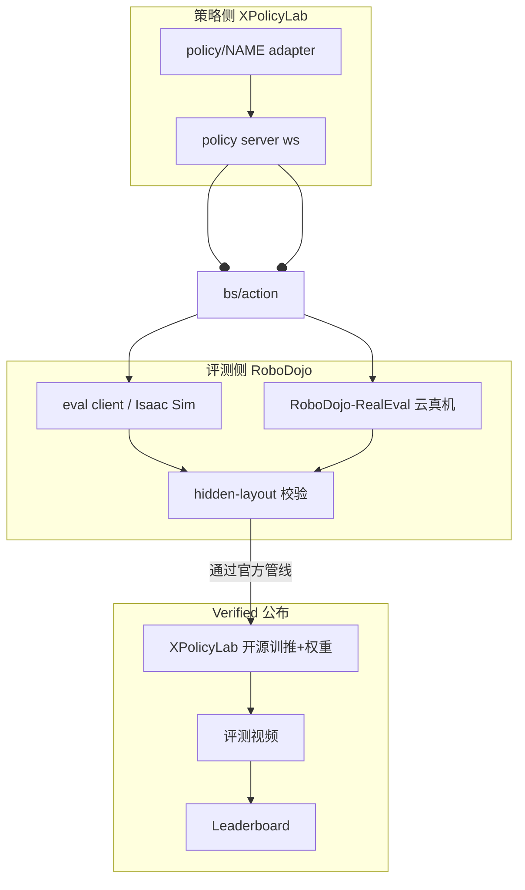
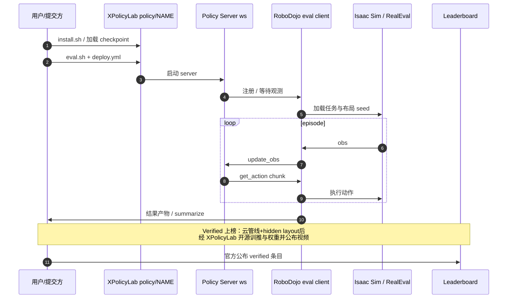

# RoboDojo（统一仿真–真机通用操纵评测）

**RoboDojo**（*A Unified Sim-and-Real Benchmark for Comprehensive Evaluation of Generalist Robot Manipulation Policies*，arXiv:[2607.04434](https://arxiv.org/abs/2607.04434)，[官网](https://robodojo-benchmark.com/)，[代码](https://github.com/RoboDojo-Benchmark/RoboDojo)，[榜单](https://robodojo-benchmark.com/leaderboard)）面向 **通用机器人操纵策略（含 VLA）**，把 **可扩展仿真评测** 与 **可复现真机评测** 放在同一协议与接口下：仿真侧 **42** 任务覆盖五类能力维，真机侧 **18** 任务覆盖 **Piper X / Piper / ARX X5**；策略侧由 [XPolicyLab](./xpolicylab.md) 统一适配。2026-07 起正式开放 **长期公益线上评测与 verified 上榜**（[Eval](https://robodojo-benchmark.com/eval)）。

## 一句话定义

用 **Isaac Sim 异构并行仿真（五维 42 任务）+ RoboDojo-RealEval 标准化真机（18 任务）+ XPolicyLab 统一策略接口**，对通用操纵策略做可复现、可社区监督的 sim-and-real 综合评测与公益榜单。

## 英文缩写速查

| 缩写 | 英文全称 | 简要说明 |
|------|----------|----------|
| VLA | Vision-Language-Action | 视觉–语言–动作通用策略；本榜主要评测对象之一 |
| RealEval | RoboDojo Real-World Evaluation | 远程云真机评测系统（标准硬件、复位、协议、部署接口） |
| DR | Domain Randomization | 仿真任务文档中的域随机化设定 |
| EE | End-Effector | 末端执行器；策略动作常见表示空间 |
| WSA | WebSocket Adapter | XPolicyLab 默认 `protocol: ws` 策略服务协议 |
| MIT | Massachusetts Institute of Technology License | 官方评测仓根 `LICENSE` 文本（README 另有 Non-Commercial 文案，引用时以 LICENSE 为准） |

## 为什么重要

- **补「只 sim 或只 real」的评测断层：** 仿真吞吐高但缺物理部署压力；真机代表性强但贵且难复现。RoboDojo 强制同一策略栈跨两侧报告，对齐 [sim↔real 评测 gap](../concepts/sim-vs-real-eval-gap.md) 校准需求。
- **能力维而非换皮任务：** 五维（泛化 / 记忆 / 精度 / 长程 / 开放词汇）刻意拉开难度，暴露简单基准掩盖的失败模式。
- **工程一次集成：** [XPolicyLab](./xpolicylab.md) 把 40+ 前沿模型接到统一观测–动作契约，本地 debug → 仿真 → 真机云评测路径清晰。
- **公益治理 + 开源上榜门槛：** AI MMLab Club 与学术机构公益运行；**分数公开前**须开源训推与权重并公布视频——比「只贴数字」的社区摘录榜（如 [VLA SOTA Leaderboard](./vla-sota-leaderboard.md)）更强复现约束。

## 核心原理

### 任务与能力维

| 侧 | 规模 | 测什么 |
|----|------|--------|
| **仿真** | **42** 任务 | **Generalization / Memory / Precision / Long-Horizon / Open**（开放词汇指令） |
| **真机** | **18** 任务 | 物理部署条件下的操纵；本体 **ARX X5、Piper、Piper X** |
| **并行** | 异构并行 | 不同任务 / 场景 / 进程在 Isaac Sim 上并发，加速反馈 |
| **资产** | 配置驱动 | 刚体、铰接、可变形物体同场景配置 |

仿真任务细目与真机任务表见官方文档：[Simulation Tasks](https://robodojo-benchmark.com/doc/sim-tasks/)、[Real Tasks](https://robodojo-benchmark.com/doc/real-tasks/)。

### 分工：RoboDojo vs XPolicyLab

| 组件 | 负责 |
|------|------|
| **RoboDojo** | 仿真客户端、任务与资产、环境配置、Docker runtime、结果产物；本 release **eval-only** |
| **XPolicyLab** | 模型依赖、checkpoint、policy server、适配器、观测/动作契约；官方上榜产物发布口 |
| **RoboDojo-RealEval** | 远程云真机：标准化硬件、场景复位、评测协议、部署接口 |

### 长期公益评测与 verified 上榜规则（2026-07 开放）

运营声明：榜单由 **AI MMLab Club（非营利）** 维护，全球学术伙伴共治，**无商业资助/赞助**。

| 阶段 | 要求 |
|------|------|
| **Private 迭代** | 可通过远程 policy server 接官方评测客户端；**不必**先开源代码/权重 |
| **Verified 公布** | ① 走官方线上评测系统；② 仿真 **三 seed** mean±std，真机覆盖三本体；③ **hidden-layout** 一致性校验（公开布局为主榜，隐藏布局防刷榜）；④ 分数公开前经 **XPolicyLab** 释放训推与部署代码、evaluated checkpoint、配置、加载推理与统一接口评测说明；⑤ **公布评测视频** |
| **非 verified** | 缺完整评测产物的结果单独标注，不算官方 verified 条目 |

入口：[Eval](https://robodojo-benchmark.com/eval) · [Protocol](https://robodojo-benchmark.com/leaderboard/protocol) · [Leaderboard](https://robodojo-benchmark.com/leaderboard)。

### 与相关基准定位

| 基准 | 主要对象 | 与 RoboDojo |
|------|----------|-------------|
| **RoboDojo** | 通用操纵 **策略闭环成功率**（sim+real） | 本页 |
| [RoboBench](./robo-bench.md) | MLLM 作 **embodied brain** 的 QA 认知 | 上层认知代理；不替代策略成功率 |
| [VLA SOTA Leaderboard](./vla-sota-leaderboard.md) | 论文摘录多基准分数 | **不重跑**；RoboDojo 为官方重跑 + 开源门槛 |
| RoboCasa / RoboTwin 等 | 仿真操纵套件 | 可互补；RoboDojo 强调五维难度与真机 RealEval |

## 流程总览（适配 → 评测 → 上榜）

## 工程实践

| 维度 | 要点 |
|------|------|
| **栈** | Python 3.11 · Isaac Sim **5.1** · Isaac Lab **2.3**（README 徽章） |
| **本地评测** | 文档 Quick Evaluation；XPolicyLab `EVAL_ENV_TYPE=debug` 可先无仿真验契约 |
| **数据** | XPolicyLab 脚本可拉 RoboDojo HDF5 / LeRobot / `RoboDojo_real` 等导出 |
| **种子与布局** | 公开布局可本地复现；官方榜另做隐藏布局一致性检查 |
| **上榜路径** | 云评测通过 → XPolicyLab PR 附 checkpoint 下载脚本 → 公布视频 → verified 榜 |

### 源码运行时序（评测闭环）

关键复现路径：以 [XPolicyLab README](https://github.com/XPolicyLab/XPolicyLab) 的 `demo_policy` 与 [RoboDojo 文档 Usage](https://robodojo-benchmark.com/doc/usage/) 为准；官方榜分以云评测管线为准，本地分数用于迭代。

## 局限与风险

- **误区：本地仿真分 = verified 榜分。** 官方条目须经云评测与 hidden-layout；本地公开布局可复现但不足以单独认证。
- **误区：私有远程评测分数可直接宣传为官方榜。** 无完整开源产物的结果不算 verified。
- **许可证口径：** 根 `LICENSE` 为 **MIT**；README 仍出现 Non-Commercial 徽章/文案——引用与商用前自行核对最新 LICENSE。
- **算力与硬件门槛：** 全量 42 任务异构并行与真机三本体覆盖成本高；论文早期集成 30 策略，仓内适配持续增长，引用「多少模型」须标注核查日。
- **与认知基准不可混比：** [RoboBench](./robo-bench.md) 高分不蕴含 RoboDojo 高成功率。

## 关联页面

- [XPolicyLab](./xpolicylab.md) — 策略适配、O(N+M) 契约与上榜开源口（arXiv:2608.09892）
- [VLA](../methods/vla.md) — 通用操纵策略方法总览
- [Manipulation](../tasks/manipulation.md) — 操纵任务域
- [具身评测基准选型闭环](../queries/embodied-eval-benchmark-selection-loop.md) — 本页落在策略成功率层与 sim↔real 层
- [具身评测基准知识链](../overview/hub-embodied-eval-benchmark.md) — 四层评测枢纽
- [仿真评测基础设施](../concepts/simulation-evaluation-infrastructure.md) — 闭环仿真评测方法论
- [仿真 vs 真机评测 gap](../concepts/sim-vs-real-eval-gap.md) — 外推校准
- [RoboBench](./robo-bench.md) — MLLM 认知评测对照
- [VLA SOTA Leaderboard](./vla-sota-leaderboard.md) — 论文摘录榜对照
- [Xiaomi-Robotics-1](./xiaomi-robotics-1.md) — 已报 RoboDojo 仿真分数的 VLA 案例
- [PRM-as-a-Judge](./paper-prm-as-a-judge.md) — 冻结 2026-07-03 公开视频做过程评测；SR 与 OPD 排名不完全一致
- [Isaac Gym / Isaac Lab](./isaac-gym-isaac-lab.md) — 仿真栈底座

## 参考来源

- [论文摘录 robodojo_arxiv_2607_04434](../../sources/papers/robodojo_arxiv_2607_04434.md)
- [官网归档 robodojo-benchmark](../../sources/sites/robodojo-benchmark.md)
- [仓库归档 RoboDojo](../../sources/repos/robodojo.md)
- [仓库归档 XPolicyLab](../../sources/repos/xpolicylab.md)
- [公告：开放长期公益评测](../../sources/blogs/robodojo_open_longterm_eval_2026-07.md)

## 推荐继续阅读

- [RoboDojo Leaderboard Protocol](https://robodojo-benchmark.com/leaderboard/protocol) — 官方完整性与反刷榜全文
- [RoboDojo Documentation](https://robodojo-benchmark.com/doc/) — 安装、任务与 Quick Evaluation
- [XPolicyLab CONTRIBUTING / adapter 标准](https://github.com/XPolicyLab/XPolicyLab) — 上榜 PR 与 `demo_policy` 参考实现
