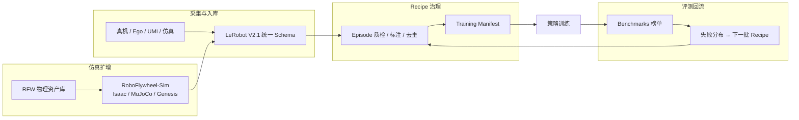

# RoboFlywheel

**RoboFlywheel**（<http://roboflywheel.com>）是面向 **Physical AI / 具身智能** 的 **开放数据基础设施门户**，由 **阿里巴巴** 联合 **上海交通大学**、**清华大学** 等共建。站点以「**一个飞轮，四个开放方向**」组织：**数据集（Datasets）**、**数据配方（Recipes）**、**仿真与物理资产（Simulation）**、**评测榜单（Benchmarks）**——试图把多源真机/仿真/Ego 数据、可复现处理管线、跨引擎仿真与统一标尺评测收进同一入口，降低「数据—训练—评测」链路的工程摩擦。

## 一句话定义

**具身数据飞轮的开放基础设施入口**——不是单一数据集，而是 **LeRobot 格式数据目录 + 声明式 Recipe 治理 + 跨引擎 Sim/World 资产 + 公开榜单聚合** 的组合平台。

## 英文缩写速查

| 缩写 | 英文全称 | 简要说明 |
|------|----------|----------|
| RFW | RoboFlywheel | 平台与 GitHub 组织 `RoboFlywheel-com` 品牌前缀 |
| RFW-A / RFW-S / RFW-W | RoboFlywheel Articulation / Soft / World | 铰链体 / 柔体 / 物理资产宇宙三条资产产品线 |
| EEF | End-Effector | 末端执行器；Recipe 示例以 EEF Cache 为混合单元 |
| VLA | Vision-Language-Action | 语言条件操作策略；Recipe 页展示 VLA 预训练/后训练配方示例 |

## 为什么重要

- **飞轮需要「基础设施」而不只是概念页**：广义 [Data Flywheel](../concepts/data-flywheel.md) 描述闭环逻辑；RoboFlywheel 试图把 **格式统一、配方可复现、仿真可扩、榜单可对照** 落成可访问门户，与 [LeRobot](./lerobot.md) 生态（V2.1 数据集、训练 CLI）直接对齐。
- **跨引擎仿真缺口**：业界仿真栈碎片化（Isaac / MuJoCo / Genesis 各一套资产与任务接口）；[RoboFlywheel-Sim](https://github.com/RoboFlywheel-com/RoboFlywheel-Sim) 宣称 **一份声明式场景描述** 编译到三端，并把 **跨引擎成功率差** 作为可读指标（站点示例：9 套件上 **≤ 1.9 pt**）。
- **评测回流位**：`/benchmarks` 聚合 **LIBERO**、**RoboTwin-2**、**Meta-World**、**RoboCasa GR1 Tabletop** 等结果，并引入 **WB-Policy-Bench**（全身移动操作的组合/场景泛化）；与 [具身评测知识链](../overview/hub-embodied-eval-benchmark.md) 互补——偏 **产业侧统一入口** 而非单篇论文基准。
- **与 RoboWheel 论文区分**：CVPR 2026 **[RoboWheel](https://zhangyuhong01.github.io/Robowheel)** 是 HOI 视频→跨本体监督的 **学术数据引擎**（HORA 数据集）；RoboFlywheel 是 **阿里系开放基础设施品牌**，二者同名不同物。

## 核心结构（四个开放方向）

| 方向 | 路由 | 机制 | 典型产出 |
|------|------|------|----------|
| **Datasets** | `/datasets` | 多源数据 → **LeRobot V2.1**；统一 Episode Annotation Schema；ModelScope 拉取 | 真机/Ego/仿真混合训练集 |
| **Recipes** | `/recipes` | Episode 粒度治理；**Govern once, mix many**；`recipe.yaml` + `deployment.yaml` | Training Manifest；一条命令进 [Action Chunking](../methods/action-chunking.md) / VLA 训练 |
| **Simulation** | `/simulation` | **RoboFlywheel-Sim** 跨引擎；**EmbodiedAtoms** 412 万物理标定资产（RFW-R/A/S） | 仿真轨迹、域随机化场景、sim-to-real 对照 |
| **Benchmarks** | `/benchmarks` | Evo-Studio 等 **公开榜单快照**；可筛开源/训练方式 | 可比较、可申诉的模型排名表 |

## 流程总览（飞轮主干）

## 工程实践

| 组件 | 入口 | 复现要点 |
|------|------|----------|
| 门户 | <http://roboflywheel.com> | SPA；静态资源 `g.alicdn.com/robo/robo/3.0.4/` |
| GitHub 组织 | [RoboFlywheel-com](https://github.com/RoboFlywheel-com) | Recipe README 可读；Sim **源码待 2026-10 末** |
| 数据下载 | ModelScope `RoboFlywheel/*` | 站点提示 `pip install modelscope` + `modelscope download --dataset ...`；**部分集仍 pending upload** |
| Recipe 运行 | [RoboFlywheel-Recipe](https://github.com/RoboFlywheel-com/RoboFlywheel-Recipe) | `run(recipe="recipe.yaml", deployment="deployment.yaml")`；LeRobot 转换见 `raw2lerobot/SKILL.md` |
| 共建联系 | RoboFlywheel@service.alibaba.com | 站点页脚「欢迎加入共建」 |

### 开源状态（截至 2026-09-24）

| 资源 | 判定 | 备注 |
|------|------|------|
| RoboFlywheel-Recipe 框架 | **部分 / 待发布** | 文档与 Skill 可见；核心算子 **2026-10 末** |
| RoboFlywheel-Sim | **待发布** | README 明确 **Pre-release**，代码未公开 |
| RFW-A / RFW-S / RFW-W | **文档开源，bulk 数据待发布** | ModelScope 链标 Coming soon |
| /datasets 目录条目 | **部分待上传** | 交互提示 ModelScope 地址待补充 |
| /benchmarks 快照 | **只读聚合** | 内嵌公开榜单 JSON，非独立评测框架仓 |

## 局限与风险

1. **发布窗口风险**：Sim、Recipe 核心与 ModelScope 大库集中在 **2026-10** 前后；入库日 **不可假设** 已可完整复现站点叙事。
2. **与 RoboWheel 易混淆**：HOI 数据引擎 **RoboWheel**（HORA）与 **RoboFlywheel** 基础设施是不同项目。
3. **榜单快照非实时**：Benchmark 区部分标注「模拟数据 · 仅用于交互演示」；正式选型应回源 **Evo-Studio / 各基准官方仓库**。
4. **封闭模型条目**：榜单含 `openness: closed` 模型（如 PriorVLA、Riemann-1.0）；对比时需同时看 **开源状态 + 训练方式** 筛选器。

## 关联页面

- [Data Flywheel（具身数据飞轮）](../concepts/data-flywheel.md)
- [飞轮最小闭环（避免空转）](../concepts/embodied-data-flywheel-minimal-closed-loop.md)
- [LeRobot](./lerobot.md)
- [RoboTwin](./robotwin.md)
- [Isaac Gym / Isaac Lab](./isaac-gym-isaac-lab.md)
- [具身评测基准知识链](../overview/hub-embodied-eval-benchmark.md)
- [具身数据纵深路线](../../roadmap/depth-embodied-data.md)

## 参考来源

- [RoboFlywheel 官网](../../sources/sites/roboflywheel-com.md)
- [RoboFlywheel-com GitHub 组织](../../sources/repos/roboflywheel-com.md)

## 推荐继续阅读

- [RoboFlywheel 门户](http://roboflywheel.com)
- [RoboFlywheel-Recipe 仓库](https://github.com/RoboFlywheel-com/RoboFlywheel-Recipe)
- [RoboFlywheel-Sim 仓库（pre-release README）](https://github.com/RoboFlywheel-com/RoboFlywheel-Sim)
- [LeRobot 文档](https://huggingface.co/docs/lerobot/index)
