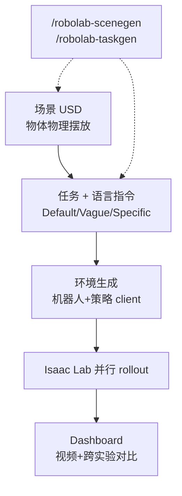
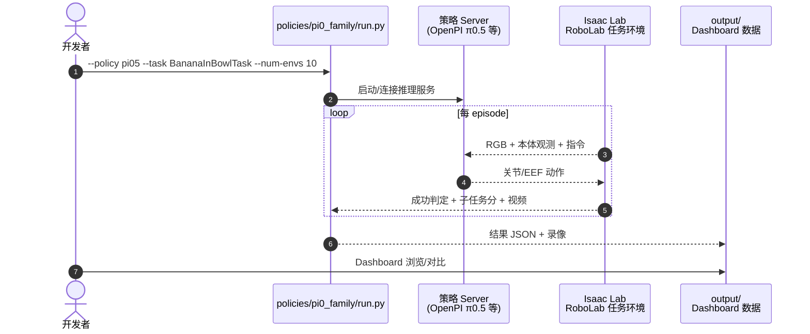

# RoboLab（通用策略高保真仿真评测）

**RoboLab**（*RoboLab: A High-Fidelity Simulation Benchmark for Analysis of Task Generalist Policies*，arXiv:[2604.09860](https://arxiv.org/abs/2604.09860)，RSS 2026，[项目页](https://research.nvidia.com/labs/srl/projects/robolab/)，[代码](https://github.com/NVLabs/RoboLab)，[Leaderboard](https://research.nvidia.com/labs/srl/projects/robolab/leaderboard.html)）是 NVIDIA SRL 提出的 **机器人–策略无关** 仿真评测平台：面向**仅用真机数据训练、不在仿真数据上共训**的通用操纵策略，测试任务泛化、语言理解与鲁棒性，并提供可扩展的场景/任务生成工具链。

## 一句话定义

用 **Isaac Lab 高保真仿真 + RoboLab-120 新任务库 + server-client 策略接口 + NPE 敏感性分析**，在刻意降低与 DROID 训练重叠的前提下评测真机策略的仿真行为，且整体排名与 RoboArena 真机 Elo **Spearman ρ=0.94**。

## 英文缩写速查

| 缩写 | 英文全称 | 简要说明 |
|------|----------|----------|
| VLA | Vision-Language-Action | 视觉–语言–动作通用策略；榜单主要评测对象 |
| WAM | World Action Model | 视频/世界模型类策略（如 Cosmos3-Nano-Policy） |
| NPE | Neural Posterior Estimation | 环境参数敏感性后验估计方法 |
| SR | Success Rate | 任务成功率 |
| DROID | Distributed Robot Interaction Dataset | 大规模真机数据集；RoboLab 刻意与之拉开物体词表重叠 |
| EGO | Ego-centric | 自中心相机视角配置 |
| RSS | Robotics: Science and Systems | 2026 悉尼会议发表 venue |

## 为什么重要

- **反饱和设计：** 120 个全新任务、三能力轴×三难度；仅 **68.7%** 基准物体出现在 DROID 训练词表，缓解「训练–评测同域」导致的虚高成功率。
- **真机策略零样本进仿真：** 不与仿真数据共训即可评测，直接服务「仿真能否预测真机策略表现」这一核心问题（亦被 [Hydra-0](./paper-hydra-0.md) 用作开环 replay 代理，r=0.96）。
- **可扩展生成：** 分钟级手搓或 LLM agent（`/robolab-scenegen`、`/robolab-taskgen`）生成场景与任务，任务库与机器人/策略解耦。
- **sim–real 校准证据：** 与 RoboArena 真机排名 **ρ=0.94**，比单纯 sim 榜更具外推可信度。
- **工程完备：** Apache-2.0 开源、并行 `--num-envs`、自包含 Dashboard、内置 π0.5 客户端。

## 核心信息

| 字段 | 内容 |
|------|------|
| 机构 | 英伟达（NVIDIA）等；合作多伦多大学、悉尼大学 |
| 仿真栈 | Isaac Sim 5.0/5.1 + Isaac Lab 2.2/2.3 |
| 任务规模 | **RoboLab-120**（平均 2.02 子任务/任务，9.0 物体/任务） |
| 默认本体 | DROID 形态单臂 Franka（可换任意 Isaac Lab 机器人） |
| 开源状态 | **已开源** Apache-2.0 评测框架与任务资产 |

## 核心原理

### 三阶段框架

| 阶段 | 机制 |
|------|------|
| **Scene Generation** | 仿真中物理摆放物体；支持光照/相机/背景/纹理/阴影扰动 |
| **Task Generation** | 为场景添加语言指令（Default / Vague / Specific 三档） |
| **Environment Generation** | 绑定机器人、策略 server、观测/动作配置 → 可运行环境 |

### 三能力轴（Competency Axes）

| 轴 | 测什么 |
|----|--------|
| **Visual** | 颜色、语义、尺寸识别 |
| **Relational** | 多物体时序、数量、空间关系 |
| **Procedural** | Affordance、重定向、堆叠等动作推理 |

### 流程总览

## 源码运行时序图

节点对齐 [`sources/repos/robolab.md`](../../sources/repos/robolab.md) 与 `policies/pi0_family/run.py`。

## 评测

### RoboLab-120 Overall（Default 指令，Leaderboard 快照 2026-09-14）

| 排名 | 策略 | 类型 | SR% | Score |
|------|------|------|-----|-------|
| 1 | OASIS WAM | VLM+WAM | 39.0 | 53.7 |
| 2 | Cosmos3-Nano-Policy | WAM | 36.8 | 51.9 |
| 3 | Phoenix | TAMP+FM | 34.4 | 45.9 |
| 5 | **π0.5** | VLA | **28.0** | **43.4** |
| 6 | DreamZero | WAM | 25.7 | 39.8 |
| 9 | GR00T N1.6 | VLA | 7.2 | 17.1 |

语言越 **Vague**，同一策略 SR 普遍下降（论文与站点均强调 language specificity 敏感性）。

### 与相关基准定位

| 基准 | 侧重点 | 与 RoboLab |
|------|--------|------------|
| **RoboLab** | 真机策略零样本进高保真 sim；120 新任务 | 本页 |
| [RoboDojo](./robodojo.md) | sim+real 统一协议；42 sim + 18 real | 互补；RoboDojo 强调真机 RealEval 与公益榜 |
| [Hydra-0 开环 replay](./paper-hydra-0.md) | WM 预测保真度 → 策略 SR 代理 | 用 RoboLab 五策略得 r=0.96 |
| [GPT 6 Astra 评测](./paper-gpt-6-astra-embodied-policy.md) | 独立十任务子集对照 | 非官方全榜复现 |

## 结论

**总判：** RoboLab 是当前少数同时提供**可扩展任务生成**、**细粒度能力轴**与**sim–real 排名校准**的通用操纵仿真基准，适合评估真机 VLA/WAM 的泛化上限而非刷饱和短任务。

- **选型：** 需要测语言模糊度、多步关系推理或环境扰动敏感性时优先 RoboLab；需要官方真机闭环与公益上榜看 RoboDojo。
- **π0.5 读法：** Default 约 **28%** SR，relational 轴相对强于 visual——与「开放世界 VLA」叙事一致但远未饱和。
- **敏感性：** 腕部相机扰动影响大；评测报告相机配置与 DROID 默认对齐。
- **版本注意：** Isaac Sim 5.0 vs 5.1 PhysX 差异会影响接触动力学；对比应固定栈版本。
- **扩展：** [RoboVoLo](https://github.com/NVlabs/RoboVoLo) 增加长程推理任务。

## 工程实践

| 项 | 内容 |
|----|------|
| 安装 | `uv sync --extra isaac50`（或 `isaac51`）；`apt install ffmpeg` |
| 验证 | `uv run pytest tests/` |
| 快速跑 | `uv run python policies/pi0_family/run.py --policy pi05 --task BananaInBowlTask` |
| Dashboard | 本地 `output/` 自包含 Web 面板 |
| 上榜 | Leaderboard 表单提交；标注训练数据是否含 RoboLab/Isaac 仿真 |

## 局限与风险

- **仿真专属：** 主榜为 sim rollout；ρ=0.94 是排名相关而非逐任务成功率等价。
- **完成度不均：** Leaderboard N/1200 因策略/算力而异，低完成度条目需谨慎横比。
- **闭源权重：** 多条 SOTA 策略权重未公开，复现依赖官方 client 或自适配。
- **DROID 形态默认：** 榜单默认 DROID 相机与关节空间；换本体需自行适配。

## 与其他页面的关系

- [RoboDojo](./robodojo.md) — 另一套 sim+real 通用操纵评测与公益榜。
- [π0.5](./paper-pi05-open-world-vla.md) — 榜单核心 VLA 基线之一。
- [Hydra-0](./paper-hydra-0.md) — 用 RoboLab 开环评估 WM 预测质量。
- [具身评测选型闭环](../queries/embodied-eval-benchmark-selection-loop.md) — 第三层策略成功率选型。
- [Isaac Lab](./isaac-gym-isaac-lab.md) — 仿真底座。

## 推荐继续阅读

- [RoboLab Leaderboard](https://research.nvidia.com/labs/srl/projects/robolab/leaderboard.html)
- [RoboVoLo 扩展任务库](https://github.com/NVlabs/RoboVoLo)
- [RoboArena 真机基准](https://roboarena.ai/) — sim–real 相关对照来源

## 参考来源

- [论文摘录 robolab_arxiv_2604_09860](../../sources/papers/robolab_arxiv_2604_09860.md)
- [NVIDIA 项目页归档](../../sources/sites/robolab-nvidia.md)
- [NVLabs/RoboLab 仓库](../../sources/repos/robolab.md)
