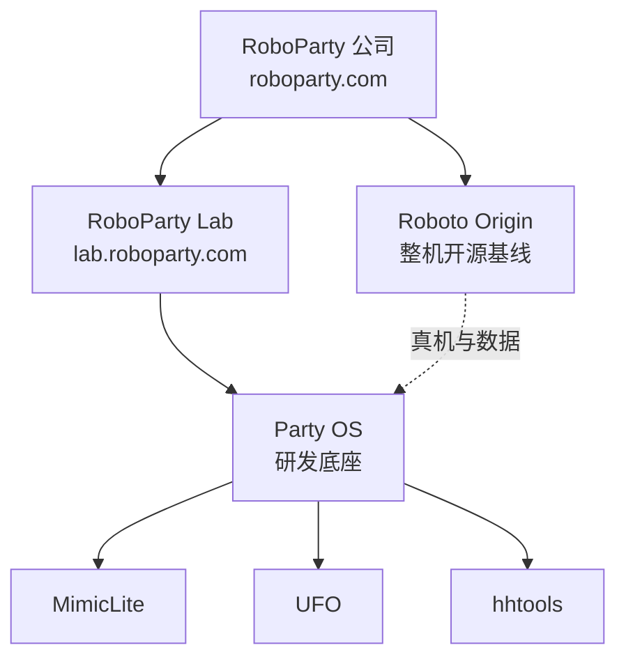

# RoboParty（萝博派对）

**RoboParty（上海萝博派对科技有限公司）** 是国内少数将「全栈开源双足人形」作为公司主线的创业团队：先以 [Roboto Origin](./roboto-origin.md) 开源整机与文档降低复现门槛，再以 [RoboParty Lab](https://lab.roboparty.com) 与 [Party OS](./party-os.md) 沉淀训练、控制与数据工具链基础设施。

## 英文缩写速查

| 缩写 | 英文全称 | 简要说明 |
|------|----------|----------|
| RPO | Roboto Origin / RoboParty Origin | 萝博头原型机开源整机项目代号 |
| Party OS | Party Operating System | Lab 侧人形研发基础设施聚合层 |
| BFM | Behavior Foundation Model | 可复用、可 prompt 的身体运控基座 |
| HSI | Human-Scene Interaction | 人–场景交互（行走、攀爬等） |
| HOI | Human-Object Interaction | 人–物体交互（抓取、操作等） |
| VLA | Vision-Language-Action | 视觉–语言–动作多模态策略 |
| AGI | Artificial General Intelligence | 通用人工智能（公司愿景语境） |

## 为什么重要

1. **开源人形的新范式**：不只开源代码片段，而是公开硬件 BOM、训练、部署与 Know-How 文档，把「黑盒整机」拆成可学习、可复现的工程系统。
2. **整机 → 基础设施的演进**：2026 年起从 [Roboto Origin](./roboto-origin.md) 走向 [Party OS](./party-os.md)，显式解决年轻研究者「idea 输在基建」的问题。
3. **工程与学术双线**：Lab 侧同时推进 MimicLite（监督跟踪）、UFO（无监督 RL）、[TeCH](./paper-tech-humanoid-control.md) 等可对标 SONIC / BFM-Zero 的产出，并与 [mjlab](./mjlab.md) 等训练栈对齐。
4. **生态位**：在国内开源人形谱系中与 [OpenLoong](./openloong.md)、[Berkeley Humanoid Lite](./berkeley-humanoid-lite.md) 等形成不同门槛与软件栈的对照（见 [开源人形硬件对比](./open-source-humanoid-hardware.md)）。

## 核心结构

RoboParty 对外可理解为 **公司门户 + 整机开源 + Lab 基础设施** 三层：

| 层级 | 入口 | 职责 |
|------|------|------|
| **公司** | [roboparty.com](https://roboparty.com) | 品牌、融资与里程碑、产品与支持 |
| **整机** | [Roboto Origin](./roboto-origin.md) | RPO 硬件/固件/训练/部署全栈开源 |
| **Lab** | [lab.roboparty.com](https://lab.roboparty.com) | 开放实验室、成果与招聘 |
| **基础设施** | [Party OS](./party-os.md) | 动作准备 → 监督跟踪 → 无监督控制工具链 |

### 公司信息（官网一手）

| 项目 | 内容 |
|------|------|
| 机构 | 上海萝博派对科技有限公司 |
| 成立 | 2025-02-21 |
| 团队背景 | 哈尔滨工业大学智能机器人方向 |
| 理念 | 低成本、高性能、开源共享 |
| GitHub | [github.com/Roboparty](https://github.com/Roboparty) |

### 里程碑（官网关于页，节选）

| 时间 | 事件 |
|------|------|
| 2025-04 | 人形研发启动；萝博头关键硬件 |
| 2025-12 | Roboto Origin 进入 Prototype |
| 2026-01 | 全栈开源 Roboto Origin |
| 2026-04 | AGIBOT World Challenge Reasoning to Action **全球第三** |
| 2026-05 | 天使+轮（顺为领投、小米战投追加） |
| 2026-07 | RoboParty Lab 成立；Party OS 首批三项工具链开源（见公众号一手） |

## 常见误区 / 局限

- **误区 1：把 RoboParty 等同于单一仓库。** 整机开发在 `rpo_*` / `roboparty_*` 子仓；Lab 工具在 MimicLite、UFO、hhtools 等独立仓；聚合仓仅作导航。
- **误区 2：认为开源即低成本量产。** 文档强调淘宝采购 + 嘉立创打样可复刻，但仍需较强 Linux/ROS2/硬件调试能力；工业级可靠性与认证不在当前公开范围。
- **局限：** 商业产品线（如 Roboto 01）与 RP1 发布节奏在公开资料中仍在演进，wiki 以已开源模块与 Lab 已发布工具为准。

## 关联页面

- [Roboto Origin（开源人形基线）](./roboto-origin.md)
- [Party OS（研发底座）](./party-os.md)
- [RoboParty Lab / Party OS 技术地图](../overview/roboparty-lab-party-os-technology-map.md)
- [开源人形机器人硬件方案对比](./open-source-humanoid-hardware.md)
- [MimicLite](./mimiclite.md) · [UFO](./roboparty-ufo.md) · [human-humanoid-tools](./human-humanoid-tools.md)
- [TeCH 论文实体](./paper-tech-humanoid-control.md)

## 推荐继续阅读

- [RoboParty 官网](https://roboparty.com)
- [Roboto Origin 文档站](https://roboparty.com/roboto_origin/doc)
- [RoboParty Lab](https://lab.roboparty.com)
- [Party OS GitHub](https://github.com/Roboparty/Party_OS)

## 参考来源

- [roboparty_com.md](../../sources/sites/roboparty_com.md)
- [lab_roboparty_com.md](../../sources/sites/lab_roboparty_com.md)
- [roboparty_com_roboto_origin_doc.md](../../sources/sites/roboparty_com_roboto_origin_doc.md)
- [roboto_origin.md](../../sources/repos/roboto_origin.md)
- [party_os.md](../../sources/repos/party_os.md)
- [wechat_roboparty_lab_party_os_3_tools.md](../../sources/blogs/wechat_roboparty_lab_party_os_3_tools.md)
