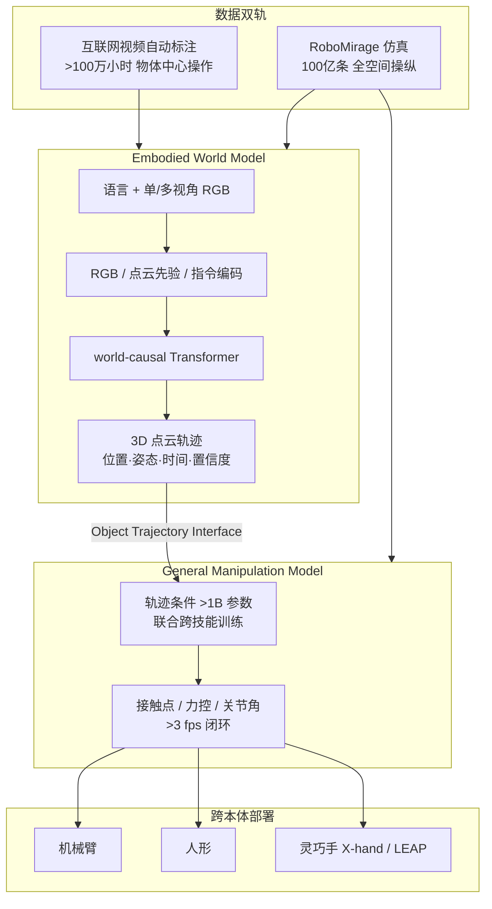

# VLOA（RoboScience · Visics 通用具身栈）

**VLOA**（*Vision-Language-Object-Action*）是 **RoboScience**（北京机科未来科技有限公司，2024-12 成立）对外披露的 **端到端通用具身大模型**：[Embodied World Model](https://en.roboscience.co/jishu_detail/18.html) 负责 **3D 动态想象**，[General Manipulation Model](https://en.roboscience.co/jishu_detail/20.html) 负责 **轨迹条件执行**，经 **Object Trajectory** 接口闭环；底层 **RoboMirage** 为自研 GPU 可微物理引擎，与 **Visics** 品牌下的跨本体灵巧操作叙事绑定。

| 机构 | 机科未来（RoboScience） |
|------|-------------------------|
| 成立 | 2024-12 |
| 核心栈 | **Visics** / **VLOA** / **RoboMirage** |
| 公开材料 | 英文站技术博文（2026-03 / 05）+ 融资新闻；**无论文预印本** |
| 开源状态 | **未开源**（见下方「局限与风险」） |

## 一句话定义

**用语言 + 视觉预测物体 3D 点云轨迹作可解释中间表示，再以轨迹条件统一操作模型跨本体闭环执行，并以自研可微物理 + 互联网视频双轨数据扩容。**

## 英文缩写速查

| 缩写 | 英文全称 | 简要说明 |
|------|----------|----------|
| VLOA | Vision-Language-Object-Action | RoboScience 大模型产品名；双引擎级联架构 |
| WM | World Model | 具身世界模型；输出 3D 点云轨迹而非纯像素续帧 |
| EWM | Embodied World Model | VLOA 认知侧：语言+视觉→物体未来 3D 轨迹 |
| GMM | General Manipulation Model | VLOA 执行侧：轨迹→接触/力控/关节指令 |
| OTI | Object Trajectory Interface | 世界模型与操作模型之间的轨迹传递接口 |
| DoF | Degrees of Freedom | 自由度；博文演示 X-hand 12 DoF、LEAP Hand 16–20 DoF |

## 为什么重要

- **级联 WM + 策略的产业样本**：与 [Generative World Models](../methods/generative-world-models.md) 综述中的 **级联路线**（[world-models-route-01-cascade](../overview/world-models-route-01-cascade.md)）一致，但中间表示选 **物体中心 3D 点轨迹** 而非全视频 latent——与 [MolmoMotion](./molmo-motion.md) 的 metric 3D 轨迹路线可对照阅读。
- **「去哪」与「怎么去」解耦**：世界模型学物理演化；操作模型 **轨迹条件** 学接触与力控，避免为每个新物体重训子技能库（博文反「原子技能库」叙事）。
- **自研仿真栈**：**RoboMirage** 声称刚体–软体–铰接体统一接触、工业级稳定性与 Python API，与 [Newton](./newton-physics.md)、[Brax](./brax.md) 等 **可微物理** 实体并列时需注意 **闭源、无公开 benchmark**。
- **数据飞轮口径**：**>100 万小时** 物体中心互联网视频（周增数十万小时）+ **100 亿条** RoboMirage 仿真操纵（2026 目标 1T）——可作为 **产业 Scaling Law** 声明样本，尚无可独立核验的数据发布。
- **团队与资本**：CEO 田野（前 Apple AI Platform 技术负责人）；首席科学家邵林（NUS，UniGrasp / SAM-RL 等）；2026-02 Pre-A 数亿元、2026-06 A 轮 10 亿元（见 [sources/sites/roboscience.md](../../sources/sites/roboscience.md)）。

## 流程总览

## 核心结构

### Embodied World Model（想象侧）

| 维度 | 博文要点 |
|------|----------|
| **相对 2D WM** | 不只做下一帧像素；在 **真实 3D 空间** 建模物体运动 |
| **相对静态 3D** | 预测 **时序连续轨迹**，非单次重建 |
| **输出** | 带时间戳的 **3D 点序列**（位置、姿态、置信度） |
| **能力声称** | 跨物体材质、流体倒水、指令级实例区分、长时一致 |
| **技术属性** | 物理约束、扩散式多解、长程一致、**硬件解耦** |

### General Manipulation Model（执行侧）

| 维度 | 博文要点 |
|------|----------|
| **参数量** | **>1B**，跨技能联合训练 |
| **输入** | 世界模型 **Object Trajectory**（物体+环境点云） |
| **范式** | **轨迹条件** — 不重学目标位姿，学接触与力控 |
| **速度** | **>3 fps** 点云闭环关节控制 |
| **演示** | 杂乱抓取、立硬币/开信封/注射器、家具组装、传送带动态抓 |
| **跨本体** | 同一策略迁移 **X-hand** 与 **LEAP Hand**（博文视频） |

### RoboMirage（可微物理引擎）

- 首页定位：**为具身 AI 原生构建的可微物理引擎**。
- 声称：可扩展接触建模、高精度多体动力学、算法保证工业级稳定、Pythonic、GPU 异构加速。
- 在 VLOA 闭环中承担 **仿真数据生成** 与 **物理引擎–仿真数据–端到端训练** 一环。

### 与 VLA / WAM 谱系的对照

| 路线 | 中间表示 | 执行 |
|------|----------|------|
| **端到端 VLA** | 常直接从图像+语言→动作 | 单模型；见 [VLA](../methods/vla.md) |
| **MolmoMotion 类** | 语言条件 **3D 点轨迹** | 轨迹接规划或 I2V |
| **VLOA** | **物体中心 3D 点云轨迹** | 专用 **>1B 轨迹条件操作模型** |
| **视频 WM 级联** | 像素/视频 latent | 下游策略或 MPC |

## 工程实践（读者可怎么用本页）

1. **选型时先问开源边界**：截至 2026-07-19 官网 **无 GitHub/HF**；复现须等论文或代码发布，勿与开源 VLA 栈混排预算。
2. **对照中间表示**：若项目已用 **3D 轨迹 / flow** 作规划先验，可读 [MolmoMotion](./molmo-motion.md) 等开源对照组。
3. **仿真栈评估**：RoboMirage 与 [Newton](./newton-physics.md)、MuJoCo MJX、Genesis 等比较时，要求 **公开 contact model、稳定性与 sim2real 协议** 再下结论。
4. **数据声明审计**：百万小时视频 / 万亿条仿真属 **公司口径**；独立评测需 **可下载子集 + 训练曲线可复现**。

## 局限与风险

- **开源状态（步骤 2.5 核查）**：`en.roboscience.co` 全站 **无代码/权重/数据集链接** → **未开源**；无 arXiv 预印本，技术细节 **不可独立复现**。
- **演示 vs 产品**：博文为 **精选场景视频**；未见系统 benchmark、失败率或真机小时数披露。
- **命名重叠**：**VLOA** 与社区 **VLA**（Vision-Language-Action）缩写相近但 RoboScience 定义为 **Vision-Language-Object-Action**；阅读文献时注意区分。
- **硬件产品**：博文提及并行开发机器人硬件作为部署平台，但 **截至入库日无公开 SKU/规格页**。
- **数据规模**：10M 小时 / 1T 操纵实例为 **2026 目标**，非已发布可核验资产。

## 关联页面

- [Generative World Models（生成式世界模型）](../methods/generative-world-models.md)
- [Manipulation（操作任务）](../tasks/manipulation.md)
- [MolmoMotion（语言条件 3D 轨迹）](./molmo-motion.md)
- [Sunday Robotics ACT-2（闭源垂直整合对照）](./sunday-robotics-act2.md)
- [机器人世界模型训练环分类](../overview/robot-world-models-training-loop-taxonomy.md)

## 参考来源

- [RoboScience 项目站](../../sources/sites/roboscience.md)
- [VLOA Part 1：Embodied World Model](../../sources/blogs/roboscience_vloa_embodied_world_model_part1.md)
- [VLOA Part 2：General Manipulation Model](../../sources/blogs/roboscience_vloa_general_manipulation_part2.md)

## 推荐继续阅读

- [Embodied World Model — VLOA Part 1（官方博文）](https://en.roboscience.co/jishu_detail/18.html)
- [General Manipulation Model — VLOA Part 2（官方博文）](https://en.roboscience.co/jishu_detail/20.html)
- [RoboScience About](https://en.roboscience.co/about.html)
- [World Model for Robot Learning Survey（arXiv:2605.00080）](https://arxiv.org/abs/2605.00080) — 学术三线 taxonomy 对照
- [MolmoMotion 项目页](https://molmomotion.github.io/) — 开源 3D 轨迹 WM 对照
