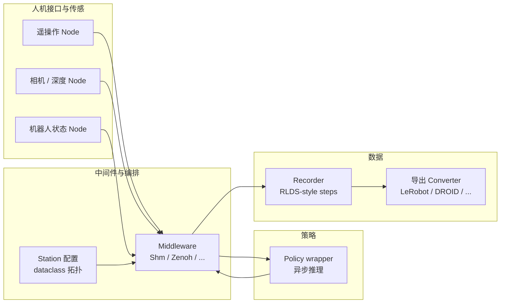

# RIO（Robot I/O）

**RIO（Robot I/O）** 是一套面向**真实机器人**的 **Python 实时 I/O** 与编排框架，目标是把「换一套机械臂 / 人形 / 相机 / 遥操作设备就要重写控制栈」的摩擦降下来：各层组件可替换，**主循环逻辑尽量与具体硬件解耦**，从而服务 **VLA 微调与闭环部署**、模仿学习数据采集、以及 DP / RL 等策略在同一栈上的落地。

会议与论文信息以官方为准：项目页标注 **RSS 2026 接收**，全文见 arXiv:2605.11564。

## 一句话定义

用 **同一套 Node 抽象 + 可插拔中间件 + station 拓扑配置**，把多路传感、遥操作输入、本体命令与 **异步策略推理** 串成可复用的实时管线，使跨形态（单臂 / 双臂 / 人形）部署主要变成**改配置**而不是** fork 一套新代码**。

## 为什么重要

- **痛点对准「基础设施碎片化」**：与单纯扩大数据集并列，论文强调跨数据集、跨实验室复现时**驱动与控制栈高度绑定单台套机**带来的工程税。
- **与「训练侧框架」互补**：文档侧叙述可与 **LeRobot / DROID 格式导出**衔接训练；RIO 更突出 **本机实时闭环**、中间件选择与 **异步推理** 的一体化（参见 [LeRobot](./lerobot.md) 实体页对照）。
- **覆盖面广**：公开硬件表涵盖 **Unitree G1、Booster T1**、Franka / UR / UFactory xArm、SO-100/101 等，以及多种夹爪、RealSense / ZED / UVC、VR 与 GELLO 等遥操作入口（细节以官方 Table 为准）。

## 核心结构

| 模块 | 作用 |
|------|------|
| **Node** | 遥操作、相机、机器人、策略等节点的统一模板；**pub / req / pubreq** 循环语义；**ring buffer** 固定频率状态流，**request queue** 承载异步命令。 |
| **Middleware** | 隐藏传输：本机 **Shared Memory**、调试友好的 **Thread**、以及 **Zenoh / ZeroRpc / Portal** 等网络路径可切换。 |
| **Robot station** | 单一 dataclass 描述站点拓扑（设备名、相机、臂与夹爪组合）；上下文管理器拉起 server/client，业务代码面向 **proxy API**。 |
| **观测与数据** | RLDS 风格 **Step**；**morphology** 为不同形态定义 state key；米 / 弧度等单位约定；记录管线文档侧提到 **RoboDM** 压缩与导出到各训练 dataloader 的 converter 思路。 |
| **Policy** | 轻量 policy 包装与 **异步推理** 节点，主循环非阻塞拉取观测、提交 chunk 动作；论文与项目页给出多种策略族与 profiling 叙事。 |

## 流程总览（数据与控制）

## 常见误区或局限

- **不是「又一个 VLA 训练框架」**：论文定位是 **I/O 与部署编排**；训练仍多为 **bring your own stack**（导出后在外部 fine-tune，再载入权重闭环）。
- **延迟与 profiling 数字依赖具体中间件、相机路数、GPU 与策略**：项目页给出的与 **LeRobot** 的端到端延迟对比应视为**同配置下的一个数据点**，换硬件需自测。
- **许可与维护**：以 GitHub 仓库 LICENSE 与发布说明为准；**rio** 与 **rio-hw** 分仓，部署前需同时对照文档的版本矩阵。

## 关联页面

- [VLA（Vision-Language-Action）](../methods/vla.md) — 跨形态 VLA 适配与动作 chunk 语境
- [Teleoperation（遥操作）](../tasks/teleoperation.md) — 多设备采集与工程注意点
- [LeRobot](./lerobot.md) — 数据集与训练侧常用栈；与 RIO 导出/对照
- [Imitation Learning](../methods/imitation-learning.md) — 示范数据 → 策略的学习路径
- [Action Chunking](../methods/action-chunking.md) — 异步 chunk 推理与平滑控制
- [Unitree G1](./unitree-g1.md) — 论文表中人形平台之一

## 参考来源

- [RIO 仓库与论文归档](../../sources/repos/robot-io-rio.md)
- Ortega-Kral et al., *RIO: Flexible Real-Time Robot I/O for Cross-Embodiment Robot Learning*, [arXiv:2605.11564](https://arxiv.org/abs/2605.11564)
- [RIO 项目主页](https://robot-i-o.github.io/)
- [robot-i-o/rio（GitHub）](https://github.com/robot-i-o/rio)
- [RIO 文档站](https://robotio-docs.netlify.app/)（含 Station 配置、安装与 Ubuntu RT 参考）

## 推荐继续阅读

- Padalkar et al., *Open X-Embodiment: Robotic Learning Datasets and RT-X Models*, [arXiv:2310.08864](https://arxiv.org/abs/2310.08864) — 大规模跨本体数据聚合背景（与 RIO 动机中的「碎片化采集栈」对照阅读）
- [Physical Intelligence openpi](https://github.com/Physical-Intelligence/openpi) — 文档示例中与 π₀ 系训练管线对接的第三方栈（以各项目 README 为准）
