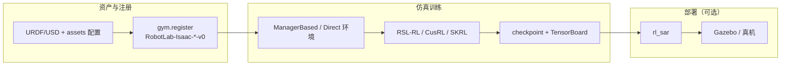

# robot_lab (IsaacLab 扩展框架)

**robot_lab** 是由 `fan-ziqi` 维护的 **IsaacLab 生态扩展库**：在核心仓库外独立开发机器人资产、Gym 环境与训练脚本，避免 fork 上游 Isaac Lab。截至 2026-06，README 列出 **24 个 Velocity-Rough 主干环境**（四足 8 / 轮足 6 / 人形 10），并集成 **BeyondMimic**、**AMP Dance**、对称增广与策略蒸馏等实验管线。

## 英文缩写速查

| 缩写 | 英文全称 | 简要说明 |
|------|----------|----------|
| RL | Reinforcement Learning | 通过与环境交互最大化长期回报来学习策略的范式 |
| URDF | Unified Robot Description Format | 统一机器人描述格式 |
| USD | Universal Scene Description | Omniverse/Isaac 场景与资产描述格式 |
| AMP | Adversarial Motion Prior | 用对抗判别约束状态转移接近专家运动分布的先验 |
| Isaac Lab | NVIDIA Isaac Lab | 基于 Omniverse 的机器人学习训练框架 |
| RSL-RL | Robotic Systems Lab RL | ETH RSL 系 PPO 训练库，robot_lab 默认训练后端 |
| Sim2Real | Simulation to Real | 仿真策略迁移真机的工程主线 |

## 核心定位

在机器人学习工具链中，robot_lab 扮演 **「Isaac Lab 之上的机型与任务适配层」**：

- **Isaac Lab 核心** 提供物理仿真、传感器与 `ManagerBasedRLEnv` / Direct 环境接口。
- **robot_lab** 提供多厂商 **URDF/USD 资产**、**速度跟踪 / 模仿 / AMP** 任务配置，以及 **RSL-RL / CusRL / SKRL** 统一训练入口。
- **rl_sar**（同作者）承接 **Gazebo / 真机** 策略部署，形成「仿真训练 → 实机运行」闭环。

## 流程总览

## 关键特性

1. **多厂商硬件覆盖**：除 Unitree、Anymal、FFTAI、Booster、RobotEra 等常见机型外，2026 版 README 新增 **Zsibot**、**Magiclab**（四足/轮足/人形）、**Agibot D1**、**Openloong Loong**、**RoboParty ATOM01** 等注册环境；轮足专题见 [轮足四足机器人](../concepts/wheel-legged-quadruped.md)，OpenLoong 整机栈见 [OpenLoong](./openloong.md)，ATOM01 训练仓见 [atom01_train](./atom01-train.md)。
2. **模块化扩展**：新机器人遵循 `assets/` → `tasks/.../config/<robot>/` → `gym.register` 三层模板，与 Isaac Lab 官方扩展规范一致。
3. **多训练后端**：**RSL-RL** 为主（含多 GPU / 多节点 `--distributed`）；**CusRL** 为实验替代；**SKRL** 用于 G1 **AMP Dance** 等 Direct 任务。
4. **模仿与风格任务**：
   - **[BeyondMimic](../methods/beyondmimic.md)**：`RobotLab-Isaac-BeyondMimic-Flat-Unitree-G1-v0`，配套 CSV→NPZ 与回放工具链。
   - **AMP Dance / A1 Handstand / Anymal 对称增广与蒸馏**：README 列为 Experimental，适合研究复现而非默认 baseline。
5. **工程配套**：Docker（`isaac-lab-base` → `robot-lab` 镜像）、pre-commit、IDE `setup_python_env` 任务、USD 缓存清理说明。

## 版本与安装要点

| robot_lab 分支/标签 | Isaac Lab | Isaac Sim |
|--------------------|-----------|-----------|
| `main` / `v2.3.2` | `v2.3.2` | 4.5 / 5.0 / **5.1** |

安装：在 **已安装 Isaac Lab 的 Python** 环境中 `git clone` 本仓（与 IsaacLab 目录并列），执行 `python -m pip install -e source/robot_lab`，用 `python scripts/tools/list_envs.py` 验证扩展加载。

## 关联页面

- [Isaac Gym / Isaac Lab](./isaac-gym-isaac-lab.md)
- [legged_gym](./legged-gym.md)
- [Unitree 品牌主页](./unitree.md)
- [轮足四足机器人（四轮足）](../concepts/wheel-legged-quadruped.md)
- [BeyondMimic](../methods/beyondmimic.md)
- [OpenLoong（青龙）](./openloong.md)
- [Atom01 Train](./atom01-train.md)
- [强化学习 (Reinforcement Learning)](../methods/reinforcement-learning.md)

## 参考来源

- [sources/repos/robot_lab.md](../../sources/repos/robot_lab.md)
- [fan-ziqi/robot_lab（GitHub）](https://github.com/fan-ziqi/robot_lab)

## 推荐继续阅读

- [Isaac Lab 安装指南](https://isaac-sim.github.io/IsaacLab/main/source/setup/installation/index.html) — 前置依赖与 conda 安装路径
- [fan-ziqi/rl_sar](https://github.com/fan-ziqi/rl_sar) — Gazebo / 真机策略部署配套
- [HybridRobotics/whole_body_tracking](https://github.com/HybridRobotics/whole_body_tracking) — BeyondMimic 上游参考实现
