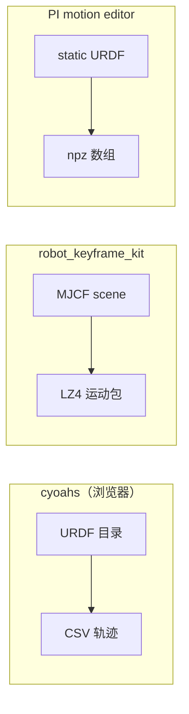

# 机器人关键帧与运动编辑工具（选型入口）

本页把三条 **公开仓库** 上的运动编辑工具放在一起对照：它们都解决「已有轨迹 / 姿态序列 → 人工修正 → 再导出」的问题，但 **绑定仿真栈、文件格式与是否纯前端** 差异很大，选型时应先确定下游是 **真机 CSV**、**MuJoCo qpos** 还是 **NumPy 归档**。

## 一句话定义

**示教或跟踪产物的工程后处理**：在 **URDF 可视化** 或 **MuJoCo 场景** 里对关键帧与连续轨迹做增删改、平滑与重采样，再把数据送回模仿学习、跟踪奖励或部署脚本。

## 为什么重要

- **模仿学习与行为克隆** 常见路径是「遥操作 / 跟踪 / 重定向 → 离线修整 → 训练」；没有趁手编辑器时，团队往往用自写脚本改 NPZ/CSV，**可重复性与协作成本高**。
- **三类工具覆盖不同栈**：纯静态站适合不外发数据；MuJoCo 集成路径适合要与 **接触 / IK / 物理步进** 对齐的编排；Flask+NPZ 路径贴近 **Project Instinct** 一类研究代码产出的数组约定。

## 三条工具对照

| 维度 | [cyoahs/robot_motion_editor](https://github.com/cyoahs/robot_motion_editor) | [Stanford-TML/robot_keyframe_kit](https://github.com/Stanford-TML/robot_keyframe_kit) | [project-instinct/robot-motion-editor](https://github.com/project-instinct/robot-motion-editor) |
|------|----------------|---------------------|------------------------|
| **运行形态** | 纯浏览器（可托管静态页） | Python 桌面 / 服务器，`keyframe-editor` CLI | 本地 `python app.py` 启 Flask + 浏览器 |
| **机器人描述** | URDF + mesh 文件夹 | MJCF（推荐 `scene.xml`） | `static/` 下 URDF + mesh |
| **主要交换格式** | Unitree / Seed **CSV** | **joblib + LZ4** pickle（含 `qpos`、速度、site 位姿等） | **`joint_pos` / `base_pos_w` / `base_quat_w`** 的 NPZ |
| **物理与 IK** | 质心 + 支撑多边形等 **运动学可视化** | **全 MuJoCo 步进** + **Mink** QP IK | README 未宣称仿真步进；以后端读写 NPZ 为主 |
| **许可** | MIT | MIT | 以仓库 `LICENSE` 为准（README 未复述） |

## 数据流总览（主干）

## 选型提示

- **已有 Unitree 风格日志或 Seed CSV**：优先考虑 **cyoahs** 的双视口与 CSV 互转；注意其强调 **无上传** 的隐私模型。
- **工作流已锚在 MuJoCo / Menagerie**：**robot_keyframe_kit** 提供 **镜像关节、机构检测、地面注入与 timed keyframe 序列**，并给出论文引用格式（见源文件）。
- **仓库内策略导出已是 NPZ 且需拖拽曲线**：**Project Instinct** 编辑器与 [Project Instinct](./project-instinct.md) 研究栈同源，适合作为 **NPZ 曲线编辑** 的默认参照实现。

## 关联页面

- [MuJoCo](./mujoco.md) — MJCF 与物理引擎上下文
- [Project Instinct](./project-instinct.md) — 同源组的公开研究与工具入口
- [Motion Retargeting Pipeline](../concepts/motion-retargeting-pipeline.md) — 重定向或跟踪之后的手工修整在流水线中的位置
- [Manipulation](../tasks/manipulation.md) — 操作任务里关键帧式示教与数据后处理
- [Teleoperation](../tasks/teleoperation.md) — 上游人类演示采集

## 推荐继续阅读

- [cyoahs 在线演示](https://motion-editor.cyoahs.dev) — 静态托管实例（以官方可用性为准）
- [robot_keyframe_kit 视频教程（YouTube）](https://www.youtube.com/watch?v=ZoRK3STKsd0) — README 嵌入的官方教程
- [MuJoCo Menagerie](https://github.com/google-deepmind/mujoco_menagerie) — Stanford 工具 README 推荐的示例模型来源

## 参考来源

- [sources/repos/cyoahs-robot-motion-editor.md](../../sources/repos/cyoahs-robot-motion-editor.md)
- [sources/repos/stanford-tml-robot-keyframe-kit.md](../../sources/repos/stanford-tml-robot-keyframe-kit.md)
- [sources/repos/project-instinct-robot-motion-editor.md](../../sources/repos/project-instinct-robot-motion-editor.md)
