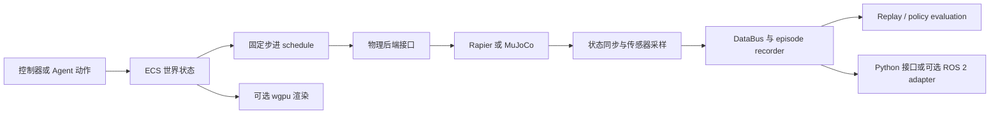

# Robot Native Engine（RNE）

## 一句话定义

**Robot Native Engine（RNE）** 是一个以 Rust 编写的机器人原生仿真引擎，将机器人、传感器、执行器、Agent 和 episode 纳入同一仿真世界，并支持固定步进、headless 回放与可选渲染 / ROS 2 适配。

## 英文缩写速查

| 缩写 | 英文全称 | 简要说明 |
|------|----------|----------|
| ECS | Entity Component System | 组织仿真世界状态与实体调度的核心结构 |
| ROS 2 | Robot Operating System 2 | 可选的机器人软件适配层；核心 crate 不依赖 ROS 2 |
| URDF | Unified Robot Description Format | 工作台与导入示例支持的机器人描述格式 |
| MJCF | MuJoCo XML format | MuJoCo 机器人 / 场景描述格式；工作台可载入 |
| RGB-D | Red, Green, Blue plus Depth | 仿真相机提供的彩色与深度观测 |
| IMU | Inertial Measurement Unit | 机体惯性测量传感器模型 |

## 为什么重要

- **仿真主循环不绑渲染器：** headless 任务、批量 rollout 和确定性回放可在不初始化 wgpu 的情况下运行；渲染是状态的可选呈现层。
- **机器人系统部件被纳入同一数据模型：** robot、joint、actuator、sensor、agent 和 episode 由 Rust workspace crate 明确分工，利于追踪数据边界。
- **便于检查仿真结果：** 固定 SimClock、显式随机种子、稳定实体顺序和 replay digest 让相同条件的运行可对照；测试可以核查仿真记录而不依赖屏幕录制。
- **面向策略与系统开发者：** 有 Python policy 示例、URDF / MJCF 工作台、RGB-D / LiDAR 等传感器、Go2 / G1 / 操作臂等场景，以及可选 ROS 2 adapter。

## 核心原理

RNE 将控制动作、物理推进和传感器采样放在固定步进的 simulation schedule 中。ECS 持有机器人和世界状态；一个 step 内依次进行控制动作应用、pre-physics 同步、物理推进、post-physics 同步、传感器采样与数据记录。渲染器读取仿真状态进行呈现，但渲染帧率不决定仿真时间。

物理层使用后端中立接口，把核心实体和后端具体类型隔开。README 展示 Rapier 实现，并在已发布的跨后端验证路径中使用捆绑的 MuJoCo 对照同一 TaskSpec；这证明项目提供跨后端验证入口，不代表每个功能在不同后端都具有完全一致的支持范围。

数据可送往 headless recorder / replay，也可经 wgpu 产生画面；Python 接口用于策略实验，ROS 2 集成位于独立 adapters 目录。各接口是可组合的软件边界，不能据此推断已有特定真机部署。

## 流程总览

## 能力与复现路径

| 能力 | 仓库入口 | 适合核查的内容 |
|------|----------|----------------|
| 最小物理示例 | hello_world、falling_cube | ECS 建世界、重力与 physics sync |
| 策略实验 | Python policy 示例 | Python 与本地仿真环境的接口 |
| 交互工作台 | robot_workbench | URDF / MJCF、关节目标、障碍场景、RGB / depth / LiDAR 检视 |
| 机器人任务 | Go2、G1、OpenArm 与移动操作示例 | 接触任务、传感器、步态或操控场景的仿真复现 |
| ROS 2 集成 | adapters/ros2 | 核心之外的中间件连接 |
| 浏览器回放 | web/rne_web_viewer | WASM 页面读取 replay artifact；README 当前描述的是本地构建运行 |

从仓库根目录运行最小例子：

    cargo run -p hello_world --example 00_hello_world
    cargo run -p falling_cube --example 01_falling_cube

启动机器人交互工作台：

    cargo run --release --locked -p robot_workbench

示例目录按功能列出 URDF 导入、Python policy、传感器、交互查看器、多机器人、Go2 和 G1 等任务。详细依赖、数据资产与检查命令应以各示例 README 和仓库当前版本为准。

## 仿真证据与工程边界

RNE 的公开代码、仿真场景和文档已经可用；我没有找到独立的论文主页、模型权重或训练数据集发布页。项目的重点是仿真基础设施、传感器建模、策略接口及 replay，而不是开箱即用的 G1 训练策略包。

仓库展示的 G1 backflip 是仿真轨迹，文档说明控制参数来自搜索而非 RL，且该结果不能作为硬件能力证据。G1 前向步态示例也有严格条件：资料指出额外的极小髋偏航力矩即可导致跌倒，因此不能把它写成可转向或可部署的 locomotion policy。

Go2 开门文档中报告的 0.058 m RMS 是特定场景的定位误差；Mid-360 模型参考真实 Go2 记录拟合，但这些指标不等于通用硬件精度。ROS 2 adapter 的存在也不等于已验证某一款机器人、驱动或实时控制链路。

## 局限与风险

- **仿真不等于真机：** 场景成功、固定步进和 replay 一致性验证的是软件仿真行为；Sim2Real 仍需单独的硬件闭环、时序、传感器与安全测试。
- **后端能力需按功能核实：** Rapier / MuJoCo 共用抽象接口不自动保证接触、约束、碰撞过滤或性能在所有任务上等价。
- **展示性策略结果不可泛化：** 参数搜索或特定场景控制示例不应写成通用训练算法、稳健行走策略或真机部署结论。
- **浏览器 Viewer 是本地开发路径：** 仓库 Web Viewer README 指示通过 Trunk 本地启动；不要将其描述成已托管、无需安装的在线仿真器。
- **生态成熟度需要外部证据：** README 把独立项目复现和外部物理 / 仿真器 / 硬件适配列为验证方向；仓内自测不能替代独立集成验证。

## 关联页面

- [MuJoCo（物理引擎）](./mujoco.md) — RNE 的可选物理后端及同类引擎对照
- [Isaac Sim](./isaac-sim.md) — 高保真场景、传感器渲染与 Omniverse 工作流
- [Sim2Real](../concepts/sim2real.md) — 区分仿真闭环与真机迁移验证

## 参考来源

- [Robot Native Engine 官方仓库归档](../../sources/repos/robot-native-engine.md)
- [官方 README](https://github.com/rsasaki0109/RobotNativeEngine/blob/main/README.md)
- [Architecture Overview](https://github.com/rsasaki0109/RobotNativeEngine/blob/main/docs/architecture/000_overview.md)
- [G1 locomotion 文档](https://github.com/rsasaki0109/RobotNativeEngine/blob/main/docs/G1_LOCOMOTION.md)
- [Go2 开门与定位文档](https://github.com/rsasaki0109/RobotNativeEngine/blob/main/docs/GO2_DOOR.md)
- [Livox Mid-360 文档](https://github.com/rsasaki0109/RobotNativeEngine/blob/main/docs/LIVOX_MID360.md)
- [Robot Workbench 文档](https://github.com/rsasaki0109/RobotNativeEngine/blob/main/docs/ROBOT_WORKBENCH.md)

## 推荐继续阅读

- [RNE 完整 Examples 索引](https://github.com/rsasaki0109/RobotNativeEngine/blob/main/examples/README.md)
- [RNE Web Viewer README](https://github.com/rsasaki0109/RobotNativeEngine/blob/main/web/rne_web_viewer/README.md)
- [RNE 代码仓库](https://github.com/rsasaki0109/RobotNativeEngine)
