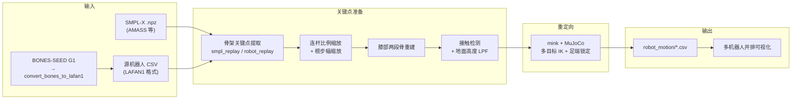

# robot_retargeter

**robot_retargeter**（<https://github.com/ccrpRepo/robot_retargeter>）是一条面向研究与工程的 **人形动作重定向工具链**：把 **[SMPL-X](https://smpl-x.is.tue.mpg.de/)** 人体序列或 **源机器人 LAFAN1 风格 CSV** 映射到 **多台目标人形**（如 G1、H2、T800、R1），用 **[mink](https://github.com/kevinzakka/mink) + [MuJoCo](./mujoco.md)** 解多目标 IK，并内置连杆比例缩放、膝部几何重建、接触检测与地面自适应，最后可并排可视化对比。

## 核心信息

| 字段 | 内容 |
|------|------|
| 维护方 | 社区开源（GitHub `ccrpRepo`） |
| 许可 | 以仓库 LICENSE 为准 |
| 典型下游 | WBT / 模仿学习参考轨迹、跨机型动作迁移 |

## 英文缩写速查

| 缩写 | 英文全称 | 简要说明 |
|------|----------|----------|
| IK | Inverse Kinematics | 多目标任务空间逆运动学求解 |
| SMPL-X | Skinned Multi-Person Linear Model with eXpressions | 带手/脸的参数化人体模型，常见重定向上游 |
| AMASS | Archive of Motion Capture as Surface Shapes | 统一 SMPL 系人体动捕大库，可作 `.npz` 输入源 |
| MoCap | Motion Capture | 动作捕捉数据，经 SMPL-X 或机器人 CSV 进入本工具 |
| SEED | Skeletal Everyday Embodiment Dataset | Bones Studio 大规模人体/G1 运动数据，需格式转换后接入 |
| G1 | Unitree G1 Humanoid | README 默认示例子目标机型之一 |

## 为什么重要

- **双入口、多出口**：同一套 YAML 骨架配置既可吃 **[AMASS](./amass.md)** 系 SMPL-X `.npz`，也可吃 **机器人→机器人** 迁移（如 G1 舞蹈 CSV → H2/T800），适合跨机型动作资产复用。
- **工程细节透明**：README 公开连杆缩放、膝部两段骨重建、接触锁定等伪代码与参数，便于对照 [Motion Retargeting Pipeline](../concepts/motion-retargeting-pipeline.md) 理解「几何缩放 → IK → 接触修补」各段职责。
- **与 NVIDIA SOMA 栈互补**：消费同一 [BONES-SEED](https://huggingface.co/datasets/bones-studio/seed) 生态时，[SOMA Retargeter](./soma-retargeter.md) 走 SOMA BVH + Warp GPU IK；本工具走 **SMPL-X / LAFAN1 CSV + mink**，对已有 AMASS 或 G1 关节轨迹的团队更直接。

## 流程总览

## 核心机制

### 连杆比例缩放

源骨架（SMPL-X 或源机器人）与目标机器人肢长不同：对每段连杆按 **目标长度 / 源长度** 逐帧缩放位移向量，**保持各段朝向**；根节点帧间位移另按 **腿长比** 调节整体步幅，减轻「小人动作上大机」的幅度失真。

### 膝部与接触

- **膝部**：两段骨 IK + 可配置 `knee_angle_offset_degrees`（文档常用约 15°）重建膝位置，提升下肢构型可达性。
- **接触**：手脚以 **低速度 ∧ 低高度** 判定支撑；对支撑足在 IK 中加入 **固定 FrameTask**（`contact_pos_fixed_factor`）抑制 foot sliding。
- **斜胯机型**：类似众擎 T800 建议在髋部增加额外映射点，稳定骨盆倾斜表达（README 配图说明）。

### 数据与许可注意

- **SMPL-X 权重** 需自行在官网注册下载，不入库。
- **BONES-SEED** 原始 G1 CSV 为欧拉角/厘米/角度制，须先跑 `convert_bones_to_lafan1.py` 再进 `retarget_from_robot.sh`。
- 重定向产物为 **运动学关节轨迹**；上真机或训 WBT 前仍建议接 [Motion Retargeting](../concepts/motion-retargeting.md) 所述动力学一致化层。

## 与相近工具对比（选型直觉）

| 维度 | robot_retargeter | [GMR](../methods/motion-retargeting-gmr.md) | [SOMA Retargeter](./soma-retargeter.md) |
|------|------------------|---------------------------------------------|----------------------------------------|
| 典型输入 | SMPL-X `.npz`、LAFAN1 CSV | BVH / SMPL / FBX 等多格式 | SOMA 统一 BVH |
| IK 栈 | mink + MuJoCo | 自研 / Pinocchio 系 | Newton + Warp GPU |
| 多机型并排 | 内置 `VIS_ROBOTS` | 多机型支持 | 当前主推 G1 |
| SEED 路径 | CSV 转换脚本 | 间接 | 官方 BVH 批处理 |

## 关联页面

- [Motion Retargeting](../concepts/motion-retargeting.md)
- [Motion Retargeting Pipeline](../concepts/motion-retargeting-pipeline.md)
- [GMR](../methods/motion-retargeting-gmr.md)
- [SOMA Retargeter](./soma-retargeter.md)
- [AMASS](./amass.md)
- [Unitree G1](./unitree-g1.md)
- [BifrostUMI（mink IK 另一用例）](./paper-bifrost-umi.md)

## 参考来源

- [robot_retargeter 仓库归档](../../sources/repos/robot_retargeter.md)

## 推荐继续阅读

- GitHub（中文 README）：<https://github.com/ccrpRepo/robot_retargeter/blob/main/README_zh.md>
- SMPL-X 官网：<https://smpl-x.is.tue.mpg.de/>
- AMASS 数据集：<https://amass.is.tue.mpg.de/>
- BONES-SEED 数据集：<https://huggingface.co/datasets/bones-studio/seed>
- mink IK 库：<https://github.com/kevinzakka/mink>
