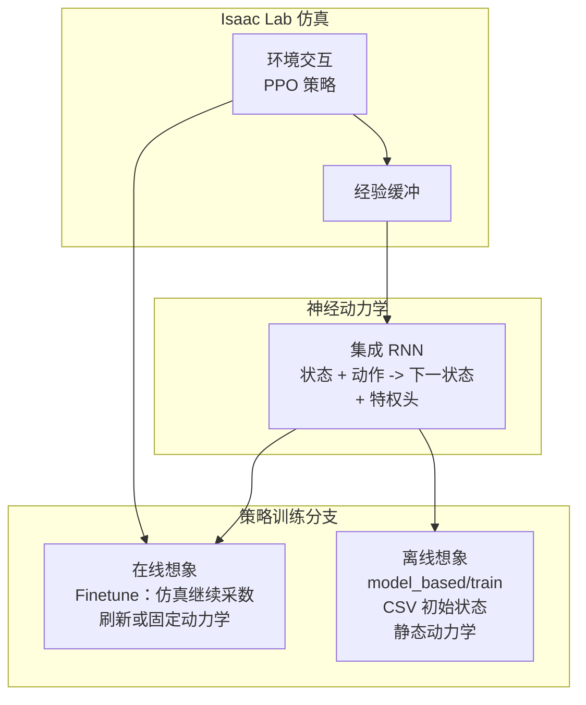

# Robotic World Model（ETH RSL：RWM / RWM-U）

**Robotic World Model（RWM）** 与 **Uncertainty-Aware RWM（RWM-U）** 是 ETH Zurich（RSL / LAS 等）开源的 **模型基强化学习（MBRL）** 路线：用 **集成循环神经网络** 拟合机器人 **状态–动作转移** 与若干 **特权监督头**（接触、终止、扩展量等），再在 **学习到的动力学** 上做 **自回归想象 rollout**，从中训练策略。官方提供 **Isaac Lab 完整扩展** 与 **无仿真器 Lite** 两仓，参考机器人为 **ANYmal D** 平地速度任务族。

## 一句话定义

把 **环境动力学** 显式学成 **可前滚的神经模拟器**，再让策略只在 **想象轨迹** 上优化——**RWM** 侧重与 **在线** 数据联训的鲁棒策略优化，**RWM-U** 用 **集成不确定性** 支撑 **纯离线** 模型基 RL 上真机。

## 为什么重要

- **把「世界模型」接到足式 RL 主流程：** 与像素级 [生成式世界模型](../methods/generative-world-models.md) 不同，这里的世界模型是 **低维状态空间动力学**，直接服务 **PPO / MBPO / MOPO** 式样本增广与策略训练。
- **在线 / 离线同一套表示：** 完整扩展中可先 **仿真内预训练动力学**，再选 **持续刷新模型（在线想象）** 或 **冻结模型 + 初始状态数据集（离线想象）**，与两篇 arXiv 论文叙事对齐。
- **工程可分层上手：** **Lite** 降低环境搭建成本（README 提供 Colab）；要 **预训练、可视化自回归、Isaac 内 play** 再走完整扩展。

## 核心结构

| 组件 | 作用 |
|------|------|
| **集成 RNN 动力学** | 多成员 **序列预测** 模型，输出下一状态分布及特权头；`ensemble_size` 等控制 **认知不确定性** 估计（RWM-U / MOPO 风格惩罚依赖此信号）。 |
| **历史窗口 + 多步前滚** | `history_horizon` 堆叠过去转移；`forecast_horizon`（或 `system_dynamics_forecast_horizon`）控制 **自回归展开** 深度。 |
| **想象环境** | 用动力学预测替换仿真步进，从模型输出 **重构策略观测与奖励**，形成 **纯模型 rollout**。 |
| **ANYmal D 参考任务** | README 以 **平地速度跟踪** 为主线的模板任务族（Pretrain / Finetune / Visualize / Play）。 |

### 流程总览（完整扩展）

**Lite 仓**对应上图中的 **「离线想象」** 子图：不包含左侧常规仿真闭环训练脚本，仅依赖 **预训练动力学权重** 与 **初始状态 CSV**。

## 双仓选型

| 维度 | [robotic_world_model](https://github.com/leggedrobotics/robotic_world_model)（完整） | [robotic_world_model_lite](https://github.com/leggedrobotics/robotic_world_model_lite)（Lite） |
|------|------|------|
| **仿真** | 依赖 **Isaac Lab**（README 徽章：Isaac Sim 4.5 / Lab 2.1 量级） | **无** |
| **动力学预训练** | ✅ `Pretrain` 任务 + `visualize.py` 自回归演示 | ❌ 使用内置 **`pretrain_rnn_ens.pt`** |
| **在线想象微调** | ✅ `Finetune` 任务 | ❌ |
| **离线想象训练** | ✅ `model_based/train.py` | ✅ `scripts/train.py` |
| **依赖** | 需安装 **leggedrobotics/rsl_rl_rwm** 替换默认 RSL-RL | Conda + `pip install -e .`（README） |
| **典型用途** | 论文级复现、可视化、与 Isaac 任务注册表联调 | 快速对齐 **离线 MBRL** 行为、Colab 体验 |

## 常见误区或局限

- **「世界模型」≠ 文生视频：** 本线的预测对象是 **机器人状态与特权量**，不要与 [生成式世界模型](../methods/generative-world-models.md) 的像素 rollout 混为同一评测口径。
- **Lite README 的 `play.py` 示例** 指向 **Isaac Lab 生态**，Lite 仓本身 **不自带** 该脚本路径；部署需回到完整扩展或自行接入策略运行时。
- **版本锁：** 完整扩展 README 钉死 **Isaac Lab / Sim** 与 **Python 3.10**；升级主版本前需核对扩展与 **rsl_rl_rwm** 兼容性。

## 关联页面

- [Model-Based RL（基于模型的强化学习）](../methods/model-based-rl.md) — MBPO/MOPO、Dyna 与想象 rollout 文献坐标
- [Generative World Models（生成式世界模型）](../methods/generative-world-models.md) — 与本路线术语对照：像素生成 vs 状态动力学
- [Isaac Gym / Isaac Lab](./isaac-gym-isaac-lab.md) — 完整扩展的安装与任务注册语境
- [ANYmal 四足机器人](./anymal.md) — 参考平台与 RSL 研究脉络
- [Latent Imagination（潜空间想象）](../concepts/latent-imagination.md) — 其他「在模型中 rollout」范式对照

## 参考来源

- [robotic_world_model（Isaac Lab 扩展）归档](../../sources/repos/leggedrobotics_robotic_world_model.md)
- [robotic_world_model_lite 归档](../../sources/repos/leggedrobotics_robotic_world_model_lite.md)
- Li et al., *Robotic World Model: A Neural Network Simulator for Robust Policy Optimization in Robotics*, [arXiv:2501.10100](https://arxiv.org/abs/2501.10100)
- Li et al., *Uncertainty-Aware Robotic World Model Makes Offline Model-Based Reinforcement Learning Work on Real Robots*, [arXiv:2504.16680](https://arxiv.org/abs/2504.16680)

## 推荐继续阅读

- [leggedrobotics/rsl_rl_rwm（GitHub）](https://github.com/leggedrobotics/rsl_rl_rwm) — README 要求的 model-based RSL-RL 分支
- [Isaac Lab 安装文档](https://isaac-sim.github.io/IsaacLab/main/source/setup/installation/index.html)
- Janner et al., *When to Trust Your Model: Model-Based Policy Optimization (MBPO)*, [arXiv:1906.08249](https://arxiv.org/abs/1906.08249) — 在线短模型 rollout 经典参照
