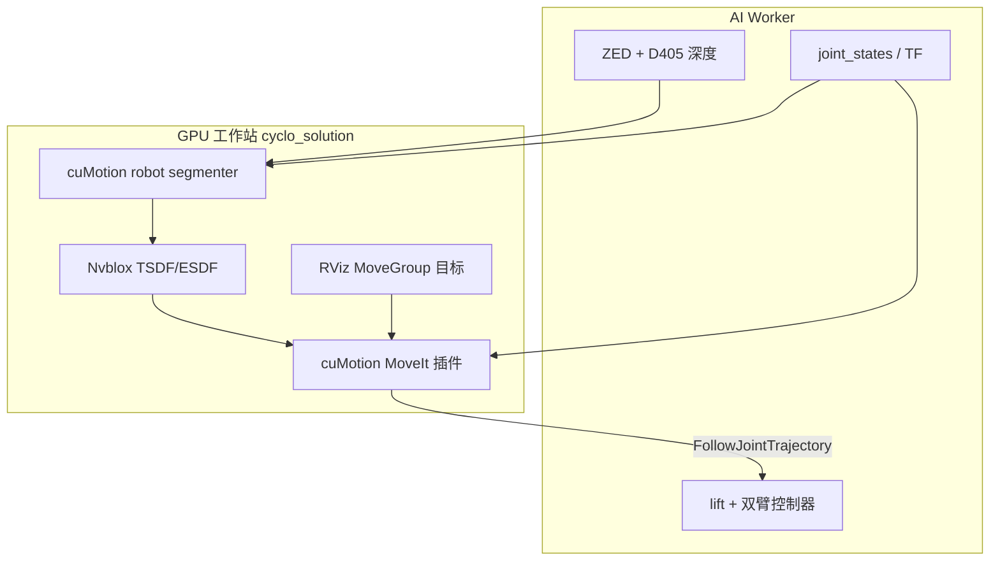
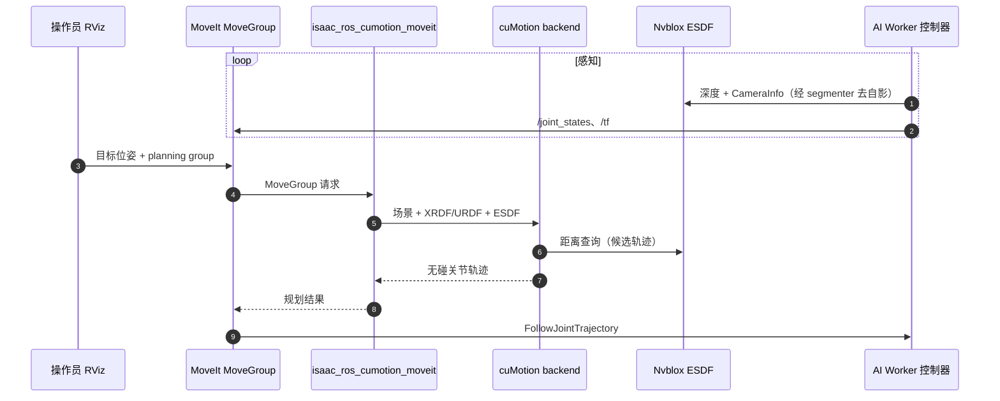

# AI Worker × Isaac ROS cuMotion

**ROBOTIS AI Worker** 与 **NVIDIA Isaac ROS cuMotion** 的集成把 **半人形 lift + 双 7-DoF 臂** 接到 **GPU 碰撞感知运动规划** 栈：官方 [Technical Story](https://docs.robotis.com/docs/systems/aiworker/resources/technical_story/isaac_cumotion/) 与 [Isaac ROS 5.0 博客](https://blogs.nvidia.com/blog/isaac-ros-5-0-agentic-open-source-robotics/)（2026-09-22）均重点介绍；演示视频：[youtu.be/fmZdMV72IR0](https://youtu.be/fmZdMV72IR0)。

## 一句话定义

**AI Worker 上行深度与关节状态，在 `cyclo_solution` 工作站的 MoveIt 2 里用 cuMotion 插件做无碰轨迹，并分静态场景、Nvblox ESDF 动态障碍与 gripper attachment 三档世界碰撞建模。**

## 英文缩写速查

| 缩写 | 英文全称 | 简要说明 |
|------|----------|----------|
| cuMotion | CUDA Motion (Isaac ROS) | cuRobo 的 Isaac ROS / MoveIt 产品化集成 |
| ESDF | Euclidean Signed Distance Field | 到最近障碍距离场；cuMotion 可查询 |
| TSDF | Truncated Signed Distance Field | Nvblox 表面融合表示 |
| XRDF | Extended Robot Description Format | cuMotion 碰撞球等扩展描述 |
| MoveIt | MoveIt / MoveIt 2 | ROS 运动规划框架 |
| FFW | Freedom From Work | AI Worker 产品/软件前缀 |

## 核心信息

| 字段 | 内容 |
|------|------|
| **硬件** | [AI Worker](./robotis-ai-worker.md)（lift + 双臂）；头 **ZED** + 双腕 **RealSense D405** |
| **软件栈** | [cyclo_solution](https://github.com/ROBOTIS-GIT/cyclo_solution) Docker；[isaac_ros_cumotion](https://github.com/NVIDIA-ISAAC-ROS/isaac_ros_cumotion)；MoveIt 2 |
| **规划组** | `arm_l` / `arm_r` / `both_arms` / `wholebody`（各配 URDF + XRDF 碰撞球） |
| **开源** | **集成已开源**（cyclo_solution + Isaac ROS 包）；AI Worker 当前 **JetPack 6.2** 时 **GPU 管线在外部工作站** |
| **博客定位** | Isaac ROS **5.0** 客户故事：视觉引导 pick/place/alignment + **CuMotion** |

## 为什么重要

- **双臂 + lift 自碰与世界碰**：比单臂 UR 演示更贴近 **AI Worker** 真实工作空间，XRDF 球体需在 Isaac Sim **Lula Editor** 分组建模。
- **碰撞建模分级清晰：** 从 **纯 IK/自碰** → **MoveIt 静态 `.scene`** → **深度 ESDF** → **attachment 携带物**，便于团队按成熟度接入。
- **与 NVIDIA Physical AI 叙事对齐：** 同栈可接 **FoundationPose / 感知 skills**（博客 5.0）与 [cuRobo](./curobo.md) 算法层；[Nvblox](./isaac-ros-nvblox.md) 从导航建图扩展到 **操作 ESDF**。

## 流程总览



## 四段演示能力

| 阶段 | 启用方式（摘要） | 碰撞世界 |
|------|------------------|----------|
| **1. 末端位姿** | 默认 `cumotion_moveit.launch.py` | 自碰 + 运动学；无深度/attachment |
| **2. 静态场景** | `enable_static_scene:=true` + `.scene` | 货架/工装等 **MoveIt 碰撞体** |
| **3. 动态 ESDF** | `nvblox_camera_set:=all` 等 + ESDF 就绪后规划 | **深度融合** 障碍；**重规划** 非 mid-execution 改轨 |
| **4. 携带物体** | `read_esdf_world:=true` + `enable_object_attachment:=true` | 抓取后 **attachment 几何** + 清除 ESDF 重复体素 |

**Launch 入口（文档）：**

```bash
ros2 launch cyclo_cumotion_bringup cumotion_moveit.launch.py
```

（静态/动态/attachment 参数见 [Technical Story](https://docs.robotis.com/docs/systems/aiworker/resources/technical_story/isaac_cumotion/)）

## 源码运行时序图

典型 **动态 ESDF + MoveGroup 规划** 一次请求（概念对齐 ROBOTIS 文档数据流）：



**复现路径：** 克隆 [cyclo_solution](https://github.com/ROBOTIS-GIT/cyclo_solution) → `cyclo_solution/docker/container.sh` 进容器 → 按文档接 AI Worker 深度（推荐 **USB3–Ethernet 有线**）→ 启动 `cumotion_moveit.launch.py` 并按阶段打开 static/nvblox/attachment 参数。

## 工程实践

| 项 | 建议 |
|----|------|
| **XRDF 调参** | 球体需 **覆盖 link 又不过大**；四 planning group 分别导出 |
| **静态场景** | RViz 导出 `.scene` 后在物理工位对照验证尺寸 |
| **动态图** | 启动顺序等待 **ESDF 可用**；理解 **replan** 语义，非安全 PLC 替代 |
| **Attachment** | 预定义 catalog（如 `table_box`）+ `AttachObjectByName`；detach 后恢复模型 |
| **部署** | 文档：**JetPack 6.2** 需 **外置 GPU**；上机一体化需升级 **兼容 JetPack 的 Isaac ROS** |

## 结论

**该集成把「能动的 AI Worker」接到「能躲障的双臂规划」——价值在分级碰撞接口与 MoveIt 工作流不变，而非单点 ms 级规划数字。**

- **先验证模型再谈避障：** 阶段 1 的 unreachable/绕路常暴露 URDF/XRDF/帧错误，应作为 bringup 门禁。
- **动态障碍靠 ESDF + 重规划：** robot segmenter 是去自影前提；遮挡与延迟会导致地图不完整。
- **抓取后必须 attachment：** 否则 gripper 清障而 **携带物穿模**——阶段 4 是仓储/搬运场景的刚需演示。
- **算力边界要诚实：** 当前主推 **工作站 + 机器人分体**；Jetson 一体化是文档明确的 **下一步**。
- **与 5.0 agentic 叙事互补：** 博客侧强调 **GPU 感知 + cuMotion 操作**；本集成是 **可跟文档复现** 的 ROBOTIS 落地样例。

## 局限与风险

- **外置 GPU 依赖**：现场网络/USB 深度稳定性影响 ESDF；文档强调有线方案。
- **非功能安全认证**：演示级碰撞规划，不能替代安全标准与硬急停体系。
- **cyclo_solution 与 ai_worker 版本**：需对齐 Cyclo / Isaac ROS 发行版矩阵（以 GitHub 与 docs.robotis.com 为准）。

## 关联页面

- [AI Worker（硬件 ROS 入口）](./robotis-ai-worker.md)
- [ROBOTIS hub](./robotis.md)
- [cuRobo](./curobo.md) · [MoveIt 2](./moveit2.md)
- [Isaac ROS Nvblox](./isaac-ros-nvblox.md)
- [Manipulation 任务页](../tasks/manipulation.md)
- [NVIDIA Physical AI 工具链地图](../overview/nvidia-physical-ai-toolchain-technology-map.md)

## 参考来源

- [ROBOTIS Technical Story 归档](../../sources/sites/robotis_aiworker_isaac_cumotion_technical_story.md)
- [NVIDIA Isaac ROS 5.0 博客归档](../../sources/blogs/nvidia_isaac_ros_5_0_agentic_open_source_2026-09-22.md)
- [YouTube 演示归档](../../sources/videos/youtube_robotis_aiworker_cumotion_fmZdMV72IR0.md)
- [cyclo_solution 仓库归档](../../sources/repos/cyclo_solution.md)
- [isaac_ros_cumotion 仓库归档](../../sources/repos/isaac_ros_cumotion.md)

## 推荐继续阅读

- [Technical Story（官方）](https://docs.robotis.com/docs/systems/aiworker/resources/technical_story/isaac_cumotion/)
- [Isaac ROS 5.0 博客](https://blogs.nvidia.com/blog/isaac-ros-5-0-agentic-open-source-robotics/)
- [Isaac ROS cuMotion 文档](https://nvidia-isaac-ros.github.io/repositories_and_packages/isaac_ros_cumotion/isaac_ros_cumotion/index.html)
- [cyclo_solution GitHub](https://github.com/ROBOTIS-GIT/cyclo_solution)
