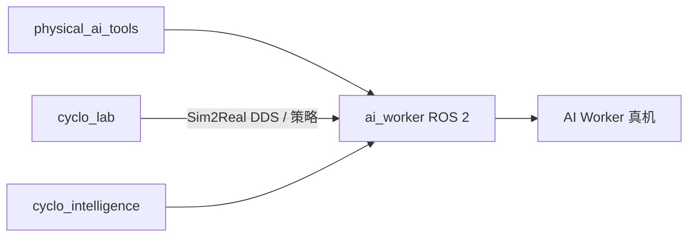

# ROBOTIS AI Worker（ai_worker）

**AI Worker** 是 ROBOTIS **Physical AI** 半人形操作平台（产品叙事 **FFW — Freedom From Work**）；官方 ROS 2 软件入口为 [`ROBOTIS-GIT/ai_worker`](https://github.com/ROBOTIS-GIT/ai_worker)（~159★，Apache-2.0）。文档与教程中心：[ai.robotis.com](https://ai.robotis.com/)。

## 一句话定义

以 `ffw_*` ROS 2 包族提供 AI Worker 的 **机器人描述、bringup、移动导航、遥操作与 Docker 一键服务**，作为 LeRobot / Cyclo 真机采集与部署的硬件侧入口。

## 英文缩写速查

| 缩写 | 英文全称 | 简要说明 |
|------|----------|----------|
| FFW | Freedom From Work | AI Worker 软件/型号前缀 |
| ROS 2 | Robot Operating System 2 | 本仓主中间件 |
| Nav2 | Navigation 2 | `ffw_navigation` 使用的导航栈 |
| BT | Behaviour Tree | 导航模式与上层 Physical AI BT 编排 |
| IL | Imitation Learning | 经 physical_ai_tools / cyclo_lab 衔接 |
| URDF | Unified Robot Description Format | `ffw_description` 描述入口 |

## 为什么重要

- **半人形操作硬件 + 官方 ROS 2**：比纯仿真资产更接近「能买、能 bringup、能接 VLA」的部署路径。
- **与 Cyclo 栈咬合**：README 明确指向 [physical_ai_tools](./robotis-physical-ai-tools.md)、[MuJoCo menagerie](./robotis-mujoco-menagerie.md)、HF 模型与 `robotis/ros` Docker。
- **GPU 碰撞感知操作（可选）**：[AI Worker × Isaac ROS cuMotion](./robotis-ai-worker-isaac-cumotion.md) 在 `cyclo_solution` 工作站上用 **MoveIt 2 + cuMotion + Nvblox** 做静态/动态/携带物体规划（[Isaac ROS 5.0 博客](https://blogs.nvidia.com/blog/isaac-ros-5-0-agentic-open-source-robotics/) 重点案例）。
- **子型号仿真齐全**：FFW-SH5 / SG2 / BG2 出现在 menagerie 与 cyclo_lab 任务名中，便于 Sim2Sim 对照。

## 核心原理

| 组件 | 角色 |
|------|------|
| `ffw_description` / `ffw_bringup` | 模型与启动 |
| `ffw_navigation` | Nav2 + BT 导航模式配置 |
| `ffw_teleop` / joystick / trajectory broadcaster | 遥操作与指令桥 |
| `ffw_swerve_drive_controller` 等 | 底盘 / 执行器控制插件 |
| `ffw_moveit_config` / `ffw_robot_manager` | 运动规划与机器人管理 |
| `docker/` + s6 | AMD64/ARM64 容器化 bringup、navigation、avatar 服务 |

## 工程实践

1. 读 [ai.robotis.com](https://ai.robotis.com/) 对齐当前推荐发行版与 Docker 标签。
2. 克隆 `ai_worker`，按 `docker/container.sh` 或 colcon 工作区 bringup（udev 规则见 `docker/99-*.rules`）。
3. 采集/训练走 [physical_ai_tools](./robotis-physical-ai-tools.md)；Isaac Lab 任务与 DDS bringup 见 [cyclo_lab](./cyclo-lab.md)；长程 BT+VLA 见 [cyclo_intelligence](./cyclo-intelligence.md)。
4. 仿真对照：[robotis_mujoco_menagerie](./robotis-mujoco-menagerie.md) 中 FFW 模型。
5. 碰撞感知双臂规划：读 [cuMotion 集成页](./robotis-ai-worker-isaac-cumotion.md) 与 [cyclo_solution](https://github.com/ROBOTIS-GIT/cyclo_solution)（当前 JetPack 6.2 常配 **外置 GPU 工作站**）。
6. 数据集与权重：[Hugging Face/ROBOTIS](https://huggingface.co/ROBOTIS)。

## 局限与风险

- **开源状态：已开源**（Apache-2.0）；硬件规格与安全规程以官网为准，本仓是软件入口而非机械图纸全集。
- **型号差异**：SH5/SG2/BG2 等在导航、相机与任务配置上不同，勿混用同一 launch 假设。
- **与 AI Sapiens 分流**：人形 K1 走 [ai_sapiens](./robotis-ai-sapiens.md)，不要把 FFW 包直接套到 K1。

## 关联页面

- [ROBOTIS 组织 hub](./robotis.md)
- [Physical AI Tools](./robotis-physical-ai-tools.md)
- [cyclo_lab](./cyclo-lab.md) · [Cyclo Intelligence](./cyclo-intelligence.md)
- [Isaac ROS cuMotion 集成](./robotis-ai-worker-isaac-cumotion.md)
- [AI Sapiens](./robotis-ai-sapiens.md)
- [Teleoperation](../tasks/teleoperation.md)

## 参考来源

- [sources/repos/ai_worker.md](../../sources/repos/ai_worker.md)
- 上游：<https://github.com/ROBOTIS-GIT/ai_worker>

## 推荐继续阅读

- [AI Worker 文档](https://ai.robotis.com/)
- [ROBOTIS Open Source YouTube](https://www.youtube.com/@ROBOTISOpenSourceTeam)
