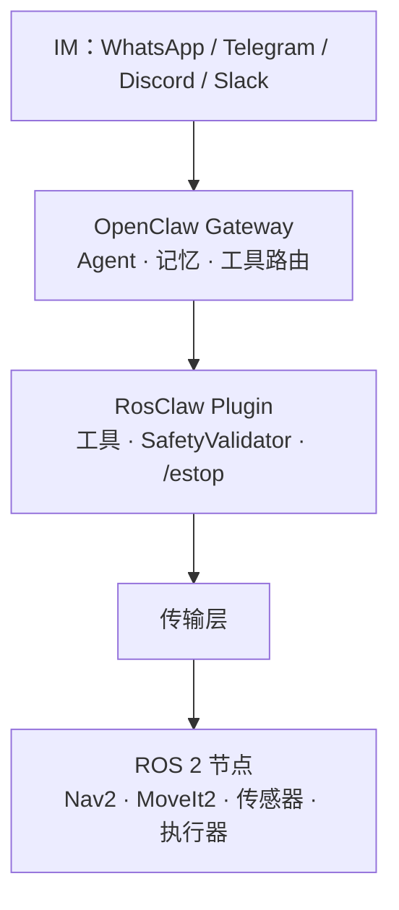
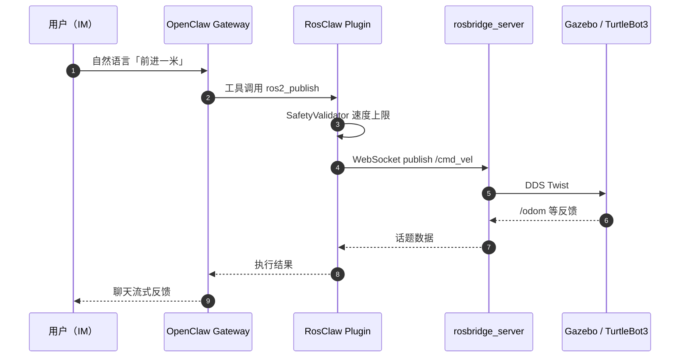

# RosClaw

**RosClaw**（[GitHub: PlaiPin/rosclaw](https://github.com/PlaiPin/rosclaw)）把 [OpenClaw](./openclaw.md) 接到 [ROS 2](https://docs.ros.org/)：用户在日常 IM 里发自然语言，AI Agent 经 RosClaw Plugin 把意图落成 `publish` / `service` / `action` 等 ROS2 操作，并把执行反馈流式写回聊天窗口。

## 一句话定义

**在 OpenClaw 控制平面上注册 ROS2 工具集，把「聊天里的那句话」变成经安全校验的 DDS/rosbridge/WebRTC 机器人指令。**

## 英文缩写速查

| 缩写 | 英文全称 | 简要说明 |
|------|----------|----------|
| ROS 2 | Robot Operating System 2 | 机器人中间件；Nav2 / MoveIt2 等栈 |
| DDS | Data Distribution Service | ROS 2 默认通信层 |
| IM | Instant Messaging | WhatsApp / Telegram / Discord / Slack 等 |
| Nav2 | Navigation 2 | ROS 2 导航栈；常用 Action 目标 |
| WebRTC | Web Real-Time Communication | 模式 C 远端 NAT 穿透与加密数据通道 |
| rosbridge | rosbridge_suite | WebSocket ↔ ROS 2 的标准桥接协议 |

## 为什么重要

- **交互范式：** 降低 ROS2 CLI / `ros2 topic pub` 门槛；远程演示不必 VPN + SSH 串命令。
- **与 OpenClaw 分工清晰：** OpenClaw 管会话、记忆与技能路由；RosClaw 专责 **ROS2 工具注册 + 传输适配 + 安全钩子**——不是又一个 VLA 或运动策略。
- **部署弹性：** 同机（边缘）、局域网（开发）、云端（RaaS）三种拓扑对应不同传输层，文内与上游 README 叙事一致。
- **工程可复用：** `@rosclaw/rosbridge-client` 可脱离 OpenClaw 单独使用；Docker Compose 提供 Gazebo + rosbridge 一键演示。

## 核心结构/机制

### 流程总览

### 三种部署模式

| 模式 | 传输 | 读法 |
|------|------|------|
| **A 同机** | 本地 DDS（`rclnodejs`） | OpenClaw 与 ROS2 同机；延迟最低；适合 Jetson / 车载工控 |
| **B 局域网** | WebSocket → `rosbridge_server` | 开发机 OpenClaw + 机器人 rosbridge；`ws://robot:9090` |
| **C 云端** | WebRTC 数据通道 + 信令 | 机器人仅出站连接；适合 NAT 后远端车队（文内叙事；以仓库发布为准） |

### Agent 工具（上游 README）

| 工具 | 用途 |
|------|------|
| `ros2_publish` | 发布话题（如 `/cmd_vel`） |
| `ros2_subscribe_once` | 单次读状态话题 |
| `ros2_service_call` | 同步服务调用 |
| `ros2_action_goal` | 长时 Action（导航等）+ 反馈 |
| `ros2_param_get/set` | 节点参数 |
| `ros2_list_topics` | 话题发现 |
| `ros2_camera_snapshot` | 相机快照 |
| `/estop` | **绕过 AI** 的紧急停止 |

### 源码运行时序图

RosClaw 为 TypeScript/Node 插件 + ROS2 桥接，**非单篇论文训练管线**；典型 **模式 B 演示栈** 运行时序如下（对齐 `docker compose` + `ws://localhost:9090`）：

## 工程实践

| 场景 | 做法 |
|------|------|
| 本地仿真演示 | `pnpm install && pnpm build`；`cd docker && docker compose up`；OpenClaw 配 RosClaw 插件与 `ws://localhost:9090` |
| 真机局域网 | 机器人侧启动 `rosbridge_server`；OpenClaw 配机器人 IP；先 `ros2_list_topics` 验证连通 |
| 安全 | 配置 `maxLinearVelocity` 等工作空间规则；现场保留物理急停；关键场景依赖 `/estop` 旁路 |
| 与 Philia 对照 | Philia 用 Robot Gateway 契约；RosClaw 用 **通用 ROS2 工具面**——更宽、需更严安全边界 |

## 局限与风险

- **仓库迁移中：** README 注明 **major re-architecture / 拆仓**；集成前核对 `main` 与 Release。
- **不是运动栈：** 不替代 Nav2 规划、WBC 或 RL loco；错误的高层指令仍可能触发危险动作（靠验证器 + `/estop` 缓解）。
- **LLM 工具选择风险：** Agent 可能选错话题/类型；生产环境应白名单话题与速率限制。
- **模式 C 复杂度：** WebRTC + 信令运维成本高于模式 B；企业多租户/审计需自建。
- **与 [RoboClaw](./roboclaw.md) 非同一项目：** 名称相近；RosClaw 偏 IM→ROS2，RoboClaw 偏跨本体具身理解。

## 关联页面

- [OpenClaw](./openclaw.md) — 上游控制平面与 IM 接入
- [RoboClaw](./roboclaw.md) — SJTU MINT 具身助手（跨本体能力抽象）
- [ros2_control](./ros2-control.md) — ROS2 控制器与硬件接口生态
- [unitree_ros2](./unitree-ros2.md) — 宇树真机 ROS2 DDS 栈
- [人形语音交互流水线](../queries/humanoid-voice-interaction-pipeline.md)
- [视觉–语言导航](../tasks/vision-language-navigation.md)
- [四足×VLN 实战营总览](../overview/quadruped-vln-embodied-workshop.md)

## 参考来源

- [RosClaw 代码仓](../../sources/repos/rosclaw.md)
- [古月居：用自然语言控制 ROS2 机器人的完整技术方案](../../sources/blogs/wechat_guyue_rosclaw_ros2_natural_language.md)

## 推荐继续阅读

- 仓库：<https://github.com/PlaiPin/rosclaw>
- OpenClaw：<https://openclaw.ai/>
- rosbridge_suite：<https://github.com/RobotWebTools/rosbridge_suite>
