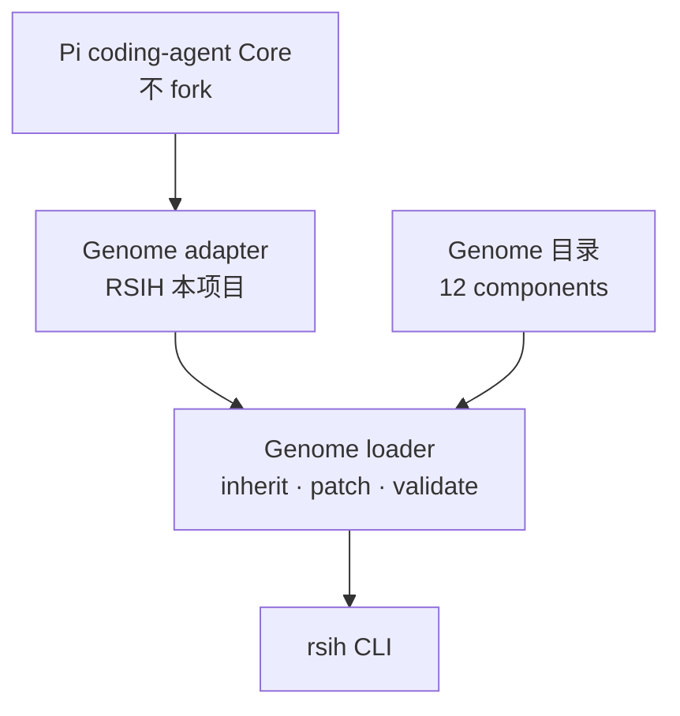
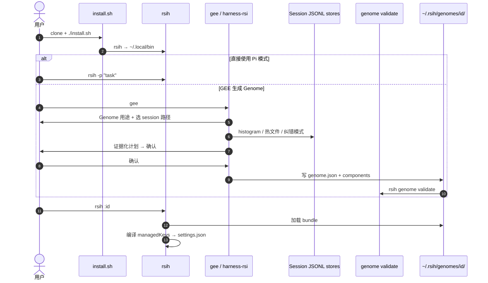

# RSI-Harness（RSIH）

**RSI-Harness**（**RSIH**，[CosmosMind-ai/RSI-Harness](https://github.com/CosmosMind-ai/RSI-Harness)，[Hugging Face 镜像](https://huggingface.co/CosmosMind/RSI-Harness)）是 [MetaRSI-v1](./paper-metarsi-v1.md) 中 **Harness-RSI** 算子的官方工程载体：在 **[Pi coding agent](https://www.npmjs.com/package/@earendil-works/pi-coding-agent)** 之上加 **Genome** 适配层，把 system prompt、tools、skills、MCP、runtime policies 等收成 **可版本、可 diff、可分享** 的目录 bundle。

## 一句话定义

**不 fork Pi Core，只用其公开配置面 — 用 Genome 目录把 agent harness 变成一等对象，并可用 `gee` 从真实会话史自动生成新 Genome。**

## 英文缩写速查

| 缩写 | 英文全称 | 简要说明 |
|------|----------|----------|
| RSIH | RSI Harness | 本页 CLI 名 `rsih` 与仓库品牌 |
| RSI | Recursive Self-Improvement | 此处落地为 **编辑 harness** 而非改模型权重 |
| Genome | Genome configuration bundle | 12 组件 + `genome.json` 的自包含 harness 目录 |
| GEE | Genome Expression Engine | `gee` 命令；启动 `harness-rsi` Genome |
| Pi | Pi coding agent | 不可 fork 的 coding agent Core |
| MCP | Model Context Protocol | Genome `integrations` 组件可声明 stdio MCP |

## 核心信息

| 字段 | 内容 |
|------|------|
| 机构 | 宇宙心智（CosmosMind AI Lab） |
| 代码 | <https://github.com/CosmosMind-ai/RSI-Harness> |
| 论文 | [MetaRSI-v1](./paper-metarsi-v1.md) · [arXiv:2609.06396](https://arxiv.org/abs/2609.06396) |
| 运行时 | Node **≥ 22.19**；`./install.sh` → `~/.local/bin/rsih` |
| Pi 版本 | README 徽章 pi-coding-agent **0.84.3** |
| 开源结论 | **已开源（harness 栈）**；**无** benchmark / training / eval 代码 |
| 许可 | 根目录 **无 LICENSE**（2026-09-14）；使用前确认仓库声明 |

## 为什么重要

- **Harness 一等对象：** 相对「settings.json + 散落 prompt + 口头记忆」，Genome 把 **切换上下文 = 切换目录**，适合 [AI Auto-Research](../concepts/ai-auto-research.md) 里 **S3 实验组织** 的版本化。
- **自指 Harness-RSI：** `harness-rsi` Genome 用 **与普通 Genome 相同机制** 构建 — `src/` 无特权分支；对应 MetaRSI「harness route 用 interface 手段改 harness」。
- **Pi 生态位：** 与 [SoL-Pi](./sol-pi.md)（Pi **extension** 效率包）、[DeepSeek Harness](./deepseek-harness.md)（Cordis 插件 OS）、[OpenClaw](./openclaw.md)（个人助手 + 技能）并列 — RSIH **钉 Pi + Genome**，不是通用多后端 OS。
- **机器人读者：** 可把 `paperlab` Genome 当 **论文实验 coding agent 脚手架** 模板；真机控制仍走 ROS / SDK，不经 RSIH 直接下发力矩。

## 核心原理

### 栈：Pi → Genome adapter → Genomes

**两条不变式（测试守卫）：**

1. 无 `--genome` 时 `rsih` **行为 ≡ `pi`**（仅配置根改为 `~/.rsih`）。
2. Pi 可配置的键，Genome **必须能路由** — Pi 升级增键时 `test/pi-surface.test.ts` 报红。

### 12 组件（互斥字段所有权）

| 组件 | 拥有 |
|------|------|
| `instructions` | system / append prompt |
| `tools` | 内建 tool 开关、参数收窄、生成 tool |
| `skills` | inline + Pi skill 文件 |
| `commands` | slash commands / prompt templates |
| `model` | provider、model cycle、request options |
| `runtime` | tool 执行、steering、max turns |
| `policies` | tool policies、compaction、memory |
| `integrations` | extensions、stdio MCP |
| `appearance` | themes |
| `settings` | `settings.json` 逃逸 hatch |
| `keybindings` | 键位 |
| `resources` | `isolate` — 关闭 Pi 自动发现 |

配置语义：**缺省 inherit** · **`null` 显式 reset** · **present 覆盖**（对象递归 merge，数组整体替换）。

### 内置 Genome

| ID | 用途 |
|----|------|
| `paperlab` | 论文实验 workflow 示例（scout / bootstrap / run-ops skills；`/run-status`） |
| `harness-rsi` | **GEE**：从 session 史 **生成** 新 Genome |

## 源码运行时序图

## 工程实践

| 场景 | 做法 |
|------|------|
| 安装 | `git clone https://github.com/CosmosMind-ai/RSI-Harness.git && cd RSI-Harness && ./install.sh` |
| 脚本化多轮 | `rsih -p "…" --run-id my-run --cwd ~/proj` — 同 id 追加同会话 |
| 切换 Genome | `rsih :paperlab` / `rsih +harness-rsi`（仅 **首参** 可为 genome 标记） |
| 校验分享包 | `rsih genome validate ./my-genome` 后再放入 `~/.rsih/genomes/` |
| 与 SoL-Pi 叠用 | 先 `pi install` SoL-Pi extensions，再 RSIH Genome patch — 注意 **settings 编译层** 管理的键冲突 |
| 开发 | `npm run check`；改组件契约后 `npm run sync:contracts` |

## 局限与风险

- **非全 MetaRSI 复现包：** 仓内 **无** Data-RSI / Model-RSI 训练与 benchmark — 仅 Harness-RSI（见 [论文页](./paper-metarsi-v1.md)）。
- **许可未声明：** 无 LICENSE 文件 — 企业集成前需法务确认。
- **分享隐私：** GEE 从 **私有 transcript** 蒸馏 Genome；**无** 预发布 redaction gate — 分享前须人工清理路径/密钥/内网域。
- **远程 install 未做：** `genome install` 仅内置名 + 本地路径，**不支持** git/npm URL 一键装（README「Not yet」）。
- **不是具身栈：** 与 [RoboHarness](./paper-robo-harness.md) / [Harness VLA](./paper-harness-vla.md) **同名不同物** — 本页是 **软件 coding agent harness**。

## 关联页面

- [MetaRSI-v1（论文）](./paper-metarsi-v1.md) — 三算子框架与 Harness-RSI 理论位置
- [SoL-Pi](./sol-pi.md) — 同 Pi 基底的 auto-research 效率扩展
- [karpathy/autoresearch](./karpathy-autoresearch.md) — 最小 train.py 实验环
- [DeepSeek Harness](./deepseek-harness.md) — DeepSeek 官方 agent OS
- [递归自改进](../concepts/recursive-self-improvement.md) — RSI 概念谱系

## 参考来源

- [sources/repos/rsi-harness.md](../../sources/repos/rsi-harness.md)
- [sources/sites/cosmosmind-ai.md](../../sources/sites/cosmosmind-ai.md)
- [sources/papers/metarsi_v1_arxiv_2609_06396.md](../../sources/papers/metarsi_v1_arxiv_2609_06396.md)

## 推荐继续阅读

- [RSI-Harness README（GitHub）](https://github.com/CosmosMind-ai/RSI-Harness/blob/main/README.md)
- [Genome 文档索引](https://github.com/CosmosMind-ai/RSI-Harness/tree/main/docs/genome)
- [MetaRSI-v1 项目页](https://www.cosmosmind.ai/research/metarsi-v1)
