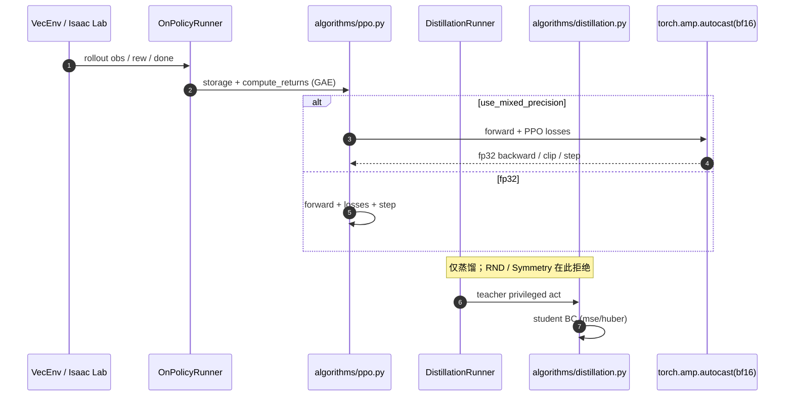

# RSL-RL

**RSL-RL**（[leggedrobotics/rsl_rl](https://github.com/leggedrobotics/rsl_rl)，论文 [arXiv:2509.10771](https://arxiv.org/abs/2509.10771)）由 **ETH Zürich Robotic Systems Lab** 与 **NVIDIA** 维护：面向机器人研究的轻量 GPU 强化学习库，主算法是 [PPO](../methods/ppo.md) 与 Student–Teacher 蒸馏，PyPI 包名 `rsl-rl-lib`。

## 一句话定义

**不要把它当成通用 RL 框架：它是 Isaac Lab / Legged Gym 栈里那层可插拔的 on-policy 更新核——PPO clip + GAE，外加一条把特权 Teacher 压成机载 Student 的 Distillation Runner；`use_mixed_precision` 只加速 `update()`，不改仿真采集精度。**

## 英文缩写速查

| 缩写 | 英文全称 | 简要说明 |
|------|----------|----------|
| RSL-RL | Robotic Systems Lab Reinforcement Learning | 本库：ETH RSL 的 GPU PPO / 蒸馏实现 |
| PPO | Proximal Policy Optimization | 主算法；clip + GAE + 可选 KL 自适应 lr |
| BF16 | Brain Floating Point 16 | `update()` 前向+损失的 autocast dtype |
| GAE | Generalized Advantage Estimation | On-policy rollout 丢掉前算优势 |
| RND | Random Network Distillation | PPO 探索奖励扩展；蒸馏路径显式拒绝 |
| BC | Behavior Cloning | DistillationRunner 对学生动作的 mse / huber |

## 为什么重要

- **生态默认后端：** [Isaac Lab](./isaac-lab.md)、[legged_gym](./legged-gym.md)、[mjlab](./mjlab.md)、[MuJoCo Playground](./mujoco-playground.md) 的 PPO 训练几乎都落到这里；读运控论文里的 `OnPolicyRunner` 就是读本库。
- **蒸馏是一等公民：** 不是事后脚本，而是独立 `DistillationRunner`——Teacher 用特权观测出动作，Student 只看机载观测做 BC。RND / Symmetry 只挂 PPO，和蒸馏不兼容。
- **BF16 是 2026 的工程旋钮，不是论文卖点：** 论文 [arXiv:2509.10771](https://arxiv.org/abs/2509.10771) 讲库的定位；混合精度来自仓库 [PR #219](https://github.com/leggedrobotics/rsl_rl/pull/219)。单次 `update()` 在 RTX 4090 上 **2.39×**、显存 **−33%**；端到端 wall-clock 常被仿真采集绑死，不要用这个数字当「训练快一倍」。

## 核心信息

| 项 | 内容 |
|----|------|
| **机构** | 苏黎世联邦理工学院（ETH Zürich）Robotic Systems Lab；英伟达（NVIDIA） |
| **开源** | **已开源**（BSD-3-Clause）：训练循环可跑，不是占位 README |
| **安装** | `pip install rsl-rl-lib` 或 `pip install -e .`（Python 3.9+） |
| **文档** | <https://leggedrobotics.github.io/rsl_rl/> |
| **算法** | `rsl_rl/algorithms/ppo.py`、`distillation.py` |
| **Runner** | `OnPolicyRunner`、`DistillationRunner` |

## 核心原理

### PPO 更新核

与 [PPO 方法页的 rsl_rl 对照表](../methods/ppo.md) 对齐：`act` / `evaluate` → rollout storage → `compute_returns`（GAE）→ clip surrogate + 价值损失 + 熵。可选 `desired_kl` 自适应学习率。观测标准化与 `action_scale` 是运控稳定性的一部分，不是「额外技巧」。

### 蒸馏路径

Teacher 在特权观测上给出动作；Student 只吃可部署观测，损失是 mse 或 huber。这是 [特权训练](../concepts/privileged-training.md) 的两阶段落地，不是非对称 Actor-Critic（后者仍是同一套 PPO，只是 critic 多看特权）。

### BF16 混合精度

`use_mixed_precision: bool = False`。为 True 时，`PPO.update()` / `Distillation.update()` 的前向与损失走 `torch.amp.autocast(..., dtype=torch.bfloat16)`；反向、梯度裁剪、all-reduce、optimizer step **仍 fp32**。不要把「混合精度」理解成整条仿真–控制环都变成 bf16。

## 源码运行时序图

最短路径：Isaac Lab / mjlab 任务配置里选 `rsl_rl` 算法块，打开 `use_mixed_precision` 只影响更新核；蒸馏任务换 `DistillationRunner`，不要和 AMP 扩展、RND 叠在同一 runner。

## 工程实践

| 项 | 说明 |
|----|------|
| 默认关 BF16 | 先在 fp32 对齐奖励曲线，再开混合精度；数值差应在噪声内 |
| 端到端别对标 2.39× | 该倍数是单次 `update()`；采集绑死时应先减仿真或加 GPU env |
| 蒸馏与探索扩展互斥 | RND / Symmetry 挂 PPO；蒸馏路径会显式拒绝 |
| 下游 AMP | 人形 AMP 走 [AMP-RSL-RL](./amp-rsl-rl.md) 或 [amp_mjlab](./amp-mjlab.md)，不要和官方蒸馏 runner 混为一谈 |
| 对照代码 | 公式↔符号见 [PPO · rsl_rl 代码对照](../methods/ppo.md) |

## 局限与风险

- **不是通用算法动物园：** 没有 SAC / off-policy replay；选型先看 [RL Runner](../concepts/rl-runner.md) 是不是 on-policy。
- **BF16 收益环境相关：** 小 MLP + 采集瓶颈时 wall-clock 几乎不动。
- **论文 ≠ 仓库全部功能：** 混合精度、RND、Symmetry 以 GitHub main 为准。
- **AMP 扩展是下游仓：** [gbionics/amp-rsl-rl](https://github.com/gbionics/amp-rsl-rl) 不是本库的一部分。

## 关联页面

- [PPO](../methods/ppo.md) — clip / KL 自适应 lr / 本库符号对照
- [RL Runner](../concepts/rl-runner.md) — `OnPolicyRunner` vs `DistillationRunner`
- [特权训练](../concepts/privileged-training.md) — Teacher 特权观测、Student 机载观测
- [Isaac Lab](./isaac-lab.md) — 当前最常见宿主
- [legged_gym](./legged-gym.md) — 经典 Isaac Gym 宿主
- [AMP-RSL-RL](./amp-rsl-rl.md) — 在本库 PPO 上叠 AMP
- [mjlab](./mjlab.md) / [MuJoCo Playground](./mujoco-playground.md)
- [wheel_legged_genesis](./wheel-legged-genesis.md) — Genesis 宿主上的 vendored RSL-RL
- [lab.flamingo](./isaac-rl-two-wheel-legged-bot.md) — CoRL 在 rsl_rl 上叠 off-policy runner

## 参考来源

- [RSL-RL 仓库归档](../../sources/repos/rsl_rl.md)
- [RSL-RL 论文摘录（arXiv:2509.10771）](../../sources/papers/rsl_rl_arxiv_2509_10771.md)

## 推荐继续阅读

- GitHub — <https://github.com/leggedrobotics/rsl_rl>
- 文档 — <https://leggedrobotics.github.io/rsl_rl/>
- 论文 — <https://arxiv.org/abs/2509.10771>
- BF16 PR — <https://github.com/leggedrobotics/rsl_rl/pull/219>
