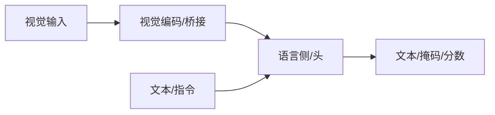

# Sa2VA

## 一句话定义

**Sa2VA**（*Marrying SAM2 with LLaVA*，[arXiv:2501.04001](https://arxiv.org/abs/2501.04001)）把 **SAM 2** 的掩码解码与 **MLLM** 对话能力接到同一 token 空间：模型输出 `[SEG]` 等指令 token，投影到 SAM 2 提示空间生成图像/视频掩码，并支持指称分割与 grounded 对话。

## 英文缩写速查

| 缩写 | 英文全称 | 简要说明 |
|------|----------|----------|
| Sa2VA | Sa2VA | 分割增强的视觉助理族 |
| VLM | Vision-Language Model | 语言交互底座 |
| Grounding | Visual Grounding | 语言到区域/掩码 |
| VOS | Video Object Segmentation | 视频对象分割相关 |
| Embodied | Embodied AI | 具身应用语境 |

## 为什么重要

- 课程第 5–6 章多模态主线节点；与机器人 VLM/VLA 选型直接相关。
- 理解其输入输出接口，才能正确接到检测、分割或策略模块。

## 核心原理

在 MLLM 上强化掩码/轨迹级接地能力，使语言指令可落到像素或时序对象，便于操作与导航。

## 工程实践

| 项 | 建议 |
|----|------|
| 权重 | 优先官方或 Hugging Face 发布 |
| 微调 | 指令数据质量优先；可用 LoRA |
| 机器人 | 明确延迟预算；重模型可云端核验 |

## 局限与风险

幻觉、错误 grounding、许可与安全过滤必须单独评估；开源状态以项目页为准，部署前核查权重协议。

## 关联页面

- [多模态基础](../concepts/multimodality-basics.md)
- [多模态 LLM 路线](../overview/multimodal-llm-development.md)
- [BLIP-2](./paper-blip2.md)
- [Transformer CV 课程策展](../entities/transformer-cv-curriculum.md)

## 参考来源

- [Transformer 视觉应用课程大纲](../../sources/courses/transformer_cv_applications_syllabus.md)

## 推荐继续阅读

- [Sa2VA arXiv:2501.04001](https://arxiv.org/abs/2501.04001)
- [Sa2VA 项目页](https://lxtgh.github.io/project/sa2va/)
