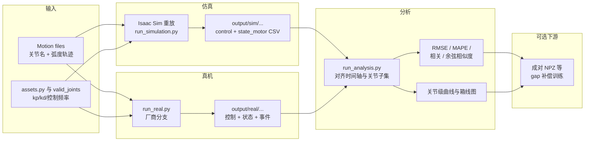

# SAGE（Sim2Real Actuator Gap Estimator）

**SAGE** 是面向 **关节运动执行器层** 的 sim2real 度量工具链：同一组参考轨迹分别在 **Isaac Sim 仿真** 与 **真实机器人** 上执行，对齐日志格式后做 **统计对比与可视化**，并可进一步整理为 **成对时序数据** 供学习类 gap 补偿模型使用。

## 一句话定义

用可复现脚本把「仿真里关节实际跟上指令的程度」和「真机同一指令下的响应」拉到同一指标体系里量化。

## 为什么重要

- **执行器 gap** 常被 lump 进「动力学不准」，但工程上需要独立度量：PD 带宽、摩擦、温度与电流限制、通信抖动都会体现在关节状态轨迹上，而不是仅靠刚体参数随机化就能覆盖。
- **闭环前置**：在堆 DR 或训练 ActuatorNet 之前，先知道「差在哪几个关节、差在位置还是力矩通道」能显著减少盲调。
- **与 NVIDIA 栈对齐**：绑定公开 README 中的 **Isaac Sim 5.0 + Isaac Lab 2.2** 版本组合，便于与社区其他 Isaac 项目对照复现。

## 流程总览

下列主干对应仓库默认「重放 → 采集 → 分析」路径；OSMO 分支将仿真/分析作业外包到平台调度，数据契约不变。

## 核心机制（知识归纳）

1. **同一运动文件驱动两端**：减少「任务不一致」带来的伪 gap；剩余差异主要来自仿真动力学、控制器实现与真机执行链。
2. **显式控制器对齐假设**：`kp`、`kd`、控制频率在 CLI 与 `assets.py` 中有优先级；若与真机采集时不一致，README 警告会 **放大** 表观 gap——这既是陷阱也是用 SAGE 反查配置错误的手段。
3. **日志语义对齐**：仿真与真机在 CSV 字段、时间戳单位、类型枚举上存在差异（README 对比表），分析脚本承担规范化与对齐。
4. **多机器人、多负载数据叙事**：README 描述 Unitree H1-2 上身 + 负载档与 RealMan 四臂结构，用于研究 **跨条件泛化** 或 **载荷引起 gap 变化**。

## 常见误区

- **把 gap 全归因于仿真器**：未对齐控制频率与 PD 时，测到的是「接口不一致」而非物理差异。
- **忽略时间对齐**：真机不规则采样与仿真固定步长混用需要谨慎重采样或事件对齐，否则相关/余弦指标会失真。
- **跳过 valid_joints 语义**：只评「能动的子集」与评全身自由度，结论不可直接比较。

## 与其他页面的关系

- 与 **[Sim2Real](../concepts/sim2real.md)**：SAGE 聚焦执行器与关节轨迹层；视觉、地形、感知 gap 不在默认管线内。
- 与 **[System Identification](../concepts/system-identification.md)** 与 **[Actuator Network](../methods/actuator-network.md)**：SAGE 提供数据与指标接口；SysID / 学习式执行器模型是下游消 gap 手段。

## 推荐继续阅读

- 上游仓库 README：<https://github.com/isaac-sim2real/sage>
- Isaac Lab 安装文档：<https://isaac-sim.github.io/IsaacLab/main/source/setup/installation/index.html>
- [AMASS](./amass.md)（人体动捕元数据，常与重定向轨迹来源一起出现）

## 参考来源

- [sources/repos/sage-sim2real-actuator-gap.md](../../sources/repos/sage-sim2real-actuator-gap.md)

## 关联页面

- [Sim2Real](../concepts/sim2real.md)
- [Isaac Gym / Isaac Lab](./isaac-gym-isaac-lab.md)
- [AMASS](./amass.md)
- [Sim2Real Gap 缩减实战指南](../queries/sim2real-gap-reduction.md)
