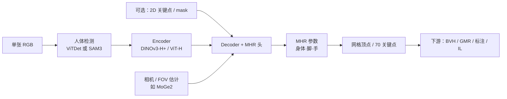

# SAM 3D Body（3DB）

**SAM 3D Body（3DB）**（arXiv:2602.15989，Meta Superintelligence Labs）是 **SAM 3D** 产品线中的 **人体支路**：从 **单张 RGB**（可选 **2D 关键点 / mask** 提示）恢复 **全身网格**，覆盖 **身体、双脚与双手**。网格采用 **[Momentum Human Rig（MHR）](https://github.com/facebookresearch/MHR)**——将 **骨骼** 与 **表面形状** 解耦，相对传统 SMPL 族更利于 rig 解释与下游动画导出。与 [SAM 3D Objects](https://github.com/facebookresearch/sam-3d-objects) 并列时，可把人–物重建 **对齐到同一坐标系**，服务场景级 embodied 感知。

## 一句话定义

**SAM 家族式可提示 HMR**：单图 → MHR 全身参数 + 网格，强调野外泛化、手脚细节与开放权重/数据。

## 为什么重要

- **机器人感知上游**：单目视频/图像 → **一致的人体 3D 姿态** 是 [Motion Retargeting Pipeline](../concepts/motion-retargeting-pipeline.md) 与 [Whole-Body Tracking](../concepts/whole-body-tracking-pipeline.md) 的常见输入；3DB 把 **手–脚–躯干** 放在同一 MHR 表示里，减少「全身 SMPL + 独立手部网络」拼接误差。
- **可提示 = 可纠错**：类似 SAM 的 **keypoint / mask** 条件让操作者或上游检测器在遮挡、截断帧上 **引导推理**，适合半自动标注与遥操作质检。
- **工程生态已成型**：官方 PyTorch + Hugging Face checkpoint；社区 [SAM3DBody-cpp](./sam3dbody-cpp.md) 提供 **ONNX + 零 Python 运行时** 与 **BVH 动捕导出**，缩短「论文 → 动捕文件 → 重定向」路径。
- **与生成式运动模型分工明确**：[GENMO](../methods/genmo.md) 等偏 **时序 SMPL 生成/估计**；3DB 偏 **单帧（或可逐帧）几何 HMR**，二者可在视频管线上串联（3DB 逐帧 + 时序平滑 / 生成模型补洞）。

## 核心结构

| 模块 | 作用 |
|------|------|
| **Encoder–decoder** | 图像特征 → MHR 姿态/形状/相机参数 |
| **MHR** | 身体 + 脚 + 手的参数化网格；与 SMPL 族不同的骨架–表面解耦设计 |
| **提示接口** | 2D keypoints、masks 等辅助条件（user-guided） |
| **检测 / 相机** | 默认人体检测（ViTDet 或 **SAM3** 检测器对齐 playground）；**MoGe2** 等 FOV 模块估计相机 |
| **数据与标注** | 多阶段：可微优化、多视角几何、稠密关键点、data engine 覆盖罕见姿态 |

### 公开 checkpoint 指标（README，2025-11-19）

| Backbone | 3DPW MPJPE | EMDB MPJPE | RICH PVE | Freihand PA-MPJPE |
|----------|------------|------------|----------|-------------------|
| DINOv3-H+ (840M) | 54.8 | 61.7 | 60.3 | 5.5 |
| ViT-H (631M) | 54.8 | 62.9 | 61.7 | 5.5 |

（另有 COCO / LSPET PCK 等；详见官方 README 表。）

## 流程总览（单图推理）

## 与 WiLoR、GENMO 的关系

| 维度 | SAM 3D Body | [WiLoR](../methods/wilor.md) | [GENMO](../methods/genmo.md) |
|------|-------------|------------------------------|------------------------------|
| 覆盖 | 全身 + 手脚（MHR） | 双手 MANO 级细节 | 时序 SMPL 估计/生成 |
| 输入 | 单图（可提示） | 单图/逐帧视频 | 视频/2D/文本/音乐等多模态 |
| 典型下游 | 动捕 BVH、重定向 | 灵巧操作、ExoActor 双手支路 | 长序列运动合成、跟踪参考 |

**实践建议**：需要 **手指精细语义** 时仍可用 WiLoR 补强；需要 **长时一致轨迹** 时在 3DB 逐帧输出上加时序滤波（见 [SAM3DBody-cpp](./sam3dbody-cpp.md)）或接 GENMO 类模型。

## 常见误区或局限

- **不是物理仿真器**：输出运动学网格与相机系平移，**不含接触力、地面约束**；落地机器人需 [Motion Retargeting](../concepts/motion-retargeting.md) 与物理筛选。
- **许可**：SAM License，商业集成需单独审阅；与 Meta 其他 SAM 产品许可策略一致。
- **单帧 vs 视频**：官方 demo 以 **单图** 为主；视频应用需自行 **跟踪 + 时序平滑**（社区 C++ 仓提供多人体 BVH 与离线五遍管线）。
- **与 SMPL 生态**：MHR 关节命名与 SMPL→机器人工具链（如 [GMR](../methods/motion-retargeting-gmr.md)）之间可能需要 **显式转换** 或 BVH 中间格式。

## 关联页面

- [SAM3DBody-cpp](./sam3dbody-cpp.md) — ONNX 实时推理、BVH 导出、Blender 插件
- [Motion Retargeting Pipeline](../concepts/motion-retargeting-pipeline.md) — 视频估计上游节点
- [Whole-Body Tracking Pipeline](../concepts/whole-body-tracking-pipeline.md) — 参考运动采集阶段
- [WiLoR](../methods/wilor.md) — 手部专用估计互补
- [GENMO](../methods/genmo.md) — 时序人体运动生成/估计对照
- [GMR](../methods/motion-retargeting-gmr.md) — SMPL/MHR 序列 → 机器人重定向

## 推荐继续阅读

- 论文：<https://arxiv.org/abs/2602.15989>
- 官方仓库：<https://github.com/facebookresearch/sam-3d-body>
- MHR：<https://github.com/facebookresearch/MHR>
- Hugging Face 权重：<https://huggingface.co/facebook/sam-3d-body-dinov3>

## 参考来源

- [SAM 3D Body（arXiv:2602.15989）](../../sources/papers/sam_3d_body_arxiv_2602_15989.md)
- [SAM 3D Body 官方仓库](../../sources/repos/sam-3d-body.md)
