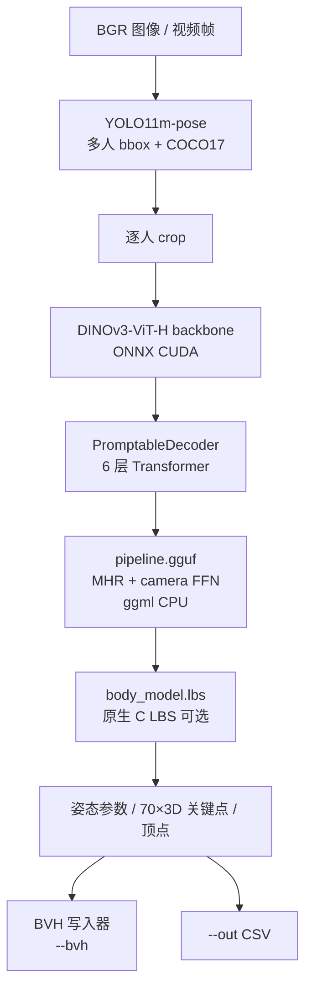

# SAM3DBody-cpp

**SAM3DBody-cpp**（[AmmarkoV/SAM3DBody-cpp](https://github.com/AmmarkoV/SAM3DBody-cpp)）是 [SAM 3D Body](./sam-3d-body.md) 的 **独立 C++ 推理引擎**：运行时 **不依赖 Python/PyTorch**（ONNX Runtime + ggml），把单目 RGB 图像或视频转为 **每人一份 MHR 姿态参数、相机平移、可选 18439 顶点网格与 70 个 3D 关键点**，并可导出 **标准 BVH** 供 Blender / DCC 与 [Motion Retargeting](../concepts/motion-retargeting.md) 使用。

## 一句话定义

**SAM 3D Body 的工程化运行时**：GPU 上接近实时、CPU 可做单图/低频；多人跟踪 + BVH + 可选 Butterworth/四元数滤波。

## 英文缩写速查

| 缩写 | 英文全称 | 简要说明 |
|------|----------|----------|
| ONNX | Open Neural Network Exchange | 跨框架神经网络模型交换格式 |
| RGB | Red-Green-Blue | 彩色图像通道，常与深度 (RGB-D) 配合 |
| Retargeting | Motion Retargeting | 将人体/动物动作映射到目标机器人骨架 |
| GPU | Graphics Processing Unit | 图形处理器，大规模并行仿真训练的算力基础 |
| CPU | Central Processing Unit | 中央处理器 |
| CUDA | Compute Unified Device Architecture | NVIDIA GPU 通用并行计算平台 |
| SMPL | Skinned Multi-Person Linear Model | 常见人体参数化模型与重定向源 |
| GMR | General Motion Retargeting | 把人体/视频动作重定向为机器人可执行参考 |

## 为什么重要

- **缩短研究–部署间隙**：官方仓以 PyTorch + Hugging Face 为主；机器人现场、ROS、嵌入式或 **禁止 Python 运行时** 的环境需要 **ONNX 拆分 + 原生 LBS**。
- **动捕中间格式开箱即用**：`--bvh` 输出 `p_0.bvh`、`p_1.bvh`…，内置 **bbox IoU 跟踪**、**骨长自适应 OFFSET**、Blender **MakeHuman** 插件，与 [FreeMoCap](./freemocap.md) 等多相机方案形成 **「单 RGB → BVH」** 低成本路径对照。
- **与官方权重对齐**：模型来自 [Fast-SAM-3D-Body](https://github.com/AmmarkoV/Fast-SAM-3D-Body) 导出；Hugging Face 提供 **~5GB CUDA 包** 或 **CPU fp32 backbone** 变体。

## 核心管线（非 2D 提升）

README 强调：网络 **直接回归 3D 人体模型参数**，而非经典 2D→3D lifting；单目深度来自 **crop 内人体比例 + 相机焦距条件**（与 SMPL/HMR 族相同的 monocular 先验）。

| 阶段 | 典型耗时语境 |
|------|----------------|
| CUDA + `backbone.onnx`（BF16） | 视频/摄像头 **接近实时**（项目定位） |
| CPU + `backbone_fp32.onnx` | 单图可行；**每帧 backbone 约 5–15s**（README 明示视频不实用） |

## 主要输出字段（工程接口）

| 字段 | 含义 |
|------|------|
| `mhr_model_params` | 组装后的 LBS 向量（204 维等） |
| `body_pose` / `hand_pose` | 躯干与双手欧拉角 |
| `pred_cam_t` | 相机系根平移 |
| `kps_3d` | 70 关节 × 3（米），启用 LBS 时 |
| `pred_vertices` | 18439 顶点（米） |

**BVH 导出**：基于 `body.bvh`（MocapNET/MakeHuman T-pose）模板，MHR 关节名映射；支持 `--butterworth`、`--butterworth-root-rotation`（四元数 SLERP-EMA，避免欧拉滤波翻转）。

## 离线精修（`offline_sam_3dbody_render`）

对 **磁盘上的完整视频**，五遍非因果处理：**全片推理 + 场景切检测（光流/直方图/人数跳变）→ 双向跟踪 → 双向滤波 → BVH 写出**，比在线 `fast_sam_3dbody_run` 更平滑、身份更稳（README 对比说明）。

## 常见误区或局限

- **模型体积**：CUDA 全套 onnx 约 **~5GB+**；需预先从 Hugging Face 下载 zip。
- **≠ 官方支持**：社区实现；精度/数值应与 PyTorch `mhr_forward` 对齐（LBS 路径声称一致），版本漂移需自行回归测试。
- **MHR→SMPL→GMR**：若下游只吃 SMPL，需中间转换；更常见是 **BVH → 重定向工具** 而非直接进 [GMR](../methods/motion-retargeting-gmr.md) SMPL 接口。
- **多人遮挡**：YOLO + IoU 跟踪在密集交互场景仍可能 **ID 切换**；离线五遍 + 场景切分可缓解不可因果错误。

## 关联页面

- [SAM 3D Body](./sam-3d-body.md) — 方法与 MHR 背景、官方 PyTorch 路径
- [Motion Retargeting Pipeline](../concepts/motion-retargeting-pipeline.md) — BVH/关键点 → 机器人参考
- [FreeMoCap](./freemocap.md) — 多相机开源动捕对照
- [GMR](../methods/motion-retargeting-gmr.md) — 机器人重定向（注意参数化差异）

## 推荐继续阅读

- 仓库 README：<https://github.com/AmmarkoV/SAM3DBody-cpp>
- ONNX 模型包：<https://huggingface.co/AmmarkoV/SAM3DBody-cpp-onnx-models>
- 导出工具链：<https://github.com/AmmarkoV/Fast-SAM-3D-Body>
- 演示视频：<https://www.youtube.com/watch?v=f-tCwCQvurQ>

## 参考来源

- [SAM3DBody-cpp 仓库](../../sources/repos/sam3dbody-cpp.md)
- [SAM 3D Body 论文摘录](../../sources/papers/sam_3d_body_arxiv_2602_15989.md)
