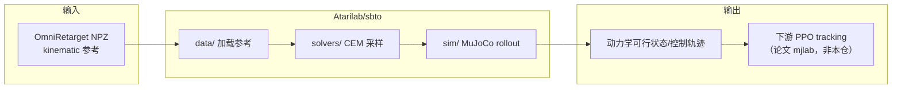

# sbto（DynaRetarget SBTO 官方实现）

**sbto**（<https://github.com/Atarilab/sbto>，MIT）是 [DynaRetarget](./paper-notebook-dynaretarget-dynamically-feasible-retargeting-us.md) 论文中 **SBTO**（Sampling-Based Trajectory Optimization）的 **官方开源实现**。它在 **MuJoCo** 里对 **PD 目标 knot** 做 **CEM 采样优化**，把 [OmniRetarget](./paper-hrl-stack-03-omniretarget.md) 等 **kinematic 参考** refinement 为 **动力学可行** 的 G1–物体轨迹；算法背景见 [DynaRetarget / SBTO 方法页](../methods/dynaretarget-sbto-motion-retargeting.md)。

## 英文缩写速查

| 缩写 | 英文全称 | 简要说明 |
|------|----------|----------|
| SBTO | Sampling-Based Trajectory Optimization | 增量扩展优化时域的采样式轨迹优化 |
| CEM | Cross-Entropy Method | 默认采样分布更新器 |
| IK | Inverse Kinematics | 上游运动学参考来源（本仓不含 IK 前端） |
| G1 | Unitree G1 Humanoid | 默认任务与实验平台 |
| DR | Domain Randomization | 下游 RL 训练随机化（论文栈，非本仓） |

## 为什么重要

- **论文代码入口：** DynaRetarget 的 **dynamic refinement** 可在此仓库复现；默认数据链到 HuggingFace **[OmniRetarget 数据集](./omniretarget-dataset.md)** `robot-object.zip`。
- **工程可扩展：** **Hydra** 配置树（`sbto/conf/`）分离 task / solver / scene；支持 **双场景**（参考 vs rollout）与 **物体增广**（box / chair / shelf / cylinder）。
- **与 SBMPC 对照基线：** 论文在 285 条 OmniRetarget motion 上报告 SBTO refinement 成功率约为 [SPIDER](../methods/spider-physics-informed-dexterous-retargeting.md) SBMPC 的 **2×**。

## 仓库结构

| 目录 | 职责 |
|------|------|
| `sbto/solvers/` | CEM 等采样优化器 |
| `sbto/sim/` | MuJoCo rollout 封装 |
| `sbto/tasks/` | G1 `robot-object` / `robot_ref` 任务 |
| `sbto/conf/` | Hydra 配置（含 `mj_scene_ref` 与 `sim/mj_scene`） |
| `scripts/visualize_ref.py` | 参考轨迹与场景可视化 |

## 快速上手

```bash
# 数据
wget "https://huggingface.co/datasets/omniretarget/OmniRetarget_Dataset/resolve/main/robot-object.zip"

# 运行 SBTO
python3 sbto/main.py solver=cem \
  task.cfg_ref.motion_path=datasets/robot-object/sub10_largebox_000_original.npz
```

**注意：** OmniRetarget NPZ 的 free joint 为 `[quat, pos]`，默认 `flip_quat_pos=True`；自定义 MuJoCo 参考需设为 `False`。

## 流程总览



## 局限

- **范围：** 发布 **SBTO 优化器**；IK 前端与 RL/mjlab 训练管线需按论文自行对接。
- **计算：** refinement 绝对成本较高（论文约 20 s CPU / 1 s motion）；SBTO_skip 变体在论文中降低约 3× 仿真步。
- **License：** MIT（`pyproject.toml`）；GitHub API 曾显示 license 字段为空，以仓库文件为准。

## 与其他页面的关系

- **论文 / 方法：** [DynaRetarget 实体](./paper-notebook-dynaretarget-dynamically-feasible-retargeting-us.md)、[SBTO 方法页](../methods/dynaretarget-sbto-motion-retargeting.md)
- **Kinematic 上游：** [OmniRetarget](./paper-hrl-stack-03-omniretarget.md)、[OmniRetarget 数据集](./omniretarget-dataset.md)
- **对照：** [SPIDER](../methods/spider-physics-informed-dexterous-retargeting.md)
- **流水线：** [Motion Retargeting Pipeline](../concepts/motion-retargeting-pipeline.md)

## 参考来源

- [sbto.md](../../sources/repos/sbto.md) — 仓库 README / pyproject 归纳（主归档）
- [dynaretarget_arxiv_2602_06827.md](../../sources/papers/dynaretarget_arxiv_2602_06827.md) — 论文算法与实验

## 推荐继续阅读

- 代码：<https://github.com/Atarilab/sbto>
- 项目页：<https://atarilab.github.io/dynaretarget.io/>
- 论文：<https://arxiv.org/abs/2602.06827>
- OmniRetarget 数据：<https://huggingface.co/datasets/omniretarget/OmniRetarget_Dataset>
