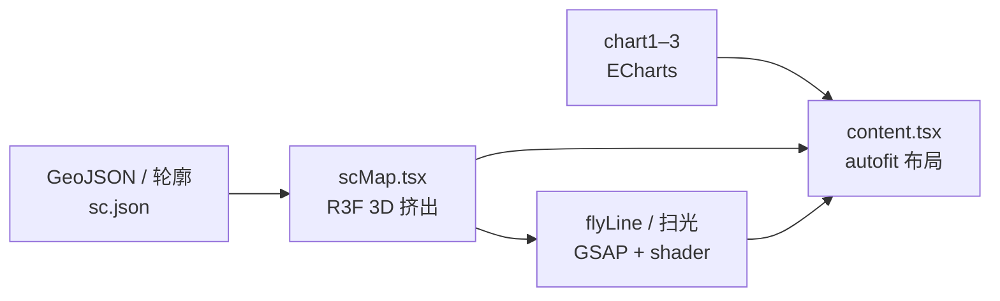
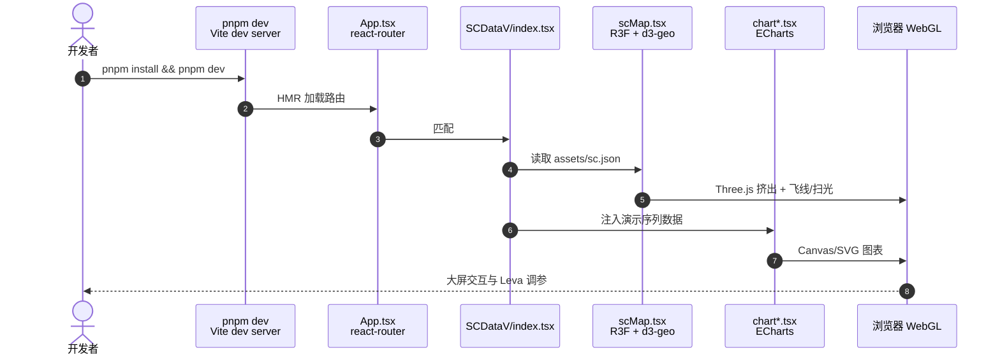

# sc-datav（Three.js 数据可视化大屏）

**sc-datav** 是 [knight-L/sc-datav](https://github.com/knight-L/sc-datav)（Apache-2.0，~2.3k stars）提供的 **Web 端 3D 数据可视化大屏** 参考实现：以 **四川省 GeoJSON 轮廓** 为默认场景，在 Three.js 中做挤出、飞线与扫光，侧栏用 ECharts 展示多路时序/柱状图，并通过 **autofit.js** 适配不同分辨率。在线演示见 [knight-l.github.io/sc-datav](https://knight-l.github.io/sc-datav/#/demo0)。

## 一句话定义

用 **React 19 + Vite + @react-three/fiber + ECharts + d3-geo** 把 **地理轮廓 3D 地图与 2D 指标面板** 捆成可 fork 的大屏前端，数据默认静态 JSON，适合替换为机队/工厂 API 或 OTel 聚合查询。

## 英文缩写速查

| 缩写 | 英文全称 | 简要说明 |
|------|----------|----------|
| GeoJSON | Geographic JSON | 矢量地理数据交换格式；本仓 `sc.json` 等 |
| R3F | React Three Fiber | React 渲染 Three.js 场景的绑定层 |
| ECharts | — | Apache 基金会下的浏览器图表库 |
| Vite | — | 现代前端构建工具；本仓 dev/build 入口 |
| GSAP | GreenSock Animation Platform | 时间轴动画库；飞线/扫光等 |
| OTel | OpenTelemetry | 云边遥测标准；与本仓 UI 可对接而非内置 |

## 为什么重要

- **运营视图 vs 仿真视口：** 机器人系统除 MuJoCo/Isaac 内相机外，常需要 **队级地理分布、告警热力、任务趋势** 同屏；本仓是 **纯浏览器、无游戏循环** 的大屏范式，与 [Three.js Game Skills](./threejs-game-skills.md) 的「可发布游戏 + Agent QA」互补。
- **模块边界可直接嫁接数据：** `scMap` / `flyLine` / `chart*` 分离，fork 后通常只改 **数据加载层**（WebSocket、REST、GraphQL），保留 Three+ECharts 呈现。
- **地理资产可换域：** README 链到 [sat-hunter](https://github.com/knight-L/sat-hunter) 下载区域卫星瓦片与轮廓，说明默认「四川」只是 demo，可扩展到园区/工厂平面 GIS。
- **与本站系统工程链对齐：** [可观测性](../concepts/observability-logs-metrics-tracing.md) 讲 **Metrics/Logs 从哪来**；[边缘–云端协同](../concepts/edge-cloud-robotics.md) 讲 **算力放哪**；本实体讲 **云侧/展厅侧怎么看**。

## 流程总览

## 核心结构

| 模块 | 路径/技术 | 职责 |
|------|-----------|------|
| 地图 | `pages/SCDataV/scMap.tsx` | d3-geo 投影 + Three 网格/材质 |
| 飞线 | `flyLine.tsx` | 区域间动态连线 |
| 图表 | `chart1.tsx`–`chart3.tsx` | ECharts 实例与联动 |
| 布局 | `content.tsx` + autofit.js | 大屏缩放与安全区 |
| 调参 | Leva | 开发期实时调视觉参数 |
| 路由 | react-router | `#/demo0`–`#/demo3` 多皮肤 |

### 源码运行时序图

主仓 **已开源**（Apache-2.0）。下列时序对齐 README 与 `package.json` scripts：本地开发从静态 GeoJSON 到浏览器呈现，无服务端环节。

关键复现路径：`pnpm install` → `pnpm dev` → 浏览器打开本地 URL → 切换 `#/demo0`–`#/demo3`；生产路径为 `pnpm build` + 静态托管（与 GitHub Pages 演示一致）。

## 工程实践

### 开源状态（2026-09-29）

| 组件 | 状态 | 入口 |
|------|------|------|
| 主仓库 | **已开源** | https://github.com/knight-L/sc-datav |
| 在线演示 | **公开** | https://knight-l.github.io/sc-datav/ |
| 地图贴图工具 | **已开源**（ sibling 仓） | https://github.com/knight-L/sat-hunter |
| 实时后端 | **无** | 需自行接 Metrics/API |

### 接入机器人队级监控的建议顺序

1. **定 SLI/SLO：** 先按 [可观测性](../concepts/observability-logs-metrics-tracing.md) 明确要展示的 RED/USE 或自定义机队指标，再映射到 ECharts series。
2. **替换静态 JSON：** 保留 `scMap` 几何，新增 data layer（轮询或 WebSocket）；避免在 1 kHz 控制进程内嵌本 UI。
3. **地理范围：** 用 sat-hunter 或自有 GIS 管线生成新 GeoJSON/贴图，勿直接沿用四川 demo 坐标。
4. **部署：** 静态 `dist/` 可挂 CDN 或内网 Nginx；敏感 fleet 数据走 VPN/零信任，勿把未鉴权 API 暴露到公网 Pages。

## 局限与风险

- **演示数据非实时：** 默认无 OTel/Prometheus 连接器；误把 demo 当生产监控会缺鉴权、降采样与告警状态机。
- **WebGL 性能：** 低端机或 4K 展厅屏上，postprocessing + 多 ECharts 实例可能掉帧；需按目标硬件减特效或降分辨率。
- **非仿真替代：** 不能替代 Isaac/Omniverse 内视或 teleop 第一视角；与 [Three.js Game Skills](./threejs-game-skills.md) 一样，属于 **浏览器呈现层**。
- **许可与品牌：** Apache-2.0 允许商用 fork，但政务/客户项目仍需替换素材与字体，避免 demo 截图侵权。

## 关联页面

- [Three.js Game Skills](./threejs-game-skills.md) — 浏览器 Three.js **游戏 + Agent Skills QA** 路线
- [可观测性（Logs / Metrics / Tracing）](../concepts/observability-logs-metrics-tracing.md) — 大屏指标应对齐的 telemetry 语义
- [边缘–云端协同](../concepts/edge-cloud-robotics.md) — 云侧队级分析 vs 边缘实时控制分工
- [前端体验优化清单](../../docs/checklists/frontend-optimization-v1.md) — 本站 `docs/` 静态站交互 roadmap

## 参考来源

- [knight-L/sc-datav 仓库归档](../../sources/repos/sc-datav.md)
- [sc-datav GitHub Pages 演示归档](../../sources/sites/sc-datav.md)

## 推荐继续阅读

- [sc-datav 在线演示 demo0](https://knight-l.github.io/sc-datav/#/demo0)
- [knight-L/sc-datav（GitHub）](https://github.com/knight-L/sc-datav)
- [sat-hunter — 区域卫星瓦片下载](https://github.com/knight-L/sat-hunter)
- [React Three Fiber 文档](https://docs.pmnd.rs/react-three-fiber/getting-started/introduction)
- [ECharts 手册](https://echarts.apache.org/handbook/en/get-started/)
