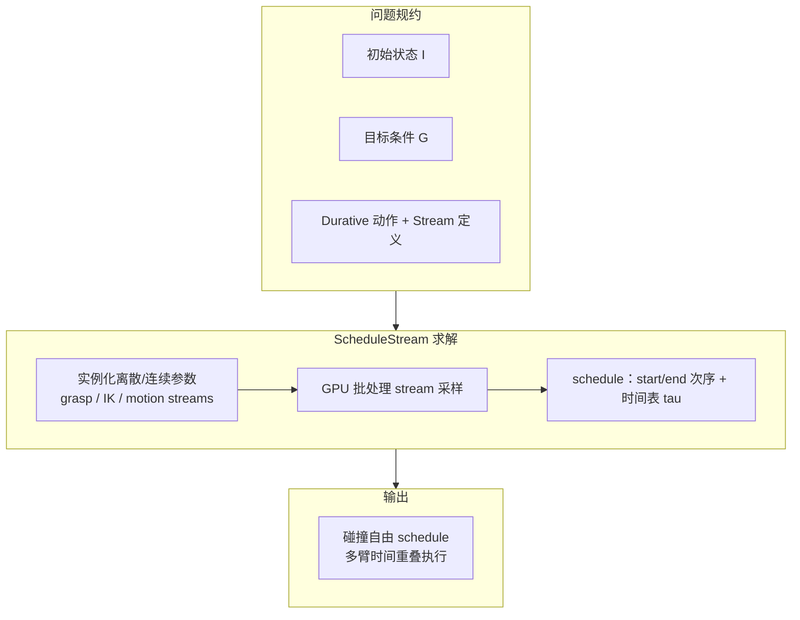

# ScheduleStream

**ScheduleStream**（[项目页](https://schedulestream.github.io/) · [NVlabs/schedulestream](https://github.com/NVlabs/schedulestream)）把 **任务与运动规划（TAMP）** 从「**离散–连续混合空间里的顺序计划**」推进到「**带时间轴的调度（schedule）**」：允许多条机械臂 **同时或重叠** 执行各自的运动段，并在 **stream 采样器**（抓取位姿、IK、关节空间轨迹等）层用 **GPU 批处理** 加速搜索。论文应用名 **TAMPAS**（Task and Motion Planning **& Scheduling**）专指多臂操作这一落地场景。

## 一句话定义

**在 PDDLStream 式「有限动作 + 连续 stream」之上引入可异步、时长依赖参数的 durative action，用领域无关算法求碰撞自由时间表，并把运动/抓取等采样批到 GPU 上，使双臂任务从「轮流动一条臂」变为可并行的调度解。**

## 为什么重要

- **双臂/人形操作的节拍瓶颈往往在「调度」而非单次 IK：** 两臂可达性、共享工作空间 clearance、物体–臂分配组合爆炸；只优化「下一步动哪条臂」会得到 **保守串行计划**。
- **统一语言而非 ad hoc 脚本：** 全栈 **Python** 声明与过程代码互操作，便于把 **仿真后端、碰撞检测、采样器** 接到同一 **schedule** 接口。
- **与 GPU 运动栈互补：** 连续 **无碰撞轨迹** 可由 cuRobo、几何规划器等 backend 提供；ScheduleStream 负责 **选哪些 stream 实例、何时启动/结束**。

## 核心结构

| 模块 | 作用 |
|------|------|
| **Stream** | 连续采样算子：输入符号参数，输出数值样本（如 grasp pose、关节配置、轨迹及 **持续时间**）。 |
| **Durative action** | 可 **异步 start**；**duration** 为参数函数；表达「抓取–移动–放置」等 **持续过程** 而非仅瞬时切换。 |
| **`schedule` 子程序** | 在 `eager-stream` 等管线中求 **动作实例 + 时间表** \(\tau\)。 |
| **Start/end 编译** | 每个 durative action 拆成 **`a.start` / `a.end`** 瞬时动作，归约为 **顺序规划** 问题（借鉴 temporal planning 思想）。 |
| **TAMPAS** | 多臂 TAMP + 调度的应用封装；sampler 内 **GPU batch** 加速。 |
| **示例后端** | 仓库含 **trimesh2d** 平面 TAMP / motion 示例；真机双臂演示见项目页视频。 |

### 流程总览（TAMPAS 概念级）

### 双臂示意（项目页三类情形）

| 情形 | 调度含义 |
|------|----------|
| 左臂仅够到橙子、右臂仅够到苹果 | 天然 **分工**；可 **并行** 抓取各自物体。 |
| 物体换位后可达性互换 | 仍可能并行，但 **几何约束** 可能迫使 **顺序** 或 **退让**。 |
| 两臂均可达两物体 | 可选 **近距离并行** 或 **等 clearance 后启动** 第二臂，避免互碰。 |

**要点：** 无需预先指定「哪条臂抓哪个物体」——规划器在 **任务层** 联合搜索 **分配 + 运动 + 时间**。

## 方法栈 / 实验与评测 / 与其他工作对比

**方法栈：** 扩展 [PDDLStream](https://arxiv.org/abs/1802.08705) 的 **stream + 有限动作** 到 **durative** 与 **调度层**；连续几何由 stream 后端（示例：**trimesh** 2D、自定义 motion planner）实现。

**实验与评测：** 仿真中与 **代表先验工作的消融** 对比，报告 **更短 makespan / 更高效 schedule**（以论文图表为准）；项目页与补充视频展示 **真机双臂** 任务。

**对比：**

| 路线 | 输出形态 | 多臂并行 |
|------|----------|----------|
| 经典 TAMP / PDDLStream 计划 | 动作 **全序** | 通常 **单臂活跃** |
| **ScheduleStream / TAMPAS** | **时间表** | **显式并行段** |
| **cuRobo 等 GPU 运动生成** | 单次 **轨迹** | 需上层 **任务调度器** 编排多段 |

## 常见误区或局限

- **误区：ScheduleStream 取代运动规划器。** 它编排 **哪些采样、何时执行**；单次 **collision-free motion** 仍依赖 stream 所调用的 backend。
- **误区：GPU 加速等于任意规模实时。** 混合空间搜索与批采样成本仍随 **臂数、物体数、stream 分支因子** 增长；边缘设备需按论文/博客 **实测** 预算。
- **局限：** 当前公开仓库以 **研究框架 + 2D 示例** 为主；真机部署需自行对接机器人 SDK、感知与 **执行层跟踪误差**。

## 关联页面

- [Manipulation（操作任务）](../tasks/manipulation.md) — 双手协调与 **任务–运动–时间** 一体化视角
- [cuRobo](./curobo.md) — **GPU 无碰撞运动生成**，可作 stream 中 motion 段的后端对照
- [Trajectory Optimization（轨迹优化）](../methods/trajectory-optimization.md) — 连续段代价与约束的方法论语境
- [Whole-Body Control（全身控制）](../concepts/whole-body-control.md) — 多臂 schedule **下发到执行层** 时的协调与平衡

## 英文缩写速查

| 缩写 | 英文全称 | 简要说明 |
|------|----------|----------|
| GPU | Graphics Processing Unit | 图形处理器，大规模并行仿真训练的算力基础 |
| TAMP | Task and Motion Planning | 联合符号任务规划与连续运动规划 |
| IK | Inverse Kinematics | 满足末端/姿态约束求解关节角的运动学逆解 |
| SDK | Software Development Kit | 软件开发工具包 |
| Manipulation | Robot Manipulation | 抓取、移动、操作物体的任务总称 |

## 参考来源

- [ScheduleStream 论文归档（本站）](../../sources/papers/schedulestream_arxiv_2511_04758.md)
- [NVlabs ScheduleStream 仓库归档（本站）](../../sources/repos/nvlabs-schedulestream.md)
- Garrett & Ramos, *ScheduleStream: Temporal Planning with Samplers for GPU-Accelerated Multi-Arm Task and Motion Planning & Scheduling*, [arXiv:2511.04758](https://arxiv.org/abs/2511.04758), ICRA 2026
- [ScheduleStream 项目页](https://schedulestream.github.io/)
- [NVlabs/schedulestream（GitHub）](https://github.com/NVlabs/schedulestream)

## 推荐继续阅读

- Garrett et al., *PDDLStream: Integrating Symbolic Planners and Blackbox Samplers*, [arXiv:1802.08705](https://arxiv.org/abs/1802.08705) — ScheduleStream 的直接前驱框架
- [ScheduleStream 补充视频（YouTube）](https://www.youtube.com/watch?v=0LyTPmAXaQY)
- [NVIDIA Research 发布页](https://research.nvidia.com/publication/2026-06_schedulestream-temporal-planning-samplers-gpu-accelerated-multi-arm-task-and-motion-planning-scheduling)
