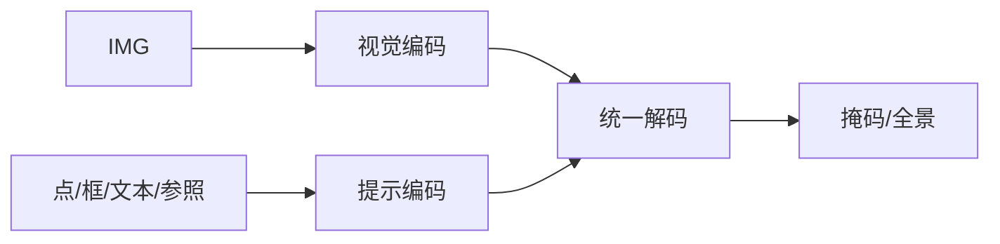

# SEEM（Segment Everything Everywhere All at Once）

## 一句话定义

**SEEM** 用统一的解码接口消费 **多种提示**（点、框、涂鸦、文本、参照实体等），在一张图上做开放词汇、交互式与全景式分割。

## 英文缩写速查

| 缩写 | 英文全称 | 简要说明 |
|------|----------|----------|
| SEEM | Segment Everything Everywhere All at Once | 多提示统一分割 |
| SAM | Segment Anything | 类别无关分割基础模型 |
| OV | Open-Vocabulary | 开放词汇 |
| Panoptic | Panoptic Segmentation | 全景输出 |
| Prompt | Visual/Linguistic Prompt | 点框文本等条件 |

## 为什么重要

- 课程 8.1.3：连接 SAM 与「语言可提示分割」的趋势节点。
- 机器人指令「割下桌上的那个杯子」需要文本/参照提示，而非仅点选。

## 核心原理

共享视觉编码 + 可学习提示编码，解码器输出掩码；文本与视觉提示映射到同一空间，支持组合提示与跨图参照。

## 工程实践

| 项 | 建议 |
|----|------|
| 选型 | 只要交互点选→SAM；要文本/全景接口→SEEM 或后续统一模型 |
| 部署 | 测多提示组合延迟；文本塔增加显存 |
| 具身 | 与 VLM 规划器串联：语言→提示→掩码→抓取 |

## 局限与风险

开放词汇受训练词表与文本塔限制；视频时序见 SAM2。商用许可与权重来源需核对。

## 关联页面

- [SAM](./paper-segment-anything.md)
- [SAM 2](./paper-sam2.md)
- [分割任务分类](../concepts/image-segmentation-taxonomy.md)
- [Transformer CV 课程策展](../entities/transformer-cv-curriculum.md)
- [机器人视觉感知栈选型闭环知识链](../queries/robot-perception-stack-selection-loop.md) — 多提示统一分割对应②层「闭集准 vs 开放词汇泛」的开放侧

## 参考来源

- [Transformer 视觉应用课程大纲](../../sources/courses/transformer_cv_applications_syllabus.md)

## 推荐继续阅读

- [SEEM (NeurIPS 2023) arXiv:2304.06718](https://arxiv.org/abs/2304.06718)
