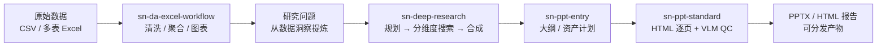

# SenseNova-Skills（OpenSenseNova）

**SenseNova-Skills** 是 [OpenSenseNova/SenseNova-Skills](https://github.com/OpenSenseNova/SenseNova-Skills) 仓库：把 **SenseNova 多模态模型** 的办公能力拆成 **可组合、可自托管** 的 [Agent Skills](https://agentskills.io/) 目录（`skills/**/SKILL.md`），覆盖 **可视化、幻灯片、表格分析、深度研究与搜索**，既可单技能调用，也可串成 **数据 → 研究 → 演示** 的端到端工作流。

## 一句话定义

用 **Tier 0 基础层 + 领域入口技能 + 分阶段研究/PPT 子技能**，把大模型办公场景固化为 **代理可发现、可编排、可恢复** 的技能图，而不是一次性 prompt 脚本。

## 为什么重要（对本知识库读者）

- **与 Hermes / 编码技能库互补：** [Hermes Agent](hermes-agent.md) 提供 **常驻运行时与 `~/.hermes/skills/` 安装位**；[mattpocock/skills](mattpocock-skills.md) 面向 **工程交付习惯**；SenseNova-Skills 面向 **办公产出**（报告、图表、Deck）。维护本 wiki 时的 **文献综述、对比表、路演材料** 可借鉴其深度研究与 PPT 管线，而不必从零写 prompt。
- **与 LLM Wiki 维护同构、不同对象：** [Karpathy LLM Wiki](../references/llm-wiki-karpathy.md) 编译 **机器人知识**；本库编译 **办公任务程序**（`SKILL.md` + 产物契约如 `task_pack.json`、`plan.json`、`report.md`）。二者都强调 **人类策展 + 代理执行**，但产物分别是 **wiki 页** 与 **可交付办公文件**。
- **机器人/具身侧触点：** 仓库示例 [`examples/embodied-ai-deep-research`](https://github.com/OpenSenseNova/SenseNova-Skills/tree/main/examples/embodied-ai-deep-research) 展示 **行业维度规划 → 分源取证 → 合成报告** 的标准化写法，与 ingest 前的 **外部资料消化** 流程相近；不替代仿真/控制栈，但可降低 **调研型 ingest** 的重复劳动。
- **与 Agent Reach 的分工：** [Agent Reach](agent-reach.md) 解决 **渠道化读搜安装**；SenseNova 内置 **学术/代码/社交搜索子技能** 并嵌入 **sn-deep-research** 编排，更适合 **已选定主题后的结构化报告**，而非单次 URL 抓取。

## 核心结构

| 域 | 入口 / 代表技能 | 要点 |
|----|-----------------|------|
| **图像与可视化** | `sn-image-base`（Tier 0）、`sn-infographic` | 文生图/识别/文本优化统一 runner；信息图含布局风格库与 VLM 质检排序 |
| **PPT** | `sn-ppt-entry` | 解析 pdf/docx/md/txt，输出 `task_pack.json`；分 **creative**（整页 PNG）与 **standard**（HTML 逐页 + VLM QC → PPTX） |
| **数据分析** | `sn-da-excel-workflow` | 多表清洗/聚合；≥10k 行走大文件流式路径；图像表格式输入走 caption 技能 |
| **深度研究** | `sn-deep-research` | planning → 分维度证据 → synthesis → `report.md`；支持 **可恢复** 与 `report_dir` 持久化 |
| **搜索** | `sn-search-academic` 等 | 学术/开发者/中英文社交聚合，供研究子技能调用 |
| **环境** | `sn-image-doctor`、`sn-ppt-doctor` | 交互式检查依赖、API key 并写入 `.env` |

### 流程总览（办公全链示例）

README 中 **内存价格** 示例串联：Excel 分析 → 深度研究 → PPT → HTML 报告。

### 与推荐运行时的安装关系

| 运行时 | 技能目录 | 模型/API |
|--------|----------|----------|
| [OpenClaw](https://openclaw.ai/) | `~/.openclaw/skills/` | [SenseNova Platform](https://platform.sensenova.cn/token-plan) 等 |
| [Hermes Agent](hermes-agent.md) | `~/.hermes/skills/` | 同上；安装后常需 **重启代理服务** 才加载新技能 |

也可通过 [**Raccoon**](https://office.xiaohuanxiong.com/home) 使用打包套件（零配置 SaaS），与本站 **自托管开源路径** 并行记录。

## 常见误区或局限

- **误区：stars 高 = 机器人仿真开箱即用。** 技能默认服务 **办公场景**（PPT/Excel/行业报告）；迁移到 **Isaac / ROS / 真机** 需另建技能或仅借用 **研究编排** 模式，不能替代控制/仿真 wiki。
- **误区：可替代本仓库 `schema/ingest-workflow.md`。** ingest 要求 **sources → wiki 提炼、`make ci-preflight`、交叉引用**；SenseNova 产出的是 **办公文件**，不会自动更新本站图谱或 lint。
- **误区：与 [mattpocock/skills](mattpocock-skills.md) 二选一。** 前者偏 **办公产出与多模态生成**；后者偏 **对齐/TDD/架构卫生**；在同一 Hermes/OpenClaw 实例上可 **并存多技能目录**。
- **局限：** 依赖 SenseNova API 与部分 Python/Node 环境；中文社交搜索等渠道需 cookie；技能列表与 Raccoon 产品能力迭代快，以 GitHub `main` 为准。

## 关联页面

- [Hermes Agent](hermes-agent.md) — 推荐运行时之一，`~/.hermes/skills/` 安装位
- [Skills For Real Engineers（mattpocock）](mattpocock-skills.md) — **编码工程** 向 Agent Skills 对照
- [Agent Reach](agent-reach.md) — 外网读搜渠道脚手架
- [Superpowers（obra）](superpowers-obra.md) — **重流程编码交付** 技能方法论
- [LLM Wiki（Karpathy 模式）](../references/llm-wiki-karpathy.md) — 持久知识编译范式
- [Ingest Workflow](../../schema/ingest-workflow.md) — 本仓库 ingest / query / lint 规范

## 参考来源

- [SenseNova-Skills 仓库源归档（本站）](../../sources/repos/sensenova-skills.md)
- [OpenSenseNova/SenseNova-Skills（GitHub）](https://github.com/OpenSenseNova/SenseNova-Skills)
- [INSTALL.md（官方安装）](https://github.com/OpenSenseNova/SenseNova-Skills/blob/main/INSTALL.md)

## 推荐继续阅读

- [sn-infographic 案例画廊](https://github.com/OpenSenseNova/SenseNova-Skills/blob/main/docs/sn-infographic-examples.md) — 信息图 prompt 设计参考
- [memory-price 端到端示例](https://github.com/OpenSenseNova/SenseNova-Skills/tree/main/examples/memory-price-end2end-analysis) — 数据分析 → 研究 → PPT 全链
- [embodied-ai 深度研究示例](https://github.com/OpenSenseNova/SenseNova-Skills/tree/main/examples/embodied-ai-deep-research) — 具身 AI 行业报告模板
- [Agent Skills 规范](https://agentskills.io/) — `SKILL.md` 约定
- [SenseNova Platform token plan](https://platform.sensenova.cn/token-plan) — API 与免费额度说明
