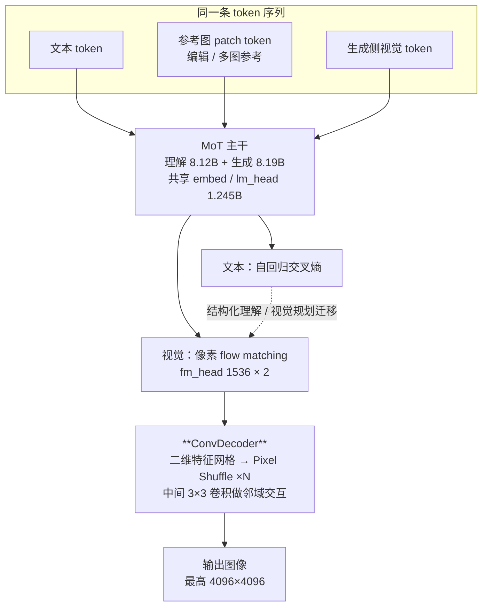
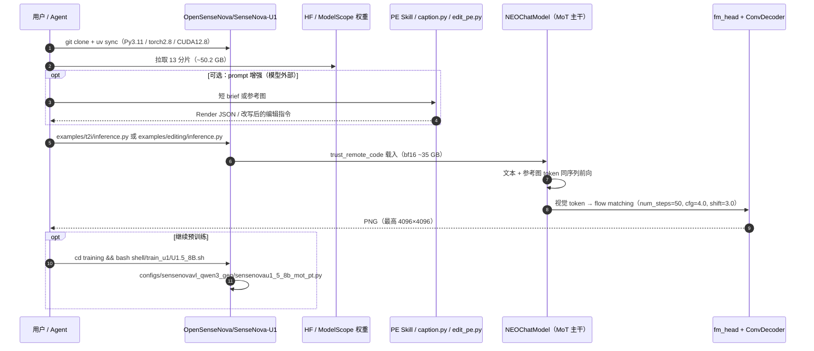

# SenseNova-U1.5（Preview · NEO-unify）

**SenseNova-U1.5-8B-MoT (Preview)**（[商汤科技](https://github.com/OpenSenseNova)，`2026-07-31`，[GitHub](https://github.com/OpenSenseNova/SenseNova-U1) · [HF 权重](https://huggingface.co/sensenova/SenseNova-U1.5-8B-MoT-Preview) · **Apache-2.0**）是 [NEO-unify](https://huggingface.co/blog/sensenova/neo-unify) 架构的**原生统一多模态模型**：**不用预训练视觉编码器、不用 VAE**，图像与文本进入同一条 token 序列，文本用自回归交叉熵、视觉用**像素级 flow matching** 联合训练。U1.5 相对 U1 的核心改动只有一处架构级——把**逐 patch 独立回归 RGB 的 MLP 像素头**换成 **ConvDecoder 渐进空间重建**——外加一轮编辑语料的清洗与合成。

## 一句话定义

**把「看懂图」和「画出图」压进同一个 Transformer 的同一条序列里；U1.5 用 ConvDecoder 让相邻 patch 在解码时互相看得见，从而在原生 4K 下不再出现网格接缝。**

## 英文缩写速查

| 缩写 | 英文全称 | 简要说明 |
|------|----------|----------|
| MoT | Mixture of Transformers | 理解与生成各一套 Transformer 参数、共享文本 token I/O；本模型双通路各约 8B |
| VAE | Variational Autoencoder | 主流图像生成的隐空间编解码器；NEO-unify **不使用** |
| FM | Flow Matching | 连续视觉目标的训练/采样范式，替代离散 token 预测 |
| T2I | Text-to-Image | 文生图任务与对应评测（Qwen-Image Bench） |
| PE | Prompt Enhance / Enhancement | 模型**外部**的 prompt 改写工作流，非模型裸能力 |
| CFG | Classifier-Free Guidance | 采样引导强度；U1.5 参考值 `cfg_scale=4.0` |
| G_O | GEdit-Bench Overall | 编辑基准的总分列（分中英两栏） |

## 核心信息

| 字段 | 内容 |
|------|------|
| **机构** | 商汤科技（SenseTime / SenseNova） |
| **发布** | `2026-07-31`（Preview；官方声明「更强的正式版即将发布」） |
| **License** | **Apache-2.0**（代码 + 权重；HF 卡 frontmatter 未填 license 字段，以仓内 `LICENSE` 为准） |
| **开源** | **已开源** — 推理、U1.5 生成侧预训练脚本与配置、全参微调代码、权重全部公开；**训练数据未开源**，U1.5 技术报告**未发布**（现有 arXiv [2605.12500](https://arxiv.org/abs/2605.12500) 对应 U1） |
| **参数** | 总 **17.55B** = 理解 8.12B + 生成 8.19B + 共享 1.245B；盘上 ~50.2 GB（BF16/F32 混存），**bf16 载入约 35.1 GB** |
| **主干** | Qwen3 42 层 / `hidden 4096` / 32 头 8 KV；视觉 `NEOVisionModel`、`patch_size 16` |
| **分辨率** | `max_pixels = 16,777,216`（即 **4096×4096**），对应「原生 4K」口径 |
| **参考配置** | `cfg_scale=4.0`、`timestep_shift=3.0`、`num_steps=50` |

> **`8B-MoT` 不是 8B 总参：** 官方 `docs/parameter_breakdown.md` 明确它指「≈8B 理解参数 **和** ≈8B 生成参数」，实测总参 17.552B。选型时按 **17.5B / bf16 35 GB** 做显存与吞吐预算。

## 为什么重要（对本知识库读者）

- **统一建模的一个干净对照点：** 具身侧的 [统一多模态 Token](../methods/unified-multimodal-tokens.md) 讨论「把视觉 patch、语言、状态、动作塞进同一序列」，但视觉输出通常被回避（只出动作）。U1.5 是**同一条序列既出文本又出像素**的完整实现，且**去掉了视觉编码器这一层先验**——正好检验「编码器是不是必需的语义瓶颈」。对 [VLA](../methods/vla.md) 的架构选择（冻结 SigLIP/DINOv2 vs 端到端像素通路）是可引用的反面样本。
- **给「生成即理解」补一条证据：** [生成式视觉预训练](../concepts/generative-vision-pretraining.md) 主张生成目标本身孕育理解能力；NEO-unify 博客报告理解/生成双通路在 MoT 主干中**冲突很小**，且**冻结理解分支时编辑能力依然强**——说明编辑所需的语义定位大量来自共享表示，而非编辑头本身。
- **一个可复现的 flow-matching 视觉头样本：** 与 [扩散模型](../concepts/diffusion-model.md) 家族、[Diffusion Policy](../methods/diffusion-policy.md) 的连续动作头同属「连续量的迭代去噪/流」范式；U1.5 的 `fm_head` + 时间步/噪声调度参数全部在公开 `config.json` 里，可直接对照阅读。
- **务实的工具面：** 本 wiki 的图示、信息图、论文配图产出可直接用它（配合 [SenseNova-Skills](./sensenova-skills.md) 的 `sn-image-base` / `sn-infographic`）；Apache-2.0 + 单机可跑，比闭源 API 更适合放进可复现的资料生产流程。

> **边界申明：** U1.5 **不输出动作**，与机器人控制栈没有直接接口。它在本库的位置是**架构参照 + 资料生产工具**，不是感知或策略组件。

## 核心原理

### 与「编码器 + 扩散解码器」路线的差别

| 环节 | 主流统一模型（编码器 + 扩散解码器） | **NEO-unify / U1.5** |
|------|-------------------------------------|----------------------|
| 图像入模 | 预训练 ViT / VAE encoder 抽特征 | **直接 patch 化像素**（`patch_size 16`，无预训练编码器） |
| 表示空间 | 编码器决定的语义/隐空间 | **模型自己塑造的共享序列空间** |
| 图像出模 | 外挂扩散模型 / VAE decoder | **序列内 flow-matching 像素头**（U1：逐 patch MLP；U1.5：ConvDecoder） |
| 参考图编辑 | 常需额外条件分支或 ControlNet 式注入 | **一条参考图 token 序列**直接进上下文 |
| 代价 | 编码器先验带来的语义瓶颈与重建损失 | 需自己学到像素级重建（博客报告 PSNR 31.56） |

### U1.5 的改动：ConvDecoder

U1 的像素头对每个 patch **独立**回归 RGB，高分辨率下 token 边界会显形为**网格纹、接缝、纹理断裂**。U1.5 改为渐进空间重建：视觉 token → reshape 成二维特征网格 → 多级 **Pixel Shuffle** 上采样，**每级之间插 `3×3` 卷积**让邻域 patch 交互后再融合成图。

官方给出两条定性结论：**整个预训练期**网格伪影被显著抑制；**下游微调到新域时**伪影复现概率也更低——后者对要把模型微调到自有画风/图表域的团队更关键。

### 第三条声明：格式暴露 → 跨任务泛化

生成/编辑语料里 JSON 格式 prompt **数量少且简单**，复杂结构化 JSON 只出现在**理解侧**语料（内容、结构、任务目标都不同）。但模型仍能跟随长而层级化的生成/编辑指令。官方把这当作「统一建模让理解侧学到的结构化理解与视觉规划迁移到生成侧」的证据——**不是靠在固定 prompt 模板上专门训练**。

> **读法提醒：** 这是**观察到的泛化**，不是受控实验；没有给出 ablation（例如去掉理解侧语料后 JSON 跟随能力下降多少）。引用时按「现象 + 作者解释」处理。

## 源码运行时序图

官方仓 **Apache-2.0 且入口完整**（推理 + 预训练 + 全参微调），最小复现路径如下：

关键复现路径：**先跑通 `examples/t2i/inference.py` 的 2048×2048 默认档**，确认显存与耗时基线；再决定是走 4K、还是走 LightLLM + LightX2V 生产栈。

## 工程实践

| 项 | 要点 |
|----|------|
| **环境** | `uv sync`；Python **3.11** / PyTorch **2.8** / CUDA **12.8**；FlashAttention 可选 |
| **显存口径** | 按 **bf16 ~35 GB** 估算，**不要**用 50.2 GB 磁盘体积换算；低显存走 GGUF + 分层加载 VRAM 模式（社区 GGUF 目前对应 **U1-8B-MoT-Merger**，非 U1.5） |
| **参考配置** | `cfg_scale=4.0`、`timestep_shift=3.0`、`num_steps=50`；8-step 蒸馏 LoRA 亦仅覆盖 U1 系列 |
| **生产部署** | **LightLLM（理解）+ LightX2V（生成）解耦**；单机 `TP2 + CFG2` 下 2048×2048 约 **0.15 s/step、端到端 ~9 s**（H100/H200），FA3 hybrid-mask attention prefill 提速 **~2.4–3.2×**；镜像 `lightx2v/lightllm_lightx2v:20260407` |
| **编辑接口** | 支持**掩码 / 边界框 / 视觉标记**的区域可控编辑；多图参考需**按顺序传图并在指令里写明每张图的角色** |
| **PE 边界** | PE Skill / Caption-to-Prompt / Editing PE 都是**模型外部工作流**（且依赖 `OPENAI_API_KEY` 调外部改写器）；对比裸模型能力时必须区分带 † 与不带 † 的数字 |
| **下载通道** | 国内走 [ModelScope 镜像](https://modelscope.cn/models/SenseNova/SenseNova-U1.5-8B-MoT-Preview)；分片编号 `-of-00016` 但实际 13 个文件（`00002`–`00004` 缺号），`index.json` 未引用缺号分片，**属正常，非下载失败** |
| **接入 agent** | 官方推荐 [SenseNova-Skills](./sensenova-skills.md)（OpenClaw / Hermes 技能格式）；也可用 [SenseNova-Studio](https://unify.light-ai.top/) 先验证效果再自建 |

## 实验与评测

> 数字以 [`docs/u1.5_preview.md`](https://github.com/OpenSenseNova/SenseNova-U1/blob/main/docs/u1.5_preview.md) 为准（官方自测；`†` = 带 PE，`*` = 官方复测对手模型）。

**Qwen-Image Bench（T2I Overall）**

| 模型 | EN | ZH |
|------|----|----|
| U1 | 48.28 | 45.99 |
| **U1.5-Preview** | **49.93** | **50.25** |
| **U1.5-Preview†（+PE）** | **55.17** | **55.22** |
| GPT Image 1 | 54.24 | 54.07 |
| Qwen Image 2\* | 55.69 | 55.63 |
| GPT Image 2 | 65.23 | 64.69 |

**图像编辑**

| 模型 | ImgEdit-Bench | GEdit EN G_O | GEdit CN G_O | WeEdit 均值 |
|------|---------------|--------------|--------------|-------------|
| U1 | 3.90 | 7.470 | 7.420 | 6.497 |
| **U1.5-Preview** | **4.37** | **8.172** | **8.051** | **6.852** |
| Qwen-Image-Edit-2511 | 4.51 | 7.877 | 7.819 | 3.913 |
| Nano-Banana-Pro | 4.37 | 7.738 | 7.799 | 8.843 |

**机制读法：**

- **中文提升远大于英文**（ZH 45.99 → 50.25，EN 48.28 → 49.93），与「加强中英文字渲染 + 平衡中英编辑语料」的改动一致；
- **GEdit 中英双语均为表内最高**，但 **WeEdit 综合仍显著落后 Nano-Banana-Pro**（6.852 vs 8.843），且 **WeEdit BP 子项反而低于 U1**（6.752 vs 7.157）——编辑不是全面变强；
- **PE 贡献约 +5 分**（49.93 → 55.17），把裸模型从「不如 GPT Image 1」抬到「与 Qwen Image 2 同档」——这部分增益来自外部改写器，不能算模型能力。

## 结论

**U1.5 证明的是「统一序列 + 无编码器 + 更好的像素解码」这条路走得通，而不是它已经赢下开放世界图像生成。**

1. **真影响指标是中文与编辑保持**：ZH T2I 与 GEdit 中英双分是本次改动的直接受益项；英文 T2I 提升有限（+1.65）。
2. **PE 数字要单独看**：带 † 的 55.17/55.22 含外部 LLM 改写；做选型对比时用裸分 49.93/50.25。
3. **编辑有回退项**：WeEdit BP 低于 U1，说明语料重构不是纯增益；有背景保持强需求的场景要实测。
4. **`8B-MoT` 是命名陷阱**：按 17.55B / bf16 35 GB 做预算，别按 8B 估。
5. **Apache-2.0 + 全栈入口是稀缺项**：推理、预训练脚本、全参微调都在仓内，比只放权重的模型更适合做架构研究与域内微调。
6. **U1.5 技术报告尚未发布**：现有 arXiv 是 U1；架构声明目前只有 README + HF 博客，缺 ablation 支撑。
7. **对具身研究的用法是「参照 + 产图」**：不要把它当感知模块接进控制栈。

## 局限与风险

| 局限 | 说明 |
|------|------|
| **官方列明的生成缺陷** | 短 prompt 凭空生成文字；密集/长文本出错（尤其小字号与中英混排）；复杂版式的计数、对齐、层级跟随不全；小脸、手、肢体不稳定；多轮/多参考编辑漂移 |
| **理解侧上下文仅 32K** | 仓库 README 的 Ongoing Improvements 明确；长视觉上下文场景受限 |
| **Preview 状态** | 官方声明正式版将发布，当前数字应视为**下界**；不建议在此版本上做长期工程绑定 |
| **评测均为官方自测** | 对手模型分数含官方复测（`*`），无第三方独立复现；WeEdit / ImgEdit 榜单口径亦需自行核对 |
| **交错生成为 Beta** | RL 未针对编辑 / 推理 / 交错任务专门优化，表现与 SFT 模型相当 |
| **常见误区** | ① 把 `8B-MoT` 当 8B 总参；② 把 † 分数当裸模型能力；③ 看到 13 个分片以为下载失败；④ 把「无编码器」误读为「无视觉 patch 化」——patch 化仍在，去掉的是**预训练编码器与 VAE** |
| **数据不可复现** | 编辑语料的清洗/合成流程只有文字描述，无数据集与脚本 |

## 关联页面

- [统一多模态 Token](../methods/unified-multimodal-tokens.md) — VLA 侧的统一序列建模；本页是「视觉也从同一序列输出」的极端形态
- [VLA](../methods/vla.md) — 视觉编码器是否必需的架构对照
- [生成式视觉预训练](../concepts/generative-vision-pretraining.md) — 「生成目标孕育理解能力」的同一条主张
- [扩散模型](../concepts/diffusion-model.md) — flow matching 像素头的邻近范式
- [SenseNova-Skills](./sensenova-skills.md) — 同一生态的 agent 技能库，`sn-image-base` 以 U1 系列为后端
- [Vision Banana](./vision-banana.md) — 图像生成预训练解锁理解任务的对照工作
- [GenCeption](./genception.md) — 视频侧生成式视觉预训练对照

## 参考来源

- [GitHub OpenSenseNova/SenseNova-U1 归档](../../sources/repos/sensenova-u1.md)
- [HF sensenova/SenseNova-U1.5-8B-MoT-Preview 归档](../../sources/sites/huggingface-sensenova-u1-5-8b-mot-preview.md)
- [ModelScope SenseNova-U1.5-8B-MoT-Preview 归档](../../sources/sites/modelscope-sensenova-u1-5-8b-mot-preview.md)
- [SenseNova-Skills 仓库归档](../../sources/repos/sensenova-skills.md)

## 推荐继续阅读

- [`docs/u1.5_preview.md`（官方发布文档）](https://github.com/OpenSenseNova/SenseNova-U1/blob/main/docs/u1.5_preview.md)
- [NEO-unify 架构博客](https://huggingface.co/blog/sensenova/neo-unify)
- [SenseNova U1 技术报告 PDF](https://github.com/OpenSenseNova/SenseNova-U1/blob/main/docs/pdf/SenseNOVA_U1.pdf) / [arXiv:2605.12500](https://arxiv.org/abs/2605.12500)
- [`docs/parameter_breakdown.md`（参数分组口径）](https://github.com/OpenSenseNova/SenseNova-U1/blob/main/docs/parameter_breakdown.md)
- [SenseNova-Studio 在线体验](https://unify.light-ai.top/)
