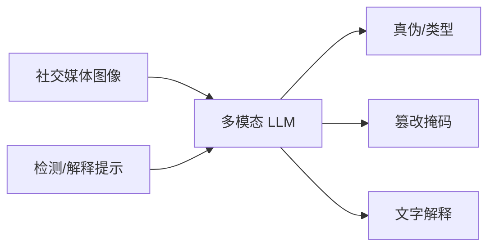

# SIDA（Social Media Image Detection Assistant）

## 一句话定义

**SIDA** 是面向社交媒体图像的 **伪造检测 + 篡改定位 + 文字解释** 多模态助手：在 VLM 词表中引入特殊 token，同时输出真伪类别、篡改掩码与判定理由。

## 英文缩写速查

| 缩写 | 英文全称 | 简要说明 |
|------|----------|----------|
| SIDA | Social media Image Detection / localization / explanation Assistant | 本文方法 |
| SID-Set | Social media Image Detection dataSet | 配套大规模伪造/篡改数据 |
| VLM | Vision-Language Model | 多模态底座 |
| DET | Detection token | 触发真伪/类型判定的特殊词元 |
| SEG | Segmentation token | 触发篡改区域掩码的特殊词元 |
| Deepfake | Deepfake / AI-generated media | 生成或篡改图像风险场景 |

## 为什么重要

- 课程 6.2.3 所列 VLM 下游应用：把「对话式 VLM」接到 **安全/鉴伪** 任务，而不仅是 caption。
- 与 [LISA](./lisa.md) 的 SEG token 思路相近，但目标从推理分割转向 **伪造检测与解释**。
- 机器人/具身侧可类比：对传感器或合成数据做「可信度」核验的接口形态。

## 核心原理

扩展 VLM 词表，加入 `<DET>` / `<SEG>` 等特殊词元。给定图像与提示（如是否真实/是否篡改），模型生成判定文本，并在需要时由 SEG 隐状态解码篡改区域掩码；配套 **SID-Set** 提供大规模真实/全合成/局部篡改标注。

## 工程实践

| 项 | 建议 |
|----|------|
| 权重 | 跟官方仓库与 HF 发布；注意 7B/13B 变体差异 |
| 评测 | 在 SID-Set 与其它伪造基准上分别报检测与定位指标 |
| 部署 | 解释文本可离线；实时闭环只需 DET 分数时可用小变体 |

## 局限与风险

- 生成模型快速迭代会导致分布漂移，需持续更新数据。
- 「解释」可能看似合理却与真实伪迹不一致——不能单独当法律证据。
- 课程语境下勿与指令图像编辑模型混淆：SIDA 主线是 **鉴伪定位**。

## 关联页面

- [多模态基础](../concepts/multimodality-basics.md)
- [多模态 LLM 路线](../overview/multimodal-llm-development.md)
- [LISA](./lisa.md)
- [Sa2VA](./sa2va.md)
- [Transformer CV 课程策展](./transformer-cv-curriculum.md)
- [机器人视觉感知栈选型闭环知识链](../queries/robot-perception-stack-selection-loop.md) — 以 SEG 词元同时输出掩码与文字解释，属②层分割接口的多模态变体

## 参考来源

- [Transformer 视觉应用课程大纲](../../sources/courses/transformer_cv_applications_syllabus.md)

## 推荐继续阅读

- [SIDA (arXiv:2412.04292)](https://arxiv.org/abs/2412.04292)
- [GitHub: hzlsaber/SIDA](https://github.com/hzlsaber/SIDA)
