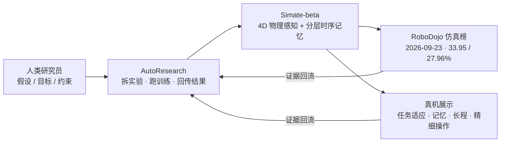

# Simate-beta（Simate 首版通用物理快系统）

**Simate-beta** 是 [Simate](./simate.md)（硅基伙伴，Silicon Mate）在成立约三个月后发布的第一款模型，2026-09-23 提交至 [RoboDojo](./robodojo.md) 仿真榜。公开信息来自媒体转述的公司披露与榜单数据，**没有技术报告、代码或权重**。

| 项目 | 内容 |
|------|------|
| 机构 | [Simate](./simate.md) |
| 上榜日期 | 2026-09-23（RoboDojo News） |
| 榜单类别 | RoboDojo 前端标注为 `vla` |
| 开源（2026-10-09 核查） | **未开源**，无技术报告 |

## 一句话定义

**一个做大参数的「快系统」（System 1）策略：用 4D 物理感知理解时空动态、用分层时序记忆支撑长程与连续操作，目标是向零样本 / 少样本的通用物理操作推进。**

## 英文缩写速查

| 缩写 | 英文全称 | 简要说明 |
|------|----------|----------|
| VLA | Vision-Language-Action | RoboDojo 前端给 Simate-beta 标的模型类别 |
| SR | Success Rate | RoboDojo 的任务成功率 |
| RSI | Recursive Self-Improvement | Simate 把长期路线称为 Physical RSI（与 [港大 MMLab 同名项目](./physical-rsi.md) 无关） |
| 4D | 3D space + time | 同时建模空间结构与时间动态的感知表征 |

## 为什么重要

- **「快系统做大」是一条明确的路线选择：** 多数分层方案把容量放在慢系统（规划 / 推理），Simate 反过来把参数压在实时动作侧，希望零样本泛化在快系统里涌现，再与 GPT-6 等通用推理模型协同（公司表述）。
- **长程项突出、开放任务偏弱：** 榜单分项显示 long-horizon Score 57.84 / SR 43.42 为六项最高，open 仅 9.12 / 8.5——和它强调的「分层时序记忆」一致，也说明开放指令泛化仍是短板。
- **研发方式是卖点之一：** 公司称 Simate-beta 是其 AutoResearch（人定假设、引擎自动跑实验）体系的第一个产物，从成立到上榜约三个月。

## 核心信息

### 公司披露的设计要点

| 要点 | 说明 |
|------|------|
| 定位 | 通用物理快系统：实时感知变化中的物理世界并快速输出动作 |
| 4D 物理感知 | 同时捕捉空间结构与时间动态，让表征直接服务于动作 |
| 分层时序记忆 | 长程任务需要记住历史、连续操作需要追踪状态，同时不能被历史拖慢反应 |
| 未披露 | 具体架构、参数规模、训练数据——称将在后续技术报告中公布 |

### RoboDojo 仿真榜分项（2026-09-23 提交）

| 维度 | Score | SR (%) |
|------|-------|--------|
| Generalization（标准） | 40.54 | 33.22 |
| Generalization（随机） | 29.63 | 22.67 |
| Precision | 34.35 | 26.92 |
| Long horizon | 57.84 | 43.42 |
| Memory | 33.33 | 33.00 |
| Open | 9.12 | 8.50 |
| **平均** | **33.95** | **27.96** |

## 常见误区或局限

- **「登顶」有时效：** 上榜当日公司称排名第一；2026-09-28 港大 MMLab × Kinetix 的 [Physical RSI 1.0](./physical-rsi.md) 以 Score 36 / SR 31% 列 Overall 第一。引用名次时注明日期。
- **仿真榜 ≠ 真机成绩：** 33.95 是 RoboDojo 仿真榜结果；真机能力只有公司视频展示，没有成功率统计。
- **「未针对榜单优化」是公司说法：** 无法独立核实。
- **不可复现：** 无技术报告、代码、权重和数据；RoboDojo 的开源上榜门槛要求见 [RoboDojo](./robodojo.md)，此条目是否满足 verified 条件未见说明。

## 关联页面

- [Simate](./simate.md) — 公司总览：Sinfra / Sipai / RoboScientist / AutoResearch
- [RoboDojo](./robodojo.md) — 评测基准与上榜规则
- [Physical RSI 1.0](./physical-rsi.md) — 同榜后来者，港大 MMLab × Kinetix（不同机构）
- [VLA](../methods/vla.md) — 方法族背景

## 参考来源

- [Simate-beta 与 RoboDojo 上榜：媒体报道与榜单数据归档](../../sources/blogs/simate_beta_robodojo_2026-09.md)

## 推荐继续阅读

- [RoboDojo Leaderboard](https://robodojo-benchmark.com/leaderboard) — 查看最新名次与分项
- [量子位报道（36氪转载）](https://eu.36kr.com/zh/p/3999916051157129) — 设计思路与 AutoResearch 介绍
