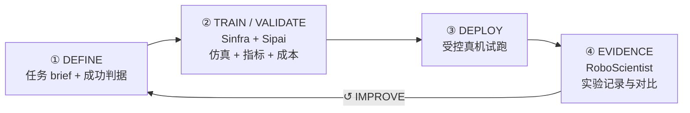

# Simate（Physical AI Platform + Model + Scientist）

**Simate**（[simate.ai](https://simate.ai/)， slogan *Intelligence, in motion*）把 Physical AI 拆成 **Platform（Sinfra）+ Model（Sipai）+ Scientist（RoboScientist）** 三个产品，目标是把「想法 → 真机行为 → 可复用证据」收成 **一条可迭代闭环**，而不是孤立地交付单个 VLA checkpoint。

| 机构 | Simate |
|------|--------|
| 官网 | <https://simate.ai/> |
| 工作区 | <https://simate.ai/sifra/#/login>（Enterprise / Cloud） |
| 开源状态 | **平台与 Sipai 模型：未开源**（见下方「局限与风险」） |

## 一句话定义

Simate 用 **Sinfra** 承载任务定义、训练、仿真验证与真机部署的全链路工程上下文，用 **Sipai** 学习具身动作策略，用 **RoboScientist** 把实验记录沉淀为下一轮改进证据——三者组成面向 Physical AI 的 **idea → action → insight** 系统。

## 英文缩写速查

| 缩写 | 英文全称 | 简要说明 |
|------|----------|----------|
| PAI | Physical AI | 能在物理世界中感知、学习、推理与行动的 AI（Simate 首页用语） |
| VLA | Vision-Language-Action | 视觉-语言-动作策略；Sipai 所在方法族 |
| GPU | Graphics Processing Unit | Sinfra 展示的 H100 / RTX 5090 / H20 算力池（训练 / 仿真 / 推理） |
| RLDS | Reinforcement Learning Datasets | Open X-Embodiment 等跨本体数据的通用序列格式 |
| MCAP | — | ABC-130k 等双臂遥操作数据的容器格式 |

## 为什么重要

- **补「只有模型、没有闭环」的选型盲区：** 许多 VLA 团队卡在数据版本、仿真 gate、真机试跑与成本对账之间的 **工程断层**；Simate 把这三段显式产品化（Sinfra 三阶段 gate + 实验记录）。
- **与社区基准对齐而非自造榜：** Sipai 公开叙事绑定 **[RoboDojo](./robodojo.md)** 评测（状态 **Evaluation in progress**），便于与 [XPolicyLab](./xpolicylab.md) 生态下的 verified 公益榜对照——但 **尚未公布分数**，不宜提前写 SOTA。
- **数据集策展入口：** Sinfra 页聚合 AgiBot World、Daimon-Infinity、ABC-130k、Open X-Embodiment 等 **第三方开放数据**，降低「选数据 → 开训」摩擦（数据本身仍受各源许可约束）。

## 核心结构

### 三分产品

| 产品 | 站内状态 | 核心职责 |
|------|----------|----------|
| **Sinfra** | Platform · IN DEVELOPMENT | DEFINE → TRAIN → VALIDATE → DEPLOY → IMPROVE；Task planner、成本估算、实验对比、工作区登录 |
| **Sipai** | Model · ROBODOJO EVALUATION | 具身动作模型栈：「One config. Everything.」— 组合数据、模型与训练配方 |
| **RoboScientist** | AI Scientist · RESEARCH PREVIEW | 实验画廊与证据链，把 run / comparison / decision 转为可检索洞察 |

### 流程总览

### Sinfra 三阶段门控

| 阶段 | 产出 | 决策 | 下一 gate |
|------|------|------|-----------|
| **DEFINE** | Task brief | 什么叫成功 | Ready to train |
| **VALIDATE** | 可对比 runs | 哪条 policy 进真机 | Ready for robot trial |
| **DEPLOY** | Deployment record | Release or improve | Repeatable behavior |

## 工程实践

| 场景 | 建议读法 |
|------|----------|
| **评估 Sipai 进展** | 跟踪 [RoboDojo](./robodojo.md) 官方榜与 protocol；Simate 首页承诺 **结果公开前不过度宣传** |
| **复现 Ring placement 等 demo** | 站内视频托管于 `mate-robot.cn` — 仅作 **行为展示**，**无** 官方训推仓库可拉 |
| **在 Sinfra 上开训** | 申请 Enterprise access 或登录 `/sifra/`；先用 Task planner 明确任务类型（单臂 / 双手 / 移动操纵等）与算力优先级 |
| **选公开数据** | 优先从 Sinfra 策展的四套入口核对 **许可**（如 AgiBot NC、Daimon CC BY-NC-SA）；见 [Daimon-Infinity](./cn-os-daimon-infinity.md) |
| **与开源 VLA 栈对照** | 需要可 fork 的训推链时，并行评估 [Isaac GR00T](./isaac-gr00t.md)、[XPolicyLab](./xpolicylab.md) 适配目录等 **已开源** 路径 |

## 局限与风险

- **平台与模型未开源（截至 2026-09-23）：** 项目页 **无** Simate 官方 GitHub / HF 模型仓；Sipai 的 Training / Evaluation / Deployment 均标 **In development** — 复现与审计依赖后续发布。
- **RoboDojo 分数尚未公开：** 「ROBODOJO EVALUATION」≠ 已上榜；勿与 [RoboDojo](./robodojo.md) 现有 verified 条目混读。
- **算力与价格为展示口径：** 页内 H100 / 5090 / H20 数量与 ¥/GPU·h 为 **DISPLAY / ILLUSTRATIVE**，非实时容量承诺。
- **演示视频 ≠ 开源：** `mate-robot.cn` 托管的真机 MP4 不能替代权重与评测脚本。
- **RoboScientist 仍为 Research preview：** 画廊偏叙事展示，工程 API 边界未在开源仓中验证。

## 源码运行时序图

**不适用** — 截至入库日 Simate 未在官网列出可运行的官方训练 / 推理 / 部署代码仓库；Sinfra 工作区为闭源 SaaS / Enterprise 形态。待官方发布开源入口后，应按 [ingest 步骤 5](../../schema/ingest-workflow.md) 补 `sequenceDiagram` 并对齐 `sources/repos/`。

## 关联页面

- [RoboDojo](./robodojo.md) — Sipai 当前绑定的 sim-and-real 通用操纵评测（第三方学术公益榜）
- [XPolicyLab](./xpolicylab.md) — RoboDojo 官方策略集成与 verified 开源门槛
- [具身评测选型闭环](../queries/embodied-eval-benchmark-selection-loop.md) — 何时用 sim 榜、何时上真机
- [VLA](../methods/vla.md) — Sipai 所在方法族与社区模型横评上下文

## 推荐继续阅读

- [Simate 首页](https://simate.ai/home/) — 产品与 Evidence 区最新 demo
- [Sinfra 产品页](https://simate.ai/research/sinfra/) — 工作流、数据集与 Task planner
- [RoboDojo Leaderboard Protocol](https://robodojo-benchmark.com/leaderboard/protocol) — 对照 Sipai 未来公开结果时的公正性规则

## 参考来源

- [Simate 官网归档](../../sources/sites/simate-ai.md)
