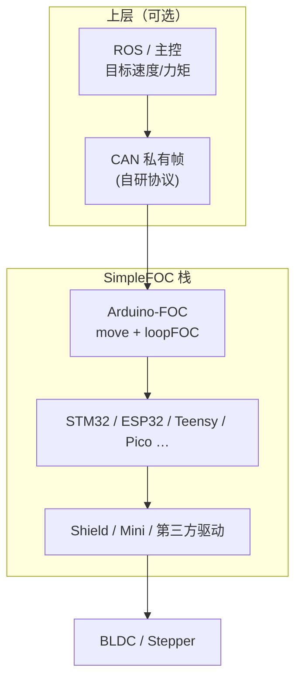

# SimpleFOC（Arduino-FOC 生态）

**SimpleFOC** 指围绕 [Arduino-FOC](https://github.com/simplefoc/Arduino-FOC) 库形成的开源项目：跨 MCU 的 **磁场定向控制** 实现、模块化硬件对象（电机 / 驱动 / 传感器 / 电流采样）、官方低成本驱动板，以及活跃的文档与社区（[simplefoc.com](https://simplefoc.com/) · [docs.simplefoc.com](https://docs.simplefoc.com/) · [community.simplefoc.com](https://community.simplefoc.com/)）。

## 为什么重要

- 在机器人栈中，它位于 **「驱动器底软之下的 MCU 电流环原型层」**：适合理解 FOC 如何产生力矩，而不必先购买 Odrive/VESC 级成品。
- 与仓库已有的 [电机底软通信总览](../overview/motor-drive-firmware-bus-protocols.md) 互补：后者讲 CANopen/私有帧 **协议**；SimpleFOC 讲 **算法与嵌入式实现**。
- 学生项目、云台、小型执行器、开源人形/四足的 **自研关节板** 常见引用；v2.4 起支持 `estimated_current`、多电机电流采样与 ESP32/STM32 优化，工程可用性提升。

## 核心结构/机制

### 软件：Arduino SimpleFOClibrary

| 组件 | 职责 |
|------|------|
| `BLDCMotor` / `StepperMotor` | 极对数、限流、控制模式 |
| `Sensor` | 编码器、磁编、霍尔 |
| `BLDCDriver` | 三相 PWM 与驱动芯片抽象 |
| `CurrentSense` | inline / low-side 电流反馈（可选） |
| `motor.loopFOC()` | 扭矩环：FOC 与调制 |
| `motor.move()` | 运动环：位置/速度/力矩目标 |

**控制模式正交**：任意运动模式（如 `velocity`、`angle_openloop`）可与电压、`foc_current`、`estimated_current` 等扭矩模式组合。

### 硬件：SimpleFOCBoards（参考设计）

- **SimpleFOCShield v3.2** — Arduino 叠层，DRV8313，可选 inline 电流采样，可堆叠双电机。
- **SimpleFOCMini v1.1** — 小型模块，适合空间受限原型。

原理图与制板指南在文档开源；与商业 **CiA402 伺服** 相比功率与互操作性有限，但 BOM 与可读性友好。

### 生态对照（文档自述）

SimpleFOC 强调 **简单与组合广度**；高功率、高集成产品常选 Odrive、VESC、mjbots 等。部分第三方板卡固件可替换为 Arduino-FOC 实现。

## 常见误区或局限

- **误区：SimpleFOC 等于机器人关节商用方案** — 数安培级、MCU 调度与散热需自行验证；人形量产关节多用厂商驱动器 + CAN/EtherCAT。
- **误区：只装库不标定** — 极对数、方向、传感器 offset、电流相序需对齐例程完成，否则易振鸣或过流。
- **局限：实时与确定性** — 无 EtherCAT DC 级多轴同步；硬实时需自选 MCU、定时器与裸机/RTOS 策略。
- **局限：文档与版本** — 应锁定库版本并对照 [release notes](https://github.com/simplefoc/Arduino-FOC/releases)；社区视频可能落后于 v2.4 API。

## 英文缩写速查

| 缩写 | 英文全称 | 简要说明 |
|------|----------|----------|
| FOC | Field-Oriented Control | 无刷电机的磁场定向控制 |
| BLDC | Brushless DC Motor | 无刷直流电机 |
| PWM | Pulse-Width Modulation | 脉宽调制，驱动电机与功率器件 |
| BOM | Bill of Materials | 物料清单，硬件零部件列表 |
| CAN | Controller Area Network | 电机/关节常用的现场总线通信协议 |
| EtherCAT | Ethernet for Control Automation Technology | 高实时性工业以太网总线 |
| API | Application Programming Interface | 应用程序编程接口 |

## 参考来源

- [sources/repos/simplefoc_arduino_foc.md](../../sources/repos/simplefoc_arduino_foc.md)
- [sources/sites/simplefoc_documentation.md](../../sources/sites/simplefoc_documentation.md)
- [simplefoc/Arduino-FOC](https://github.com/simplefoc/Arduino-FOC)

## 关联页面

- [磁场定向控制（FOC）](../concepts/field-oriented-control.md)
- [电机驱动器底软通信协议总览](../overview/motor-drive-firmware-bus-protocols.md)
- [Atom01 Firmware](./atom01-firmware.md)（开源人形底层固件对照）

## 推荐继续阅读

- [Theory corner](https://docs.simplefoc.com/theory_corner) — PID、对齐与滤波
- [Motor parameter measurement](https://docs.simplefoc.com/) — 文档内电机参数测量指南（docs 导航）
