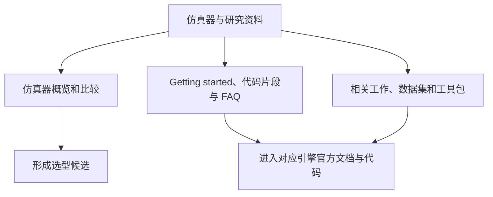
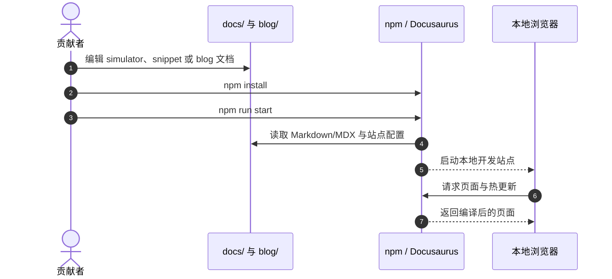

**一句话定义：** Simulately 是面向机器人学习研究的开源仿真器资源站，集中整理物理仿真器概览与比较、开发片段、相关工作及工具资料。

## 英文缩写速查

| 缩写 | 英文全称 | 简要说明 |
|------|----------|----------|
| RL | Reinforcement Learning | 机器人仿真常见的策略训练范式 |
| API | Application Programming Interface | 仿真器或工具包提供给程序调用的接口 |
| MDX | Markdown for the JSX ecosystem | Docusaurus 用于混排 Markdown 与组件的文档格式 |
| GPU | Graphics Processing Unit | 并行仿真和渲染常用的计算设备 |

## 基本信息

| 项目 | 内容 |
|------|------|
| 维护组织 | RoboVerse 组织（RoboVerseOrg，GitHub 仓库所有者） |
| 项目性质 | 仿真器知识与资源网站 |
| 网站 / 源码 | [simulately.wiki](https://simulately.wiki/) / [RoboVerseOrg/Simulately](https://github.com/RoboVerseOrg/Simulately) |

## 为什么重要

机器人仿真资料分散在各个引擎的文档、研究论文和示例代码中。Simulately 将常见机器人/物理仿真器的入门材料、比较说明和针对性代码片段汇集到一个可协作维护的网站，适合作为选型与上手的导航入口。它帮助读者缩短资料搜集时间，但不会替代具体引擎的官方手册或论文原文。

## 项目组成与信息流

官方 About 页将内容概括为仿真器综述与比较、开发 snippets、相关研究、工具包和贡献指南。公开文档还组织了演示数据集、物体与场景资料。项目覆盖 MuJoCo、Isaac Gym/Sim、SAPIEN、PyBullet、Gazebo、CoppeliaSim、Genesis、Taichi 等生态；具体条目以站点当前目录为准。

该图表示资源站的导航关系，不代表一个统一仿真运行时或基准测试流水线。

## 工程实践

### 浏览与选型

1. 从 [Simulately 文档首页](https://simulately.wiki/docs/) 进入 About 与目录。
2. 在仿真器分类中比较引擎能力，再进入对应 simulator 页面；snippets 分类提供初始化、加载场景、传感器、控制等主题示例。
3. 将代码片段视作快速起步材料。版本差异、API 行为和性能数字应回到对应引擎的官方文档、代码及论文核对。
4. 项目页说明，用于文中实验（如渲染、getting-started）的代码和数据放在仓库 `code` 分支；此分支材料与主分支的 Docusaurus 文档站用途不同。

### 本地运行文档站

仓库 README 要求 Node.js 18 或以上，并给出 `npm install` 与 `npm run start` 的本地开发流程。仓库以 Docusaurus 构建，npm 脚本也提供静态构建入口 `npm run build`。

此图对应 README 的文档贡献路径；它运行和预览的是网站，不是在此仓库中启动物理仿真任务。

## 开源状态与边界

GitHub 仓库公开，采用 Apache-2.0 许可证；代码包含 Docusaurus 站点、文档、配置及相关静态资源。站点主页由 Cloudflare 托管（README 说明站点由 Docusaurus 构建、Cloudflare Pages 提供服务）。没有证据表明 Simulately 提供统一的物理引擎、跨引擎执行 API 或独立的策略训练框架，因此应把它定位为仿真知识与示例资源集合；真实项目仍需安装并使用各仿真器自身。

## 局限与风险

- **信息新鲜度不同：** 仓库包含不同年份撰写的条目。比如总体比较页标出的受欢迎度/引用统计数据截止 2023-12-20；这些数字不应作为当前排名或硬件性能结论。
- **比较结果有条件：** 渲染 FPS 等结果取决于机器、驱动、模拟器版本和测试脚本。站点自身也说明其比较数据不是普适权威结果，复用前应核对实验代码与条件。
- **资料聚合不等于统一标准：** 不同页面的深度与维护时间不一；做严肃评估要回到引擎官方文档、原论文和可运行代码。
- **不是仿真后端：** 此项目网站的源码开放，不能据此推断所介绍的所有引擎、数据或模型都采用同一许可证或可直接互换。

## 关联页面

- [MuJoCo（物理引擎）](./mujoco.md) — Simulately 仿真器分类中的一个具体引擎；其 API 与许可证应以 MuJoCo 官方资料为准。
- [Isaac Gym / Isaac Lab](./isaac-gym-isaac-lab.md) — GPU 并行仿真与机器人学习生态。
- [MuJoCo vs Isaac Lab：仿真器选型对比](../comparisons/mujoco-vs-isaac-lab.md) — 结合吞吐、渲染和研究目标判断候选平台。
- [训练栈分层地图](../overview/robot-training-stack-layers-technology-map.md) — 将仿真器放回机器人训练与部署链路中理解。

## 参考来源

- [Simulately GitHub 仓库归档](../../sources/repos/simulately.md)
- [Simulately 官方网站归档](../../sources/sites/simulately.md)

## 推荐继续阅读

- [Simulately 官方文档](https://simulately.wiki/docs/) — 查看当前目录、内容和贡献流程。
- [Simulately 上游源码](https://github.com/RoboVerseOrg/Simulately) — 核对仓库 README、许可证和本地运行入口。
- [MuJoCo 官方文档](https://mujoco.readthedocs.io/en/stable/) 与 [NVIDIA Isaac Lab 文档](https://isaac-sim.github.io/IsaacLab/) — 对照具体仿真器的最新 API 与运行条件。
