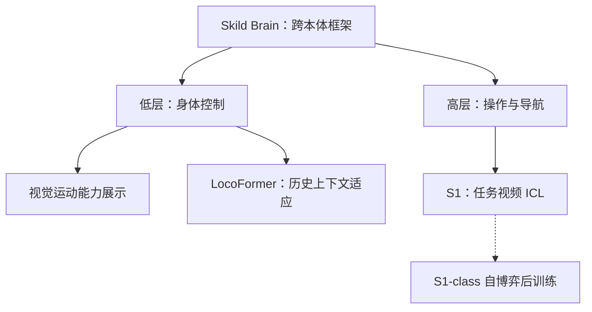

# Skild AI

| 字段 | 内容 |
|------|------|
| **机构** | 斯齐尔德（Skild AI） |
| **类型** | 商业具身基础模型公司 |
| **公开锚点** | [skild.ai](https://www.skild.ai/)；旗舰博文 [S1](https://www.skild.ai/blogs/s1) |
| **Skild Brain** | 公司品牌名：统一 **omni-bodied** 策略脑（官方技术介绍 2025-07-29；首页为持续维护入口） |
| **联系** | press@skild.ai |
| **学术前序** | LocoFormer（arXiv:2509.23745，Liu / Pathak / Agarwal） |
| **成立** | 2023；[官方公告](https://www.skild.ai/blogs/announcing-our-300m-series-a)确认年份，月份未确认 |
| **开源** | 截至 2026-10-07，已核查技术博客和 LocoFormer 项目页未见官方代码、权重或数据下载入口 |

## 一句话定义

**Skild AI**：主张 **omni-bodied** 物理智能的商业团队——同一套策略脑不绑定单一机型或任务；对外技术锚点从 2025 运动域 **LocoFormer**（Skild AI 署名；上下文里累积在线经验）推进到 2026-08 操作域 **S1**（一条视频示范、权重不变）。

## 英文缩写速查

| 缩写 | 英文全称 | 简要说明 |
|------|----------|----------|
| S1 | Skild S1 | 2026-08 旗舰操作基础模型，视频 in-context 指定任务 |
| ICL | In-Context Learning | 不更新权重、从上下文示范归纳映射 |
| VLA | Vision-Language-Action | S1 对照基线是语言条件 VLA |
| CMU | Carnegie Mellon University | 公司衍生叙事中的研究所母体 |

## 为什么重要

- **产业 ICL 样本：** 与 [Generalist AI](./generalist-ai-robotics.md) 的 **涌现 physical prompting** 对照，Skild 把 ICL 写成 **预训练目标本身**（任务只通过示范指定）。
- **Omni-bodied 产品叙事：** 首页（2026-09-06）将 **Skild Brain** 定位为跨机型/跨任务统一脑，并列出 **安防巡检、移动操作 API、自主装箱** 三条落地线；数据侧强调 **Learns from Humans**（人类视频可扩展采集）。
- **跨域迁移叙事：** 先在 locomotion 验证长上下文适应，再搬到 manipulation 长程未见任务，见 [S1](./skild-s1.md)。
- **引用纪律：** 成功率、数据小时数为官方自报；**确认未开源**，不可替代 Octo / π / OpenVLA 做实验。

## 公开技术路线与时间

日期表示可核实的公开事件，研发完成日、公告日和代码开放日分别判断。同一 Brain 的能力博客复用本公司节点，不把每篇博客拆成产品。

| 日期 | 节点 | 归属与边界 |
| --- | --- | --- |
| 2025-07-29 | Skild Brain 技术介绍 | 低频高层操作/导航策略 → 高频低层控制；未公开具体 Hz。文章回顾 2024 年结果，日期按公开介绍计。 |
| 2025-08-06 | 视觉端到端运动控制 | Skild Brain 的低层能力展示：图像和本体感知直接到电机命令；不另外命名模型版本。 |
| 2025-09-24 / 09-28 | [LocoFormer](./paper-locoformer.md) | 公司博客 / arXiv v1 提交。论文机构为 Skild AI；Light Origins 是后续引用方。长上下文利用在线运动历史，区别于 S1 的任务视频 prompt。 |
| 2026-01-12 | 看人视频学习 | 人视频与少量机器人数据微调；此阶段不能写成部署不改权重。 |
| 2026-03-19 | 工业部署合作 | ABB / UR / MiR 合作及 NVIDIA / Foxconn 双臂装配展示；部署里程碑，非独立模型版本。 |
| 2026-08-18 | [S1](./skild-s1.md) | 官方博客列表日期；正文引用仅到 2026-08。一条任务视频驱动 ICL，推理不更新权重。 |
| 2026-09-23 | [Physical Self-Play](./skild-physical-self-play.md) | S1-class 模型自博弈后训练；未说明与操作演示是否同一 checkpoint。 |

S1 正文回顾的 **2026-02 域内 ICL / 2026-05 首次翻煎饼**是内部研发里程碑，不能作为两个独立项目发布。2026-09-10 部署跟进博文提到 S1 “两周前”发布；本路线采用官方列表显示日期，不倒算出另一个首发日。详见[日期与身份依据](../../sources/sites/skild-ai-timeline-audit-2026-10-07.md)。

## 框架关系

图归纳公开能力位置；虚线表示后训练联系，不能据此认定 S1、LocoFormer 和足球策略共享同一架构或权重。

## 工程实践

| 场景 | 建议 |
|------|------|
| 写综述 / 选型 | 把 Skild 与 Generalist、π 并列为 **闭源 ICL / 通才策略** 对照，不要假设可下载权重 |
| 复现 ICL | 用开源 one-shot IL / [RoboTTT](./paper-robottt-test-time-training-vla-context.md) / SynthICL；S1 只提供评测轴（已见 vs 未见、短程 vs 10 min） |
| LocoFormer 代码 | 官方未开源；[lucidrains/locoformer](https://github.com/lucidrains/locoformer) 是社区 WIP，非官方配方 |

## 局限与风险

- 官方有分层控制、视觉运动、跨形态适应等多篇技术博客；S1 完整训练配方仍未披露。
- 「omni-bodied」是愿景修辞；公开演示未给出跨本体定量表。
- 开放状态按官方资源入口逐项核查；GitHub 组织仓库数不能证明全公司的代码开放情况，也不能推定将来会开源。

## 关联页面

- [S1：机器人 In-Context Learning](./skild-s1.md)
- [Skild Physical Self-Play（后训练自博弈）](./skild-physical-self-play.md)
- [机器人 In-Context Learning](../concepts/robot-in-context-learning.md)
- [Foundation Policy](../concepts/foundation-policy.md)
- [Generalist AI](./generalist-ai-robotics.md) — 另一条闭源通才 / ICL 产业线
- [Robbyant（蚂蚁灵波）](./robbyant.md) — 同讲「一个大脑控制多种机器人」，但 LingBot-VLA 公开权重
- [海外具身智能实验室地图（2026）](../overview/overseas-embodied-ai-labs-landscape-2026.md)
- [LocoFormer（Skild AI 论文）](./paper-locoformer.md)
- [HOST](./paper-host-one-shot-human-video.md) — 开源单视频 one-shot 对照，不是本公司产品

## 参考来源

- [Skild AI 官方时间线核查（2026-10-07）](../../sources/sites/skild-ai-timeline-audit-2026-10-07.md)

- [Skild AI 公司站点归档](../../sources/sites/skild-ai.md)
- [S1 博客归档](../../sources/blogs/skild_s1_in_context_learning.md)

## 推荐继续阅读

- 公司首页：<https://www.skild.ai/>
- S1 原文：<https://www.skild.ai/blogs/s1>
- Liu, Pathak, Agarwal, *LocoFormer*（[arXiv:2509.23745](https://arxiv.org/abs/2509.23745)）
